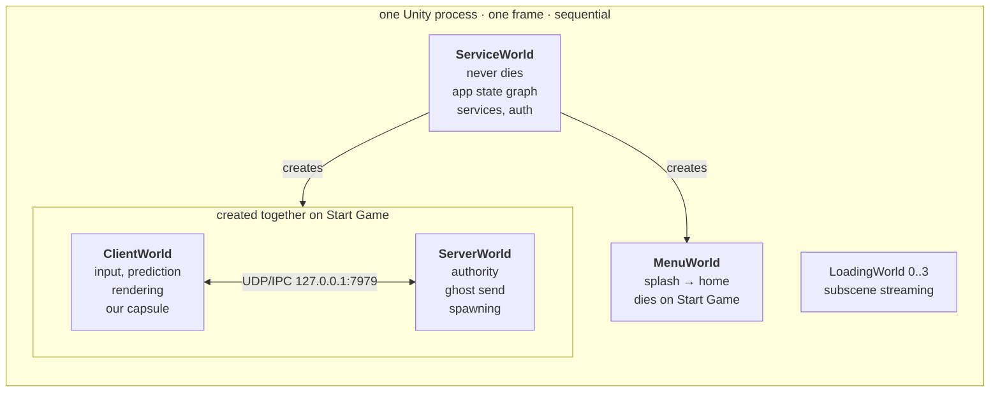
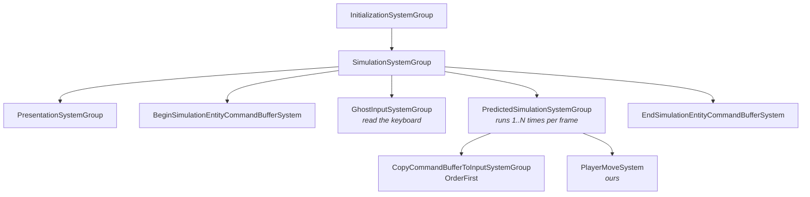

# 03 · Worlds: six machines in one process

A `World` is an `EntityManager` (its own chunk allocator, its own entity IDs) plus a list of
systems. Two worlds share nothing. Entity `#42` in `ClientWorld` and entity `#42` in
`ServerWorld` are unrelated, the way PID 42 on two machines is unrelated.

> **⚡ Hardware analogy** — a world is a **separate address space**. Same silicon, same
> frame, zero shared state. The only way data crosses is a message on the wire.

## Our six



`ServiceWorld` is the one that outlives everything — it owns the state graph that says
"we are in Menu" or "we are in Game", and it is what creates and destroys the others.

Chapter 42 is the definitive account: every world netcode can build, what `WorldSystemFilterFlags.Default` really expands to, and which world to reason about when debugging what.

> **🔬 Probe** — see them live:
> ```csharp
> foreach (var w in World.All) Debug.Log($"{w.Name} flags={w.Flags}");
> ```

## Flags are the routing table

Each world carries `WorldFlags`. Systems declare where they are allowed to exist:

```csharp
[WorldSystemFilter(WorldSystemFilterFlags.ClientSimulation)]           // clients only
[WorldSystemFilter(WorldSystemFilterFlags.ServerSimulation)]           // server only
[WorldSystemFilter(Worlds.ServerLocal)]                                // server OR offline
[WorldSystemFilter(ClientSimulation | ServerSimulation)]               // both — shared rules
```

BovineLabs adds its own world kinds on top of Unity's, in `BovineLabs.Core/Worlds.cs`:

| Constant | Value | Meaning |
|---|---|---|
| `Worlds.Service` | bit 21 | the persistent service world |
| `Worlds.Menu` | bit 22 | the menu world |
| `Worlds.ClientLocal` | Client \| Local | client, or a single-player local world |
| `Worlds.ServerLocal` | Server \| Local | server, or single-player |
| `Worlds.Simulation` | Client \| Server \| Local | anything that simulates |

`Worlds.ServerLocal` is doing real work: it means "authority", whether that authority is a
netcode server or an offline single-player world. Write your authoritative rules against
that and single-player comes free.

> **💀 Trap** — a system with **no** `[WorldSystemFilter]` defaults to
> `LocalSimulation | ServerSimulation | ClientSimulation`, so it lands in *every* game
> world including the server. Half of all "why did that run twice?" bugs are a missing
> filter.

## Groups: the ordering is a graph, not a list

Systems do not run in declaration order, alphabetical order, or file order. They run in the
order of a topologically-sorted dependency graph built from attributes.



The four attributes that matter:

```csharp
[UpdateInGroup(typeof(PredictedSimulationSystemGroup))]   // which box am I in
[UpdateBefore(typeof(SomeSystem))]                        // edge
[UpdateAfter(typeof(SomeSystem))]                         // edge
[UpdateInGroup(typeof(X), OrderFirst = true)]             // pin to the front of the box
```

> **💀 Trap** — `[UpdateBefore]` **only works between systems in the same group**. Point it
> at a system in another group and Unity logs a warning and ignores it. You will see exactly
> this warning in our project's console, coming from Unity's own
> `CompanionGameObjectUpdateTransformSystem`. Harmless there; not harmless in your code.

## ISystem vs SystemBase

| | `ISystem` (struct) | `SystemBase` (class) |
|---|---|---|
| Burst-compilable | ✅ | ❌ |
| Managed data | ❌ | ✅ |
| Use for | 99% of gameplay | anything touching `async`, HTTP, `UnityEngine.Object` |

Our project uses `ISystem` everywhere except where it genuinely cannot — the same rule the
packages follow. `ConnectionApprovalServerSystem` is a `SystemBase` precisely because it
`await`s an HTTP call to Unity Authentication.

## The bootstrap

`ICustomBootstrap` lets you take over world creation. Nerve does, via
`BovineLabsBootstrap : ClientServerBootstrap`. It is why our worlds are named and shaped
the way they are, and why `CreateClientServerWorlds()` is the thing the service graph calls
when you press **Start Game**.

Next: the part where all those chunks get chewed in parallel.

→ [04 · Burst and jobs](04-burst-and-jobs.md)
