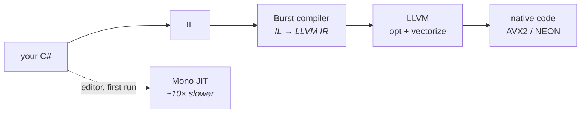
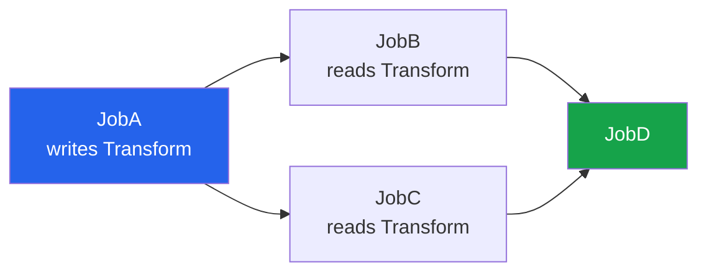

# 04 · Burst and jobs

Two separate technologies that people blur together. Keep them apart in your head:

- **Burst** is a *compiler*. It turns a subset of C# into machine code via LLVM.
- **Jobs** is a *scheduler*. It runs work on worker threads with enforced data safety.

You can use either without the other. Together they are why DOTS is fast.

## Burst: LLVM, not JIT



Burst assumes things Mono cannot:

| Assumption | Consequence |
|---|---|
| No garbage collector | no write barriers, no safepoint polling |
| No managed objects | every value is a known-size struct |
| No exceptions (in release) | no unwind tables, no landing pads |
| Aliasing is declared | LLVM can vectorize aggressively |
| Math is a real intrinsic | `math.normalize` becomes 4 SIMD instructions |

> **⚡ Hardware analogy** — Burst is a **cross-compiler with `-O3 -ffast-math -march=native`**
> aimed at a language that normally forbids all three. `[BurstCompile]` is you signing the
> waiver.

### The rules you must obey

```csharp
[BurstCompile]                                    // ← on the STRUCT
public partial struct PlayerMoveSystem : ISystem
{
    [BurstCompile]                                // ← and on EACH method
    public void OnUpdate(ref SystemState state) { }
}
```

> **💀 Trap** — `[BurstCompile]` on the methods but **not** on the struct silently does
> nothing. No error, no warning. Your system just runs at Mono speed forever. This is the
> single most common invisible perf bug in DOTS.

Inside a bursted method you may not touch: `class`, `string`, `object`, `try/catch` (in
release), `UnityEngine.Debug.Log`, LINQ, delegates that aren't `FunctionPointer`. Our
`PlayerGatherInputSystem` deliberately has **no** `[BurstCompile]` on `OnUpdate`, because
`Keyboard.current` is a managed object. That is the correct call, not a compromise.

### Statics are a landmine

Burst compiles a **separate copy** of static fields. A `static int` written from managed
code is invisible to bursted code. The supported bridge is `SharedStatic<T>`:

```csharp
public static readonly SharedStatic<AppStateRequest> Value =
    SharedStatic<AppStateRequest>.GetOrCreate<AppStateRequest>();
```

That is exactly how the sample's **Start Game** button reaches ECS, and how Nerve's
`ClientDisconnectionOutcome` escapes the graph. When you see `SharedStatic`, read it as
"a global that Burst and Mono agree on".

## Jobs: a dependency graph the compiler checks



`state.Dependency` is a `JobHandle` — a token in that graph. Schedule a job, get a handle,
pass it on. The **safety system** tracks which `NativeArray`s each job reads and writes and
*refuses to compile or run* an unsafe combination.

| API | Threads | Order |
|---|---|---|
| `.Run()` | main thread | immediate, blocking |
| `.Schedule()` | one worker | after dependencies |
| `.ScheduleParallel()` | many workers | after dependencies, chunks split |

> **⚡ Hardware analogy** — the job system is a **scoreboard**. Every `NativeContainer` is a
> register with readers and writers tracked; the scheduler stalls dependents until hazards
> clear. Unity's version just yells at you at compile time instead of stalling silently.

### The escape hatches, and when they are legitimate

```csharp
[NativeDisableParallelForRestriction]   // "I promise indices don't overlap"
[NativeDisableContainerSafetyRestriction]// "I promise this alias is fine"
[NativeDisableUnsafePtrRestriction]      // "this raw pointer outlives the check"
```

All three appear in this stack. `ClientAppContext` uses the third to hold a `SystemState*`,
because a Grove context must reach the system it is running inside. That is not sloppiness —
it is the same reason you cast away `volatile` exactly once in a driver, in a place with a
comment.

## Why our capsule code runs single-threaded

`PlayerMoveSystem` uses `SystemAPI.Query` with `foreach`, on the main thread, bursted. Two
capsules. Scheduling a parallel job for two entities would cost more in scheduling overhead
than it saves.

The lesson generalises: **parallelism is a throughput tool with a fixed setup cost.** Below
a few thousand entities, `foreach` on the main thread wins. Measure before you schedule.

> **🔬 Probe** — `Jobs → Burst → Open Inspector` in the editor shows the **actual assembly**
> Burst generated for any bursted method. Read it. If you were expecting `vmulps` and you
> see a call into a math library, something broke your vectorization.

Part I done. You now know the machine. Next: what is actually installed on it.

→ [05 · The package map](05-package-map.md)
