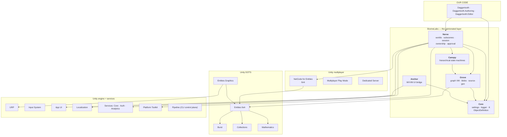

# 05 · The package map

21 direct dependencies. Every one earns its slot — we got the manifest down from 49 and
then had to *add* several back, because of a mechanism you will meet in the next chapter.

## The layer cake



## What each one is for

### The BovineLabs layer

| Package | One-line job | Why you cannot skip it |
|---|---|---|
| **Core** | Settings framework, `BLLogger`, `K` typed constants, `ObjectDefinition` registry | Everything above imports it |
| **Grove** | A **graph virtual machine**: nodes → blob bytes → function-pointer dispatch | Canopy and Nerve are both written *in* it |
| **Canopy** | Hierarchical state machines on Grove | Nerve's app flow is a Canopy graph |
| **Nerve** | Worlds, subscene sets, sessions, ownership, connection approval | This is the "game framework" |
| **Anchor** | MVVM binding between App UI (UXML) and ECS | The sample's menu is Anchor |

The dependency direction matters: **Grove knows nothing about games.** It is a generic
graph executor. Canopy adds "states". Nerve adds "multiplayer app". Read them in that
order and each one is small.

### The Unity layer, and why two forks

```json
"com.unity.entities": "…tertle-monorepo.git?path=com.unity.entities#d55ffc7…",
"com.unity.netcode":  "…tertle-monorepo.git?path=com.unity.netcode#d55ffc7…",
```

Entities and NetCode are pinned to a **fork** in `vex-studio/tertle-monorepo`, at one exact
commit. BovineLabs needs behaviour the shipping packages do not expose yet. The pin is a
commit SHA, not a branch, which is the only sane way to depend on a fork.

> **💀 Trap** — mixing a forked `com.unity.entities` with a registry `com.unity.netcode`
> gives you version-solver errors that read like nonsense. Both come from the fork or
> neither does.

### The ones that look optional and are not

| Package | Looks like | Actually is |
|---|---|---|
| `com.unity.services.core` / `.authentication` / `.analytics` | "cloud stuff, skip it" | **a compile gate** — without them, `BovineLabs.Nerve.State` compiles to nothing |
| `com.unity.platformtoolkit` | "console/Steam thing" | same: a `defineConstraint` on Nerve.State |
| `com.unity.dt.app-ui` | "UI toolkit extra" | Anchor needs it; Nerve's `BuildModWindow` references it unguarded |
| `com.unity.dedicated-server` | "for headless builds" | defines `UNITY_USE_MULTIPLAYER_ROLES`, which is what gives MPPM its per-player **Role** dropdown |
| `com.unity.pipeline` | "?" | an HTTP control plane in the editor — how the CLI drives play mode, menus, and `eval` |

That table is the chapter's whole point. **Four of our packages exist purely to satisfy
compile-time constraints.** Chapter 06 explains the mechanism, and it is the nastiest
silent failure in the entire Unity toolchain.

### Ours

| Assembly | Platform | Holds |
|---|---|---|
| `Daggertooth` | all | components, systems, the Grove context |
| `Daggertooth.Authoring` | editor-constrained | `ClientStateSettings` |
| `Daggertooth.Editor` | Editor only | `ClientGraphSetup` — builds the `.cnerve` |

Three assemblies for ~400 lines of code looks like over-engineering. It is not; chapter 06
shows what happens when you collapse them.

> **🔬 Probe** — the real resolved graph, including transitives:
> ```bash
> cat Library/PackageManager/ProjectCache | head -50
> ls Library/PackageCache/
> ```

→ [06 · Assemblies, and the silent-death trap](06-assemblies.md)
