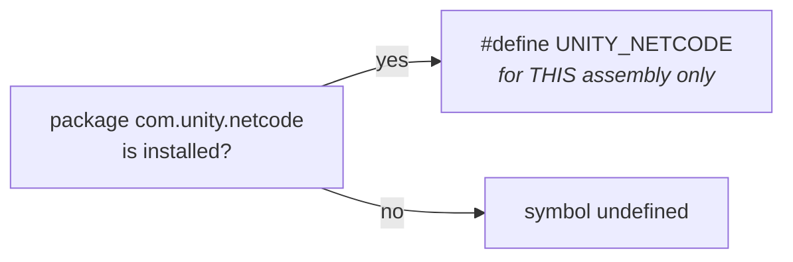
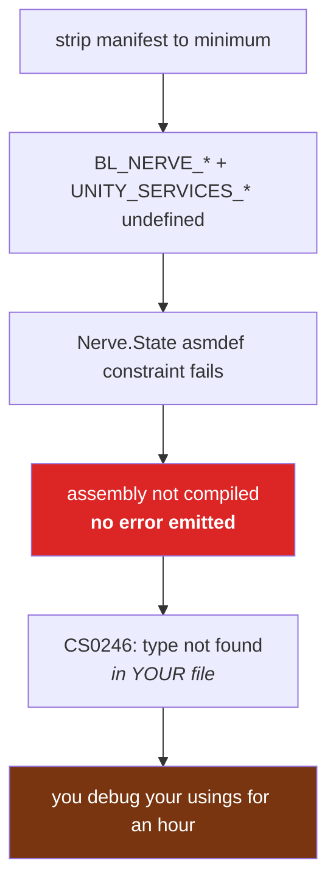
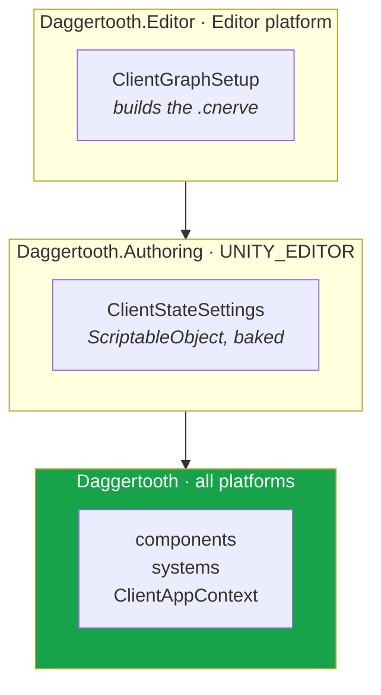

# 06 · Assemblies, and the silent-death trap

This chapter is worth more than its length. It describes a failure mode that produces
**no error, no warning, and no output** — the code simply is not there. We lost hours to it
twice.

## An asmdef is a compilation unit

Unity compiles one DLL per `.asmdef`. The file is the linker script:

```json
{
  "name": "Daggertooth",
  "references": [ "BovineLabs.Core", "Unity.NetCode", ... ],
  "includePlatforms": [],
  "defineConstraints": [ "UNITY_NETCODE", "UNITY_SERVICES_CORE", ... ],
  "versionDefines": [ { "name": "com.unity.netcode", "expression": "", "define": "UNITY_NETCODE" } ]
}
```

## `versionDefines` — "if that package exists, define this symbol"



Note the scope: **per assembly**. Every asmdef that wants `UNITY_NETCODE` must declare its
own `versionDefines` entry. Symbols do not inherit from referenced assemblies. This is why
the same 8-entry block is copy-pasted into every asmdef in the BovineLabs stack, and now
into ours.

## `defineConstraints` — "compile me only if ALL of these are defined"

And here is the knife:

> **💀 THE TRAP** — `defineConstraints` is **all-or-nothing at the assembly level**. If one
> symbol is missing, Unity does not compile the assembly. Not partially. **At all.** It
> produces no DLL, logs nothing, and every type in it silently ceases to exist.

`BovineLabs.Nerve.State` declares six:

```json
"defineConstraints": [
  "BL_NERVE_CANOPY", "BL_NERVE_GROVE",
  "UNITY_SERVICES_CORE", "UNITY_SERVICES_AUTHENTICATION",
  "UNITY_SERVICES_ANALYTICS", "UNITY_PLATFORM_TOOLKIT"
]
```

We had stripped the manifest to a minimum. Five of those six were unsatisfied. So
`BovineLabs.Nerve.State` — the assembly containing sessions, ownership, approval, and every
client node — **was not built**. The symptom was "these types don't exist", which reads like
a bad `using`, which sends you hunting in exactly the wrong place.

The fix was installing four packages we thought we did not need. That is chapter 05's table.



> **🔬 Probe** — the only reliable check. If your assembly is missing from this list, its
> constraints failed:
> ```bash
> ls Library/ScriptAssemblies/ | grep -i nerve
> ```

## The second trap: referencing an editor-only assembly from runtime code

`BovineLabs.Nerve.State.Authoring` has `"UNITY_EDITOR"` in its `defineConstraints`. It is an
editor-only assembly.

Our `Daggertooth` asmdef referenced it. In the editor: fine, everything compiles, everything
works, ship it. In a **player build**, `UNITY_EDITOR` is undefined, that assembly is not
built, and the reference silently drops — taking every type we used from it.

This is a bug that cannot reproduce until the day you make your first build, at which point
it looks like a catastrophic regression.

### The fix is the three-assembly split



Rule of thumb, and it is the same rule the sample follows:

| Contains | Assembly | Constraint |
|---|---|---|
| Components, systems, contexts | runtime | package constraints only |
| `SettingsBase`, bakers referencing authoring types | `.Authoring` | `+ UNITY_EDITOR` |
| Menu items, importers, graph construction | `.Editor` | `includePlatforms: ["Editor"]` |

## Why `autoReferenced: false` matters

Most BovineLabs assemblies set `autoReferenced: false`. That means they are **not**
automatically visible to `Assembly-CSharp` — you must reference them explicitly. It is
deliberate: it prevents accidental coupling and it keeps compile times down. It also means
"I can't see the type" often just means "add the reference".

## The checklist

Before you blame your code:

1. Is the DLL in `Library/ScriptAssemblies/`?
2. Does your asmdef **reference** the assembly?
3. Does your asmdef declare the `versionDefines` for symbols you use in `#if`?
4. Do your `defineConstraints` match the constraints of everything you reference?
5. Is anything you reference `UNITY_EDITOR`-only while you are not?

Five questions. They would have saved us both incidents.

→ [07 · Core: settings, logging, and the registry](07-core.md)
