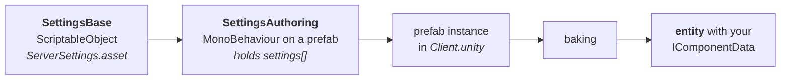
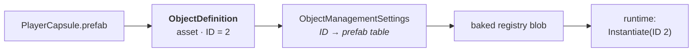

# 07 · Core: settings, logging, and the registry

`BovineLabs.Core` is the base plate. Four subsystems matter to us.

## 1. Settings — a ScriptableObject that becomes an entity

The problem: designers want to tune numbers in the Inspector. ECS wants blittable data in
chunks. Settings is the bridge.



Each `SettingsBase` implements `Bake(Baker<SettingsAuthoring>)` and adds whatever components
it wants onto one entity.

### The routing table

Which world does a settings asset land in? `[SettingsWorld("client")]` says. The lookup
lives in `EditorSettings`:

| World key | SettingsAuthoring prefab | ends up in |
|---|---|---|
| `service` | `ServiceSettings.prefab` | ServiceWorld |
| `menu` | `MenuSettings.prefab` | MenuWorld |
| `client` | `ClientSettings.prefab` | ClientWorld |
| `server` | `ServerSettings.prefab` | ServerWorld |
| *(none)* | `GameSettings.prefab` (default) | everywhere |

`EditorSettingsUtility.GetSettings<T>()` does the whole dance in one call: finds or creates
the asset in `Assets/Settings/Settings/`, reads `[SettingsWorld]`, and inserts it into the
right prefab's array (sorted, deduped, null-pruned).

That one call is how our `ClientStateSettings` got wired. Read it as the supported API and
never hand-edit those prefab arrays.

> **🔬 Probe** — after creating a settings asset, confirm the link:
> ```bash
> grep -A2 "settings:" ".../Settings/Authoring/ClientSettings.prefab"
> ```

## 2. `K` — typed constants without magic strings

`K` is a code-generated set of named byte/int constants sourced from settings assets, so
layer masks and enum-ish IDs stop being magic numbers scattered through code. You will see
`Assets/Settings/K/` in this project. It is small; it is not on our critical path; know it
exists so you do not reinvent it.

## 3. `BLLogger` — logging that Burst can do

`UnityEngine.Debug.Log` is a managed call. Bursted code cannot make it. `BLLogger` is a
singleton component holding a native ring buffer:

```csharp
var logger = SystemAPI.GetSingleton<BLLogger>();
logger.LogDebugString($"connection {id} approved");
```

A managed system drains the buffer each frame and forwards to Unity's console. Grove's
`GraphImpl` grabs it into `GroveContext.Logger` so any node, anywhere, can log without
breaking Burst.

> **⚡ Hardware analogy** — this is a **UART with a DMA ring buffer**. The fast path writes
> into a circular buffer with no formatting; a slow consumer drains and formats. Same
> pattern, same reason.

## 4. ObjectDefinition — a handle registry for prefabs

The problem: an ECS component cannot hold a prefab reference. It can hold an `int`.



Each prefab gets an `ObjectDefinition` asset carrying a stable numeric ID. A settings asset
registers them all. At bake time that becomes a lookup table; at runtime you spawn by ID.

Our two definitions: `PlayerCapsule` = 2, `PlayerController` = 3. `ServerSettings` points
`playerController` and `playerCharacter` at them, which is how Nerve's spawn code knows what
to instantiate for a joining player.

### `[AutoRef]` and the ID assignment trap

IDs are assigned by an editor post-processor, `AutoRefProcessor`. It batches work through
`EditorApplication.delayCall` and keeps an `AlreadyProcessedAssets` set marked
`[NoAutoStaticsCleanup]` — so the set survives domain reload.

> **💀 Trap** — if an asset lands in that set *before* it is fully importable, it is skipped
> and never revisited. Symptom: every `ObjectDefinition.ID` is `0` and the registry is empty,
> with no error. We hit this exactly once and unstuck it by reflecting into the processor to
> clear the set and re-run. That is **unsupported** and still sits in our debt list; the
> supported unstick is to delete `Library/` and let the import order be natural.

## What to take away

Four patterns, all of which you will now recognise in Nerve because Nerve is built from
them:

1. Inspector data → entity via a **baker on a prefab in a world-targeted scene**.
2. Managed identity → runtime identity via a **numeric handle and a table**.
3. Slow, managed work → **ring buffer** drained by a managed consumer.
4. Editor-time wiring → a **utility that owns the whole dance**, not hand-edited assets.

→ [08 · Grove: a virtual machine for gameplay logic](08-grove.md)
