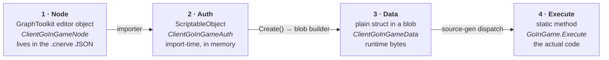
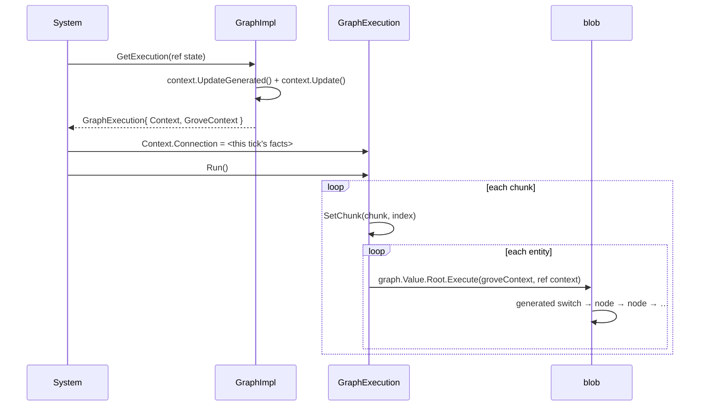

# 08 · Grove: a virtual machine for gameplay logic

This is the chapter where your background pays the biggest dividend, because Grove is not a
"visual scripting tool". Grove is **a bytecode VM with an ahead-of-time linker, a flat
instruction image, and a switch-dispatch interpreter generated at compile time.**

You have written one of these. Possibly for a bootloader.

## The four representations

One node exists in four forms, and confusing them is the main source of Grove pain:



| Form | Assembly | Lives | Analogy |
|---|---|---|---|
| Node | `*.State.Editor` | editor only | **source code** |
| Auth | `*.State.Authoring` | editor only | **object file** |
| Data | `*.State` (runtime) | blob bytes | **the .bin image** |
| Execute | `*.State` (runtime) | code segment | **the ISA implementation** |

> **⚡ Hardware analogy** — Node → Auth → Data is *compile → link → flash*. `Execute` is the
> instruction decoder. `[ExecuteNode((int)NerveExecutionTypes.ClientGoInGame, …)]` is an
> **opcode assignment**.

## The instruction set

```csharp
public enum NerveExecutionTypes
{
    StartupGate             = -NerveId.Offset,
    Initialize              = -NerveId.Offset - 1,
    CreateWorld             = -NerveId.Offset - 4,
    ClientGoInGame          = -NerveId.Offset - 10,
    ClientConnectionTracker = -NerveId.Offset - 11,
    …
}
```

Literally an opcode table. The negative offset namespaces Nerve's opcodes away from Grove's
built-ins so two packages can extend the same VM without colliding.

## The image: a blob asset

At bake time the whole graph is flattened into **one `BlobAssetReference<GraphData>`** —
a single contiguous allocation, relocatable, with internal offsets instead of pointers.

```
GraphData
├─ GraphId       : ulong
├─ Root          : BlobPtr<ExecutionHeader>
├─ Nodes[]       : BlobArray<NodeHeader>
├─ Inputs[]      : BlobArray<GraphInputData>
└─ Outputs[]     : BlobArray<GraphOutputData>

NodeHeader
├─ Type          : NodeType (Execution | Data | Unknown)
└─ payload       : the node's Data struct, inline
```

`BlobPtr<T>` is a **relative offset**, not an address. That is what makes the whole image
memcpy-able, cache-friendly, and shareable read-only across every entity running the graph.

> **⚡ Hardware analogy** — position-independent code with PC-relative addressing. Same
> trick, same reason: you do not know where it will be loaded.

## Dispatch: source generation, not virtual calls

A blob cannot hold a `delegate`. So Grove's source generator scans for `[ExecuteNode]`,
collects every opcode, and generates a switch:

```csharp
// generated, conceptually
switch (header.Type)
{
    case (int)NerveExecutionTypes.ClientGoInGame:
        GoInGame.Execute(ref data.As<ClientGoInGameData>(), groveContext, ref context, ref state);
        break;
    case (int)NerveExecutionTypes.ClientConnectionTracker:
        ClientConnectionTracker.Execute(…);
        break;
    …
}
```

Burst compiles that switch into a jump table. **No virtual dispatch, no function pointer
indirection, fully inlinable.** This is why Grove is fast enough to run per-entity.

The generic `<T>` on every `Execute` is the context type. The generator instantiates the
switch **once per context type** — so `ClientAppContext` gets its own specialised copy with
everything monomorphised.

## The context: the VM's register file

```csharp
public unsafe partial struct ClientAppContext : INerveClientContext<ClientAppContext>
{
    public BufferContainer<GroveState> GroveStates;         // ← RAM
    public ComponentContainer<NerveStateMachine> StateMachines;
    public ClientConnectionInput Connection;                 // ← memory-mapped input
    public EndSimulationEntityCommandBufferSystem.Singleton CommandBuffer;  // ← output port
    [NativeDisableUnsafePtrRestriction] private SystemState* systemState;
}
```

Every node receives `ref T context`. Nodes are pure functions over (their data, the context).
The context is how a node reaches the world.

`partial` matters: the generator adds `CreateGenerated` / `UpdateGenerated` /
`SetChunkGenerated` and the `IContextGenerator<T>` implementation by scanning your
`BufferContainer<>` / `ComponentContainer<>` fields.

## `GroveState`: the VM's writable memory

The blob is **read-only and shared**. Anything a node needs to remember goes in
`DynamicBuffer<GroveState>` on the entity — a hash map keyed by
`GraphStateUtil.GetKey(groveContext, nodeId, localKey)`.

```csharp
graphState.AddOrSet(requestedConnectionKey, connection.Identity);
graphState.TryGetValue(key, out ClientConnectionSnapshot snapshot);
```

That is exactly how `ClientGoInGame` remembers "I already sent the RPC for this connection"
across ticks, and how `ClientConnectionTracker` publishes the snapshot the gate reads.

> **⚡ Hardware analogy** — blob = **ROM**, `GroveState` = **RAM**, `GroveContext` = the
> **register file plus MMIO window**. The VM is Harvard architecture.

## One frame of execution



Note the ordering that makes our client system work: `GetExecution` **copies** the context by
value, so writing `execution.Context.Connection` afterwards is what the run actually sees.

## Why this design

| Property | How Grove gets it |
|---|---|
| Designer-authorable | GraphToolkit editor |
| Zero runtime allocation | blob image, `GroveState` buffer |
| Burst-compatible | no delegates, generated switch |
| Per-entity | context carries chunk arrays, node data is shared |
| Extensible by packages | opcode ranges + `[ExecuteNode]` |

Now: what happens when you build a state machine on top of it.

→ [09 · Canopy: hierarchical states](09-canopy.md)
