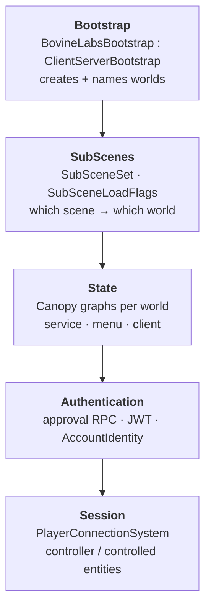
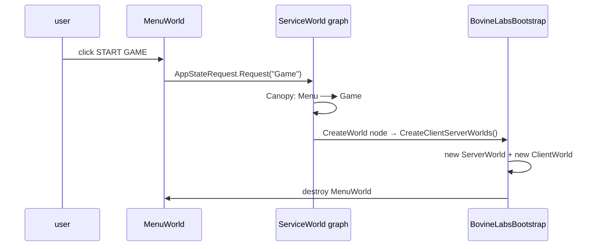
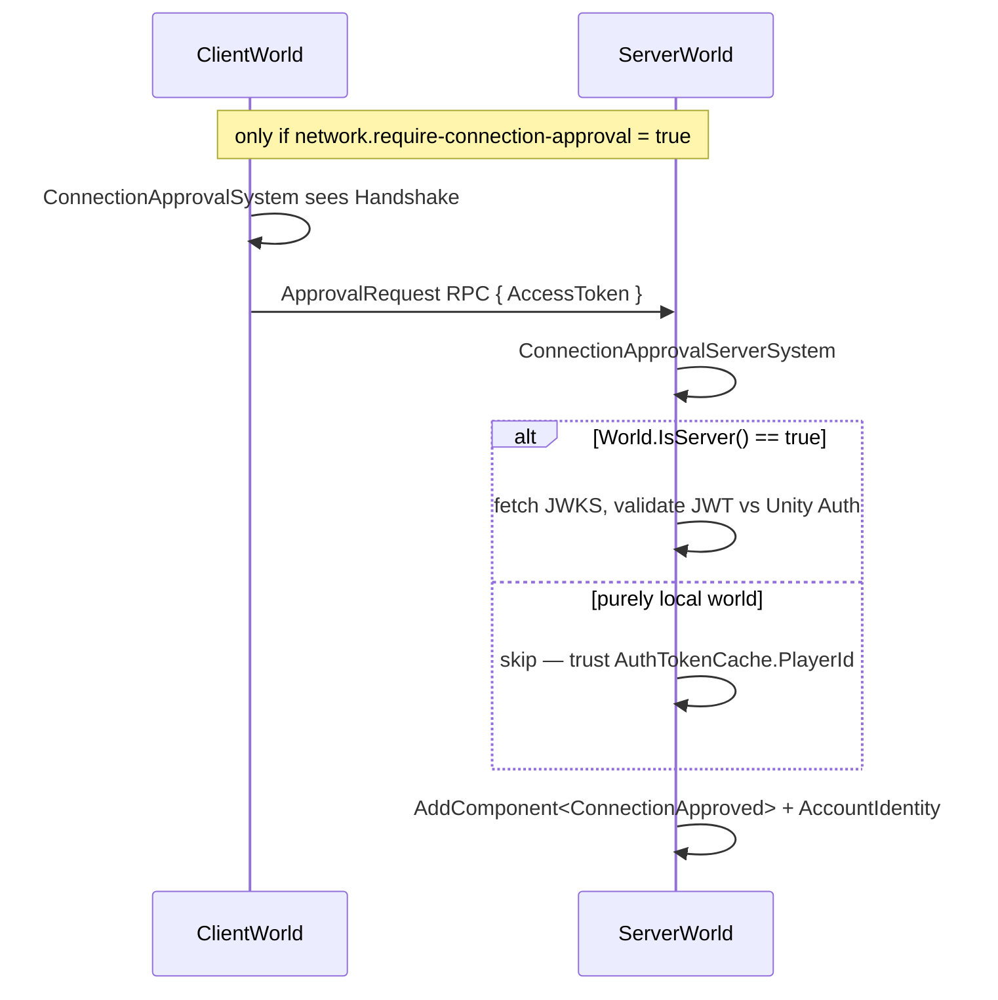
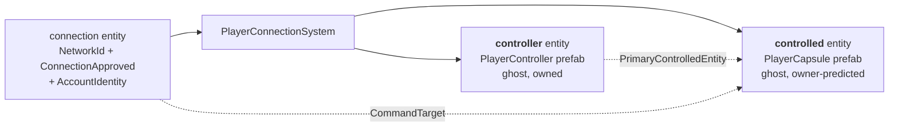

# 10 · Nerve: the game framework

Nerve is the layer that answers: *who creates the worlds, what loads into them, who is
allowed to connect, and what do they get to control?*

## Five subsystems



## 1 · Bootstrap

`BovineLabsBootstrap` implements `ICustomBootstrap`. It creates `ServiceWorld` at startup and
exposes `CreateClientServerWorlds()` — which the **service graph's `CreateWorld` node** calls
when you press Start Game.



> **💀 Trap** — `RequestedPlayType` defaults to `ClientAndServer`. In a Multiplayer Play Mode
> *virtual player* that means it builds a **second ServerWorld**, which tries to bind
> `127.0.0.1:7979`, which is already taken. Chapter 23 is entirely about this.

## 2 · SubScenes — content routing

```csharp
[Flags] public enum SubSceneLoadFlags : byte
{
    Game = 1<<0, Service = 1<<1, Client = 1<<2, Server = 1<<3, ThinClient = 1<<4, Menu = 1<<5,
}
```

A `SubSceneSet` says *these scenes* load into *worlds matching these flags*:

| Set | Target | Scenes |
|---|---|---|
| RequiredService | Service | `Service.unity` |
| RequiredMenu | Menu | `Menu.unity` |
| RequiredGame | Game | `Game`, `Client`, `Server` |
| **RequiredClient** | **Client** | `Game`, **`Client`** |
| RequiredServer | Server | `Game`, `Server` |

This is the mechanism that puts our `ClientStateSettings` in the client world: it is on
`ClientSettings.prefab`, instantiated in `Client.unity`, which `RequiredClient` loads into
anything flagged Client. Trace it backwards from a missing entity and you will land here.

## 3 · State — chapter 09, applied

Each world gets a `NerveGraphSettings` subclass carrying a graph asset:

| Class | `[SettingsWorld]` | Graph | Extension |
|---|---|---|---|
| `ServiceStateSettings` | `service` | `ServiceAppLoop` | `.snerve` |
| `MenuStateSettings` | `menu` | `MenuFlow` | `.mnerve` |
| **`ClientStateSettings`** *(ours)* | `client` | `ClientFlow` | `.cnerve` |

Three graph types, three importers, three `[MenuItem]`s — `ClientNerveGraph` shipped with
Nerve all along. The sample just never authored a `.cnerve`.

## 4 · Authentication — and the hole we found



With approval **off** (the default) *both* systems call `state.Enabled = false` in `OnCreate`.
Nothing ever adds `ConnectionApproved`. And `PlayerConnectionSystem` only spawns for
connections that have it. So on a default project, **no player ever spawns**, silently.

Turning approval on is not free either: our topology is a separate `ClientWorld` +
`ServerWorld`, and `World.IsServer()` is `true` for that ServerWorld, so it takes the real
JWT branch and calls out to `player-auth.services.api.unity.com`.

Our `LocalApproveConnectionSystem` fills the gap — trivially approving with
`AccountIdentity = "local-{networkId}"`. It is labelled a hack in its own doc comment
because it *is* one, and the comment says exactly when to delete it.

## 5 · Session — who controls what



Two entities per player, not one. The **controller** is the persistent identity (survives
respawn); the **controlled** is the current pawn. `CommandTarget` on the connection points at
whatever entity should receive this player's input.

That is why our two-player run shows **4 ghosts**: 2 controllers + 2 capsules. If you ever
see 3, two clients adopted the same controller — an identity collision.

> **🔬 Probe** — count them per world:
> ```csharp
> em.CreateEntityQuery(ComponentType.ReadOnly<GhostInstance>()).CalculateEntityCount()
> ```

→ [11 · Anchor and the UI layer](11-anchor-ui.md)
