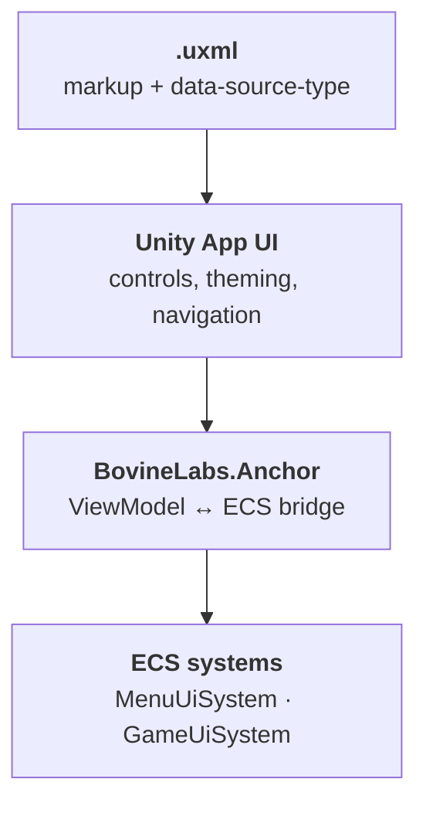
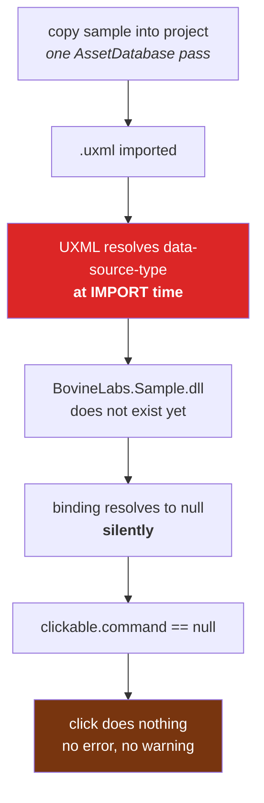
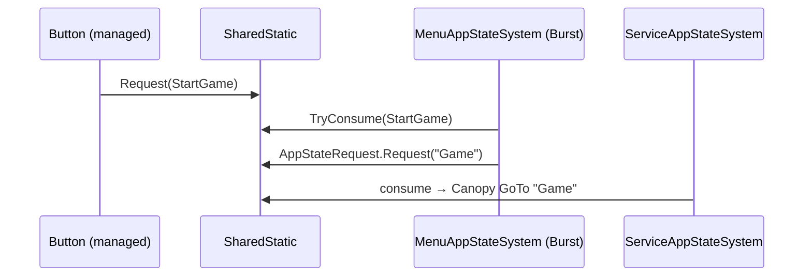

# 11 · Anchor and the UI layer

UI is where a DOTS project gets awkward: UI Toolkit is managed, event-driven, and
allocation-happy; ECS is none of those. Anchor is the negotiated peace treaty.

## The stack



- **App UI** gives you the widget set and a navigation stack (`AnchorSettings.StartDestination`
  is `"splash"` in our sample).
- **Anchor** gives you `ViewModel` objects that a UXML binding can read and an ECS system can
  write, plus the `UXMLService` that resolves types at import.

## The trap that cost us an evening

Buttons rendered. Buttons highlighted on hover. Buttons did **nothing** when clicked.

The chain:



> **💀 THE TRAP** — `data-source-type` in UXML is resolved **when the asset is imported**,
> not when the panel is built. If the assembly containing that type has not been compiled
> yet, the reference is silently dropped and never retried.

The fix is one line, and it is worth memorising:

```csharp
AssetDatabase.ImportAsset(uxmlPath, ImportAssetOptions.ForceUpdate);
```

Force-reimport the `.uxml` **after** scripts compile. Any time you add UXML and C# in the
same operation, you owe yourself this.

### The wrong diagnosis I made first

I inspected `button.dataSource` at runtime, found `null`, and declared that the proof.
It was not: `dataSource` **inherits down the visual tree**, and reading it on a leaf does not
report the inherited value. The real evidence was `clickable.command == null`.

The lesson generalises past UI: *a null read is only evidence if you know the read is
authoritative.* In a stack with inheritance, resolution order, or lazy binding, it usually
is not.

## How UI reaches ECS

Two SharedStatics, and that is the entire API surface:

```csharp
SampleUiActionRequest.Request(SampleUiAction.StartGame);   // UI → ECS
AppStateRequest.Request(AppStateIds.Game);                 // world → service world
```



> **⚡ Hardware analogy** — a **doorbell register**. The managed side writes a bit; the fast
> side polls and clears it. No allocation, no callback across the Burst boundary, no
> ownership question.

This is exactly how we drove the game from the CLI during testing:

```csharp
BovineLabs.Sample.SampleUiActionRequest.Request(BovineLabs.Sample.SampleUiAction.StartGame);
```

One `eval` call, no mouse. Because the UI is just a writer to a register, anything can be
that writer.

## Practical rules

1. **Never** put game logic in a UI callback. Write a request; let a system act.
2. If a binding looks broken, suspect **import order** before you suspect the binding.
3. `[SettingsWorld]`-style world targeting applies to UI too — the menu UI lives in the menu
   world and dies with it.
4. Prefer one `SharedStatic` request struct per direction over a growing event bus. It stays
   greppable.

→ [12 · From editor node to runtime bytes](12-authoring-to-blob.md)
