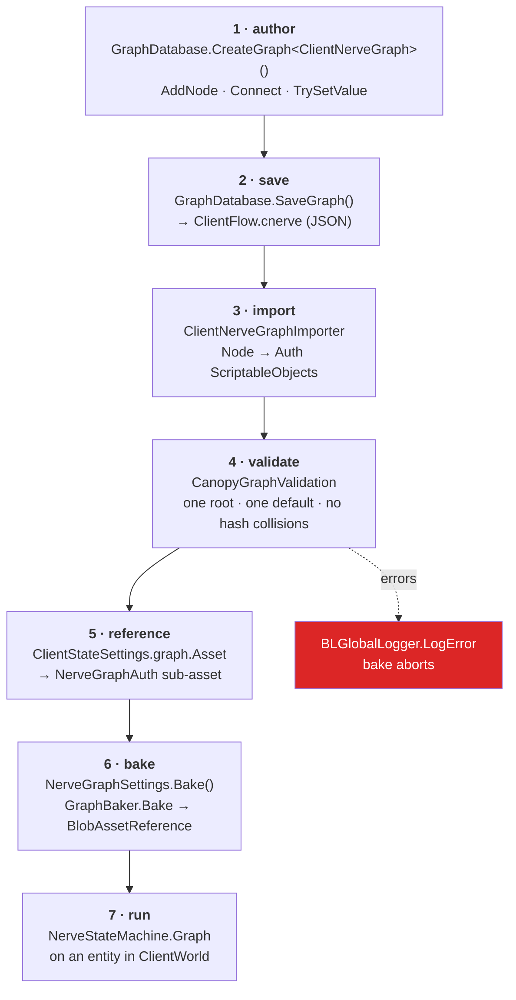

# 12 · From editor node to runtime bytes

The full toolchain, end to end. This is the chapter to re-read when a graph "doesn't do
anything" — because the answer is always *which stage did it die at*.

## The pipeline



## Stage by stage, with the failure signature

### 1–2 · Author and save

```csharp
var graph = GraphDatabase.CreateGraph<ClientNerveGraph>("Assets/Settings/Graphs/ClientFlow.cnerve");
var root  = new CanopyStateNode { Position = new Vector2(80, 260) };
graph.AddNode(root);
root.GetNodeOptionByName(CanopyStateNode.StateIdOption).TrySetValue("root");
graph.Connect(root.ChildrenOutputPort, connecting.ParentInputPort);
GraphDatabase.SaveGraph(graph);
```

Doing this **in code** rather than by hand in the graph window is the difference between a
reproducible project and an artifact nobody dares regenerate. Nerve's own sample builds its
graphs this way; so does ours (`Assets/Editor/ClientGraphSetup.cs`).

**Failure signature:** `TrySetValue` returns `false` → you used the wrong option name. Our
helper throws and prints every available option, which turns a 20-minute hunt into a
one-line message.

### 3 · Import — the extension is the type

| Extension | Graph class | Nodes available |
|---|---|---|
| `.snerve` | `ServiceNerveGraph` | service nodes + Startup Gate |
| `.mnerve` | `MenuNerveGraph` | menu nodes |
| `.cnerve` | `ClientNerveGraph` | client nodes + Startup Gate |

`[UseWithGraph(typeof(ClientNerveGraph))]` on a node is the gate. Put a `ClientGoInGameNode`
in a `.snerve` and the toolkit will not offer it.

**Failure signature:** graph asset imports but `AssetDatabase.LoadAssetAtPath<NerveGraphAuth>`
returns `null` → the importer did not run, usually a stale `Library/`.

### 4 · Validate

Runs on every graph change *and* at bake. Our setup script re-checks explicitly and throws,
so a broken graph fails at build time rather than as a silent no-op at runtime.

### 5 · Reference

```yaml
graph:
  Asset: {fileID: 9196009390298549883, guid: a6c03d8d85d7223d19c4cfb099a46b21, type: 3}
```

Note `fileID: 9196009390298549883` — the `NerveGraphAuth` is a **sub-asset** inside the
`.cnerve` file, not the file itself. Both the guid and the fileID must be right.

**Failure signature:** `'X' is missing a Nerve graph.` at bake.

### 6 · Bake

```csharp
public override void Bake(Baker<SettingsAuthoring> baker)
{
    var entity = baker.GetEntity(TransformUsageFlags.None);
    baker.DependsOn(graphAsset);                 // ← re-bake when the graph changes
    baker.AddComponent<NerveStateMachine>(entity);
    GraphBaker.Bake<NerveStateMachine>(baker, entity, graphAsset, variants, instanceValues);
}
```

`baker.DependsOn` is what makes editing the graph re-bake the subscene. Omit it and you
edit a graph, see no change, and lose an hour.

**Failure signature:** graph edits have no runtime effect → missing `DependsOn`, or the
subscene did not re-import.

### 7 · Run

The entity now carries `NerveStateMachine { Graph, StateId }` and a `DynamicBuffer<GroveState>`.
The executor's query is `WithAllRW<GroveState>().WithAllRW<NerveStateMachine>()` — if either
is missing, the system finds nothing and does nothing, quietly.

## The debugging ladder

When a graph does nothing, walk **down** this list; the first `no` is your bug.

| # | Question | Check |
|---|---|---|
| 1 | Does the `.cnerve` file exist? | `ls Assets/Settings/Graphs/` |
| 2 | Did it import to `NerveGraphAuth`? | `AssetDatabase.LoadAssetAtPath<NerveGraphAuth>(path)` |
| 3 | Any validation errors? | `graph.GetValidationErrors()` |
| 4 | Does the settings asset reference it? | grep the `.asset` for `Asset:` |
| 5 | Is the settings asset on the right prefab? | grep the prefab's `settings:` array |
| 6 | Is the prefab in the right scene, in the right SubSceneSet? | `SceneSettings` |
| 7 | Did the entity appear? | query `NerveStateMachine` in that world |
| 8 | Is a system running the executor there? | `[WorldSystemFilter]` on your driver |

We used exactly this ladder to land the client graph, and steps 5–7 are where the two
non-obvious hops live.

> **🔬 Probe** — step 7, in play mode:
> ```csharp
> foreach (var w in World.All)
>   Debug.Log($"{w.Name}: {w.EntityManager.CreateEntityQuery(
>       ComponentType.ReadOnly<NerveStateMachine>()).CalculateEntityCount()}");
> ```

Part II done. You can now read every package in the stack. Time for the wire.

→ [13 · Network topology](13-topology.md)
