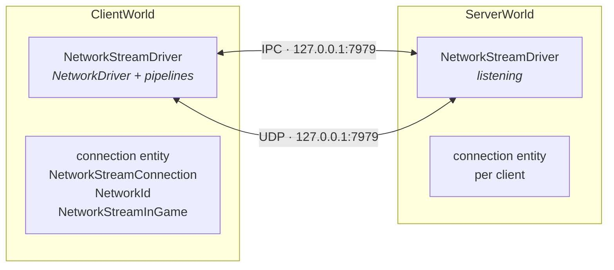
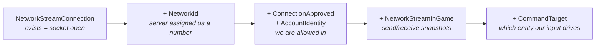

# 13 · Network topology

Forget "multiplayer" for a second. Look at what is physically there.

## Two worlds, one socket pair



Both drivers exist in the same process here. NetCode registers **two transports**:

| Transport | Used when | Cost |
|---|---|---|
| **IPC** | client and server in the same process | memcpy, no kernel |
| **UDP** | anything else, including MPPM virtual players | real socket |

Our host's own client uses IPC; the second Play Mode player uses UDP to loopback. That is
why the Play Mode Tools window shows both endpoints on the server row.

## The connection entity is the whole API

There is no `Connection` class. A connection is an **entity**, and its component set *is* its
state machine:



Read that chain as a checklist. Every "player doesn't spawn" bug is one of those components
missing, and the ladder in chapter 19 walks it.

> **💀 Trap** — **no ghosts are sent until `NetworkStreamInGame` exists on the connection.**
> Not "fewer". None. It is the single flag that arms the whole snapshot system, and it is
> why chapter 21's client graph matters so much.

## Pipelines: the QoS layer

The transport composes **pipeline stages** per channel:

| Stage | Gives you |
|---|---|
| `NullPipelineStage` | raw unreliable |
| `ReliableSequencedPipelineStage` | ack/retransmit, in-order — used for RPCs |
| `UnreliableSequencedPipelineStage` | drop-old, in-order — used for snapshots |
| `FragmentationPipelineStage` | MTU splitting |
| `SimulatorPipelineStage` | injected latency/loss/jitter (editor emulation) |

> **⚡ Hardware analogy** — a **protocol stack assembled from composable shift registers**.
> Each stage owns a slice of per-connection state and hands a buffer to the next.

Snapshots are deliberately *unreliable*: a lost snapshot is not worth retransmitting, because
the next one (20 ms later) already contains newer truth. Commands are the same. Only RPCs and
ghost spawn/despawn need reliability.

That single design decision is why NetCode tolerates packet loss gracefully and why you must
never assume a specific tick's data arrived.

## Connection events, not polling

```csharp
foreach (var evt in SystemAPI.GetSingleton<NetworkStreamDriver>().ConnectionEventsForTick)
{
    // evt.ConnectionEntity, evt.State, evt.DisconnectReason
}
```

`ConnectionEventsForTick` is a `NativeArray<NetCodeConnectionEvent>.ReadOnly` valid **for this
tick only**. `ConnectionState.State` walks
`Unknown → Connecting → Handshake → Approval → Connected → Disconnected`.

Nerve's `ClientConnectionTracker` consumes exactly this array and folds it into a durable
`ClientConnectionSnapshot` in graph state — because the events vanish next tick but the
conclusion ("we are disconnected, reason Timeout") must persist.

> **⚡ Hardware analogy** — the event array is a **status register you must read before the
> next clock edge**. The snapshot is the latch you copy it into.

## Play type and roles

`ClientServerBootstrap.RequestedPlayType` decides which worlds get built:

| PlayType | Builds |
|---|---|
| `ClientAndServer` | ClientWorld **and** ServerWorld |
| `Client` | ClientWorld only |
| `Server` | ServerWorld only |

With `com.unity.dedicated-server` installed, `UNITY_USE_MULTIPLAYER_ROLES` is defined and
**Multiplayer Roles override this per virtual player**. Chapter 23 shows why that is the
difference between a working second player and a port-bind crash.

> **🔬 Probe** — what the driver actually bound:
> ```csharp
> var d = SystemAPI.GetSingleton<NetworkStreamDriver>();
> // Play Mode Tools shows the same thing: [IPC:...] [UDP:...]
> ```

→ [14 · Ghosts: replicating state](14-ghosts.md)
