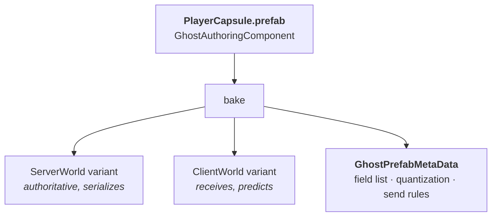
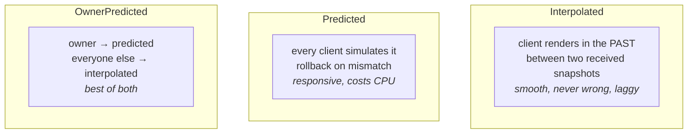
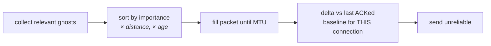

# 14 · Ghosts: replicating state

A **ghost** is an entity the server owns and mirrors to clients. Our capsule is one. So is
the controller.

## The prefab is the schema



`GhostAuthoringComponent` on the prefab produces a serialization **schema**: which
components, which fields, at what precision, with what change-detection. Baking generates
serializer code per ghost type — no reflection at runtime.

### Our capsule's settings

| Setting | Value | Meaning |
|---|---|---|
| `HasOwner` | ✅ | adds `GhostOwner { NetworkId }` |
| `SupportAutoCommandTarget` | ✅ | adds `AutoCommandTarget`, auto-routes input |
| `DefaultGhostMode` | **OwnerPredicted** | owner predicts; everyone else interpolates |

That third row is the whole design in one dropdown. Chapter 17 unpacks it.

## The three ghost modes



For a player capsule, `OwnerPredicted` is nearly always right: *you* need your own capsule to
respond in zero frames; you do not need someone else's to be frame-exact, you need it smooth.

## Snapshots: delta-compressed, importance-scheduled

Each server tick, per connection:



Three consequences you must internalise:

1. **A snapshot is not the whole world.** It is as much of it as fits in ~1200 bytes,
   prioritised. Low-importance ghosts update at a lower effective rate. This is a feature.
2. **Delta baselines are per connection.** The server remembers what each client has ACKed.
3. **Loss is normal.** The next snapshot re-bases automatically.

> **⚡ Hardware analogy** — importance scheduling is a **weighted round-robin arbiter on a
> fixed-width bus**. You do not get more bandwidth; you get to choose who wastes it.

## Quantization

Floats are sent as scaled integers:

```
Quantization = 1000  →  1.23456f  becomes  1235  (int)
```

Fewer bits on the wire, and — crucially — **quantized values compare equal more often**, so
delta compression finds more unchanged fields. Choose per field: position often 1000,
rotation 1000, a health value maybe 1.

> **💀 Trap** — quantization is a real precision loss, applied *before* the client compares
> predicted vs received. Set it too coarse and prediction will disagree with the server
> constantly, causing continuous micro-rollbacks that look like jitter. Set it too fine and
> you burn bandwidth. This is a tuning knob, not a formality.

## Relevancy

`GhostRelevancy` lets the server decide a ghost simply does not exist for a given connection —
interest management, fog of war, zoning. Nerve wraps this in a `RelevancySettings` asset,
which our project has registered on `ServerSettings.prefab`.

For two capsules on one map it does nothing. At 200 players it is the difference between
shipping and not.

## Spawning: three flavours

| Flavour | Who creates the client copy | Use |
|---|---|---|
| **Server-spawned** | client, on first snapshot | default |
| **Predicted spawn** | client immediately, matched to the server's later | projectiles |
| **Pre-spawned** | baked into the subscene on both sides | static level props |

Our capsules are server-spawned: `PlayerConnectionSystem` instantiates on the server, and the
client materialises them when the snapshot arrives. That is why `ghosts=2` appears in the
client world without the client ever calling `Instantiate`.

> **🔬 Probe** — see the schema Unity actually generated:
> ```
> Multiplayer → Ghost Snapshot Inspector   (in play mode)
> ```
> It shows per-ghost byte cost. If a ghost is unexpectedly expensive, a field you did not
> mean to replicate is in the schema.

→ [15 · The tick](15-the-tick.md)
