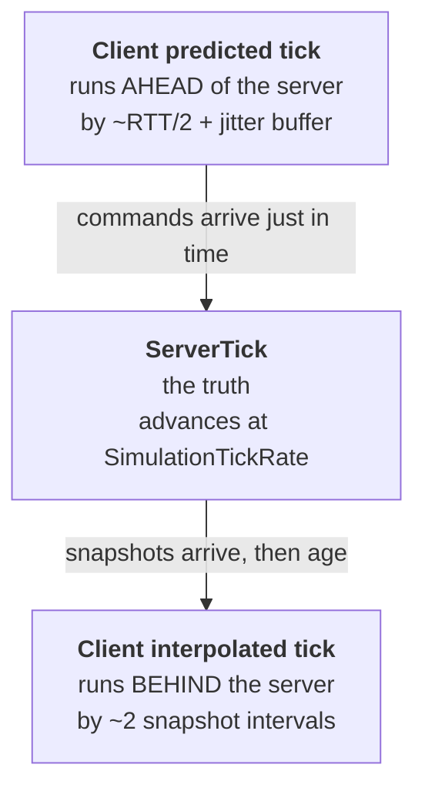
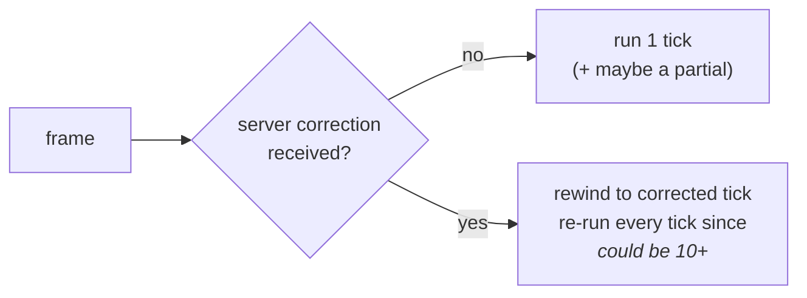

# 15 · The tick

Chapter 01 said the frame loop is a lousy clock. NetCode builds a good one on top of it.
This chapter is that clock.

## Two timebases

| | Frame | Tick |
|---|---|---|
| Rate | whatever the GPU allows | fixed, e.g. **60 Hz** |
| Delta | variable | constant `1/60` |
| Purpose | rendering | simulation + network |
| Per frame | 1 | **0, 1, or many** |

`SimulationTickRate` is authored in `ClientServerTickRate`. Everything on the wire is stamped
with a `NetworkTick` — a wrapping `uint`, so **never compare with `<`**. Use
`tick.IsNewerThan(other)`, which handles wraparound the way a sequence-number comparison must.

> **⚡ Hardware analogy** — `NetworkTick` is a **wrapping counter with a comparator that
> understands modular distance**. Exactly like TCP sequence numbers. Comparing raw values
> works for hours and then breaks once, catastrophically.

## Three clocks that must agree-ish



Read it as a timeline:

```
              interpolation delay          prediction lead
        ├──────────────────────────┤ ├────────────────────────┤
  ──────┴──────────────────────────┴─┴────────────────────────┴──────▶ time
     interp tick                 server tick              predicted tick
   (what you SEE of others)      (the truth)          (what you FEEL of yourself)
```

Three different "nows" on one screen simultaneously. Your capsule is drawn at the predicted
tick; the other player's capsule is drawn at the interpolated tick. That is not a bug —
that is the entire trade, made explicit.

## Why the client runs ahead

A command for tick `T` must be **in the server's hands before the server simulates `T`**. So
the client must generate it early — at least one-way latency plus jitter margin. NetCode
measures RTT continuously and adjusts the lead automatically. When the network worsens, the
client silently runs further ahead.

> **💀 Trap** — a command that arrives late is *dropped*, and the server extrapolates from the
> last input it has. That reads to the player as "my input was eaten". If you see this, look
> at the command age stats in Play Mode Tools before you look at your input code.

## Partial ticks

Render at 144 Hz with a 60 Hz simulation and most frames have no new tick. Rendering at the
last full tick would visibly stutter. So NetCode runs a **partial tick**: the prediction
group simulates a *fraction* of a tick purely for presentation, then throws it away and
re-runs the full tick when it truly arrives.

```csharp
var networkTime = SystemAPI.GetSingleton<NetworkTime>();
networkTime.IsFirstTimeFullyPredictingTick   // ← run one-shot effects HERE only
networkTime.IsPartialTick
networkTime.ServerTick
```

> **💀 Trap** — spawn a particle, play a sound, or increment a counter in the prediction
> group without checking `IsFirstTimeFullyPredictingTick` and it happens **several times per
> tick**. Every "my gun fires 3 bullets per trigger pull" bug is this.

Continuous integration (moving a transform) is safe in partial ticks. One-shot side effects
are not.

## The prediction group runs N times per frame



This is why `PredictedSimulationSystemGroup` is special and why chapter 17 exists.

## `SystemAPI.Time.DeltaTime` inside prediction

Inside the prediction group, the delta is the **tick delta**, not the frame delta. That is
why our movement code is correct without doing anything clever:

```csharp
var deltaTime = SystemAPI.Time.DeltaTime;   // one tick, every time, including during replay
transform.ValueRW.Position += move * (Speed * deltaTime);
```

If it used frame delta, a rollback replaying 10 ticks in one frame would move the capsule
10 frames' worth of distance. Determinism dies, and it dies *only under packet loss*, which
is the worst kind of bug to reproduce.

## The tick rate is a design decision

| Rate | Cost | Fits |
|---|---|---|
| 30 Hz | cheap | strategy, MMO |
| **60 Hz** | balanced | most action games — **ours** |
| 120 Hz+ | expensive | fighting, competitive FPS |

Higher tick rate = lower input latency, more CPU on the server, more bandwidth, and more
rollback work per correction. It multiplies through everything.

> **🔬 Probe** — read the live clock:
> ```csharp
> var t = SystemAPI.GetSingleton<NetworkTime>();
> Debug.Log($"server={t.ServerTick} partial={t.IsPartialTick} firstFull={t.IsFirstTimeFullyPredictingTick}");
> ```

→ [16 · Commands: input on the wire](16-commands.md)
