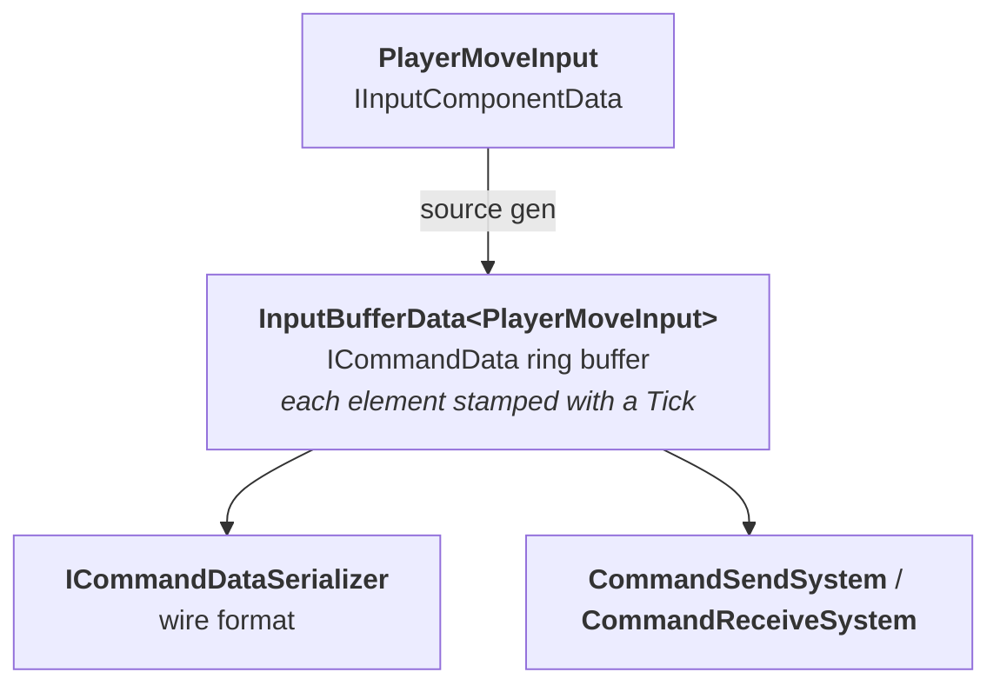
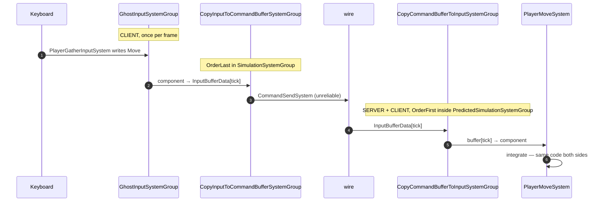

# 16 · Commands: input on the wire

The single most important sentence in this book:

> **Send intent, never results.**

Our component is four bytes and it is the whole protocol:

```csharp
public struct PlayerMoveInput : IInputComponentData
{
    public float2 Move;      // WASD direction. Not a position. Not a velocity. A direction.
}
```

If we sent `Position` instead, a modified client could write any position it liked and the
server would obey. That is client authority, and it is the hole every cheat engine walks
through. Unity's own prediction docs open by warning about it.

## What `IInputComponentData` generates for you



You write one struct; the generator produces the buffer type, the serializer, and the
send/receive systems. The buffer is a **ring of the last ~64 ticks**, not a single value —
because the server needs history, and because rollback needs to replay it.

> **⚡ Hardware analogy** — a **circular DMA buffer with a timestamp per slot**. The producer
> writes at the head; the consumer reads by timestamp, not by position.

## The four-stage relay



Stages 2 and 5 are the ones nobody expects, and they are why the design works:

| Group | Where | Job |
|---|---|---|
| `GhostInputSystemGroup` | client, `SimulationSystemGroup` | you write the component |
| `CopyInputToCommandBufferSystemGroup` | client, **OrderLast** | component → ring buffer slot for this tick |
| `CopyCommandBufferToInputSystemGroup` | **inside prediction**, **OrderFirst** | ring buffer slot for *the tick being simulated* → component |

Stage 5 is the magic. During a rollback replaying ticks 100–110, this group re-materialises
**the exact input from tick 100**, then 101, and so on. Your movement system reads
`PlayerMoveInput` and never knows it is in a replay.

## Gathering input correctly

```csharp
[UpdateInGroup(typeof(GhostInputSystemGroup))]
[WorldSystemFilter(WorldSystemFilterFlags.ClientSimulation)]
public partial struct PlayerGatherInputSystem : ISystem
{
    public void OnUpdate(ref SystemState state)   // ← no [BurstCompile]: Keyboard is managed
    {
        var kb = Keyboard.current;
        if (kb == null) return;

        var move = new float2(
            (kb.dKey.isPressed ? 1 : 0) - (kb.aKey.isPressed ? 1 : 0),
            (kb.wKey.isPressed ? 1 : 0) - (kb.sKey.isPressed ? 1 : 0));

        foreach (var input in SystemAPI.Query<RefRW<PlayerMoveInput>>()
                                       .WithAll<GhostOwnerIsLocal>())     // ← only MY capsule
        {
            input.ValueRW.Move = move;
        }
    }
}
```

Three details that are all load-bearing:

1. **`WithAll<GhostOwnerIsLocal>()`** — without it you would write input into every player's
   capsule in your world. NetCode adds this tag to ghosts whose `GhostOwner.NetworkId`
   matches yours.
2. **No `[BurstCompile]`** — `Keyboard.current` is managed. Correct, not a compromise.
3. **`ClientSimulation` only** — the server must never invent input.

## Routing: which entity gets my commands?

Two mechanisms, and you want the first:

| Mechanism | How |
|---|---|
| **`AutoCommandTarget`** | on the ghost prefab + `SupportAutoCommandTarget`; NetCode routes automatically to ghosts you own |
| **`CommandTarget`** | on the connection entity, pointing at one specific entity; manual |

Our capsule uses `AutoCommandTarget`. Nerve *also* sets `CommandTarget` on the connection via
`PlayerConnectionSystem`, because Nerve supports controlling different pawns over time.

> **💀 Trap** — if input reaches the client's own capsule but the server never moves,
> suspect routing first. The client is happily predicting with input the server has no
> reason to associate with that entity.

## Redundancy for free

Each command packet contains **the last few ticks of input**, not just one. Lose a packet and
the next one still carries the missing tick. This is why unreliable transport is acceptable
for input: the redundancy is in the payload, not the protocol.

> **🔬 Probe** — Play Mode Tools shows command age and how many commands the server is
> holding. A steadily growing age means the client's prediction lead is drifting.

→ [17 · Prediction and rollback](17-prediction.md)
