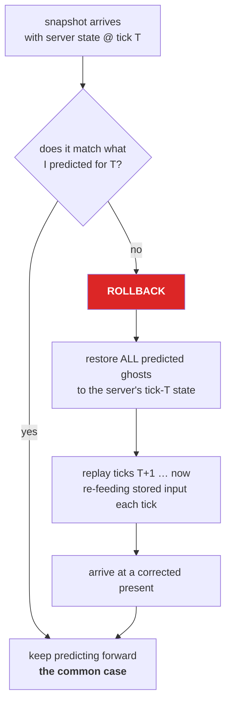

# 17 · Prediction and rollback

This is the heart of the machine, and you have built it before — in silicon.

> **⚡ Hardware analogy** — a **branch predictor with speculative execution and a pipeline
> flush.** The client speculates forward on predicted input. The server is the branch
> resolution unit. On a mispredict, you flush and replay from the checkpoint. Same
> structure, same costs, same failure modes.

## The problem

Round trip is 50 ms. If the client waited for the server to confirm every step, pressing W
would move your capsule 50 ms later. Unplayable.

So the client **does not wait**. It applies your input immediately, assuming the server will
agree. Usually it does.

## The loop



Every step of that replay runs **your systems**, with the input from the command ring buffer
for that exact tick. Which is why chapter 16's stage 5 exists.

## `Simulate`: the one bit that makes it work

`Simulate` is an **enableable tag component**. Before each tick of the prediction loop,
NetCode enables it on exactly the ghosts that should simulate *that* tick and disables it on
the rest.

```csharp
foreach (var (input, transform) in
         SystemAPI.Query<RefRO<PlayerMoveInput>, RefRW<LocalTransform>>()
                  .WithAll<Simulate, GhostOwner>())      // ← Simulate is NOT optional
{
    transform.ValueRW.Position += move * (Speed * deltaTime);
}
```

> **💀 THE TRAP** — omit `WithAll<Simulate>()` and your system integrates **every predicted
> entity on every iteration of the rollback loop**. Replaying 10 ticks moves the capsule 10×
> too far. It looks fine on a perfect connection and disintegrates the moment a packet drops.
> This is the single most common NetCode bug, and it only appears under exactly the
> conditions that are hardest to reproduce.

Think of `Simulate` as the **clock-enable line** on a register. The clock is running; the
enable decides who latches this edge.

## Why our movement system is written the way it is

```csharp
[BurstCompile]
[WorldSystemFilter(WorldSystemFilterFlags.ClientSimulation | WorldSystemFilterFlags.ServerSimulation)]
[UpdateInGroup(typeof(PredictedSimulationSystemGroup))]
public partial struct PlayerMoveSystem : ISystem
```

Line by line:

| Line | Why |
|---|---|
| `ClientSimulation \| ServerSimulation` | **the same code must run on both sides.** Two implementations = two behaviours = permanent desync. |
| `PredictedSimulationSystemGroup` | so it participates in rollback and gets tick delta |
| `WithAll<Simulate>` | the clock enable |
| `WithAll<GhostOwner>` | only player-owned things |
| reads `PlayerMoveInput` | intent, re-materialised per replayed tick |

There is no client version and no server version. One rule, executed twice. That is what
"server-authoritative with client prediction" actually means in code.

## What must be predicted-safe

Anything inside the prediction group can run many times for the same tick. Therefore:

| Safe | Unsafe |
|---|---|
| Integrating a transform | Spawning a particle |
| Reading input | Playing a sound |
| Applying forces | Incrementing a score |
| Anything idempotent per tick | Anything with an external side effect |

For the unsafe ones, gate on:

```csharp
if (!SystemAPI.GetSingleton<NetworkTime>().IsFirstTimeFullyPredictingTick) return;
```

## `PredictedGhost`

Every predicted ghost carries `PredictedGhost { AppliedTick, PredictionStartTick }`. It tells
you *which* server tick the current state was last corrected from. Useful for debugging: if
`AppliedTick` is far behind `ServerTick`, this ghost has not been corrected in a while.

## Why rollbacks happen at all

Even with identical code:

- **Quantization.** The server's float, quantized and dequantized, is not bit-identical.
- **Input timing.** A command arriving one tick late changes the server's simulation.
- **Other players.** You cannot predict what someone else pressed. Their capsule affects
  yours; your prediction of the shared world was wrong.
- **Server-only events.** A pickup despawning, a door opening.

Small rollbacks every few seconds are **normal and healthy**. Continuous large rollbacks mean
your prediction is genuinely diverging — look at floating-point non-determinism, at
uninitialised state, and at systems missing `Simulate`.

## The cost

Rollback cost = (ticks to replay) × (cost of your predicted systems). A 200 ms spike at 60 Hz
is 12 replayed ticks in one frame. If your predicted simulation costs 2 ms, that frame costs
24 ms and you drop it.

> **⚡ Hardware analogy** — deeper pipeline, more expensive flush. Same engineering answer:
> keep the predicted set small, keep predicted systems cheap, and do not predict what does
> not need to feel instant.

> **🔬 Probe** — Play Mode Tools → prediction stats shows ticks-per-frame. Sustained values
> above 1 mean you are replaying constantly.

→ [18 · Interpolation](18-interpolation.md)
