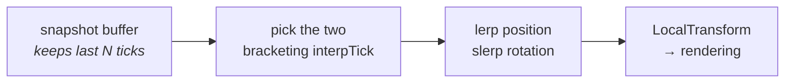

# 18 · Interpolation

Prediction is for the entity you control. Interpolation is for everything else — and it is
the cheaper, calmer half of the system.

## The idea

Snapshots arrive every ~50 ms (20 Hz send rate is common) while you render every ~7 ms. You
cannot show the newest snapshot the instant it arrives; you would get a slideshow with
teleports.

So the client renders **in the past**, between two snapshots it already has:

```
snapshots:     S(t=100)          S(t=150)          S(t=200)
                  │                 │                 │
                  ▼                 ▼                 ▼
  ────────────────●─────────────────●─────────────────●──────▶ server time
                        ▲
                        │
              render here (t=125)
              ← interpolation delay ≈ 2 snapshot intervals →
```

Always between two known-good points. Never extrapolating. Never guessing.



## Prediction vs interpolation, side by side

| | Predicted | Interpolated |
|---|---|---|
| Shows | the future (~RTT/2 ahead) | the past (~2 snapshots behind) |
| Correctness | speculative, corrected | always between real data |
| Feel | zero input latency | smooth, slightly stale |
| Cost | CPU: replay on mismatch | almost none |
| Reacts to your input | ✅ | ❌ |
| Used for | your capsule | the other player's capsule |

In our game both are on screen at once. Your capsule is drawn ~25 ms ahead of the server; the
other player's is drawn ~100 ms behind. Neither of you sees "now". Nobody ever does.

> **⚡ Hardware analogy** — an **elastic buffer between two clock domains**. You accept
> latency to absorb jitter. Make it too small and you underrun (visible stutter); too large
> and you add pointless lag. Same knob, same trade, same tuning instinct.

## `GhostImportance` and the interpolation buffer

The buffer must hold enough history to bracket the interpolation tick even when packets drop.
NetCode sizes it from the tick rate and observed jitter. If a ghost's data is missing for the
bracketing ticks, the client holds the last known value — which reads as a brief freeze
rather than a teleport. That is the correct failure mode.

## Why not just predict everything?

You can. `DefaultGhostMode = Predicted` on every ghost, and every client simulates the whole
world. Fighting games and some shooters do this.

The bill:

- Every ghost replays on every rollback. Cost scales with **predicted entities × replayed
  ticks**.
- Every predicted entity must be deterministic across machines.
- Physics, if predicted, must be deterministic — which is a large commitment.

`OwnerPredicted` says: pay that price for exactly the one entity where latency is
unacceptable, and take the cheap smooth path for everything else. For a capsule game it is
free correctness.

For the full decision — real defaults, the cost table, and the contagion rule that decides how
big your predicted set really is — see [41 · Clock domains](41-clock-domains.md).

## Smoothing the correction

When a rollback moves your predicted capsule, snapping is visible. NetCode can blend the
visual position toward the corrected one over a few frames
(`GhostPredictionSmoothing` / `SmoothingAction`).

> **💀 Trap** — smoothing operates on the *rendered* transform, not the simulated one. Never
> read a smoothed value back into simulation, or you have built a feedback loop between
> presentation and truth. Presentation reads from simulation. Never the reverse.

## What to check when the other capsule looks wrong

| Symptom | Likely cause |
|---|---|
| Teleports | interpolation buffer underrun — packet loss or too-small delay |
| Rubber-bands | ghost is Predicted but not deterministic |
| Smooth but very late | interpolation delay too large for your tick/send rate |
| Frozen, then jumps | ghost fell out of relevancy, then came back |

> **🔬 Probe** — Ghost Snapshot Inspector shows arrival timing per ghost. Irregular arrival
> with regular sends means the problem is the wire, not your code.

Part III done. You now know the wire. Time to trace one keypress all the way through it.

→ [19 · Connection lifecycle](19-connection-lifecycle.md)
