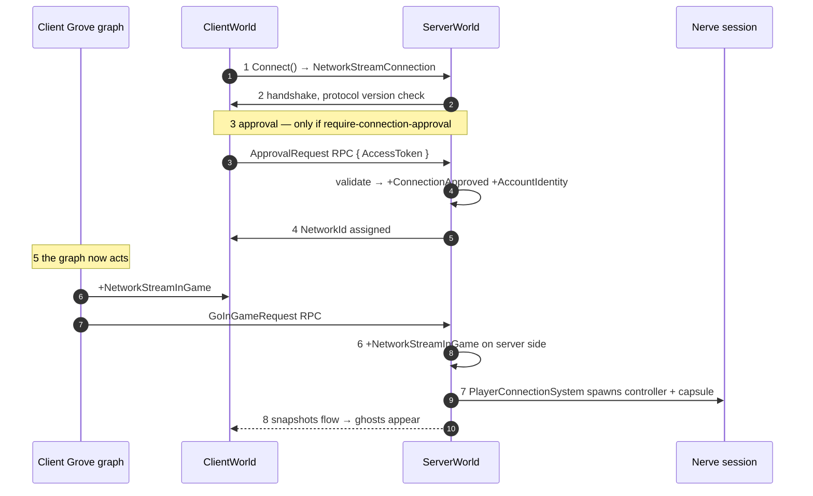
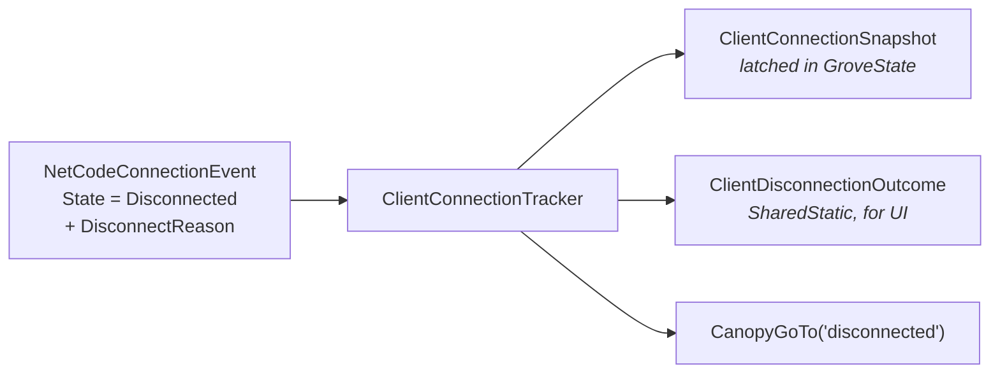

# 19 · Connection lifecycle

Eight steps from "socket" to "I can move my capsule". Learn this chain and you can diagnose
any join failure in about ninety seconds.

## The chain



## Step by step, with the exact failure

| # | Step | Evidence it happened | If it didn't |
|---|---|---|---|
| 1 | Socket | `NetworkStreamConnection` exists | wrong port/address; server not listening |
| 2 | Handshake | connection event → `Handshake` | **protocol version mismatch** — different ghost schemas |
| 3 | Approval | `ConnectionApproved` + `AccountIdentity` | approval disabled → nothing ever adds them |
| 4 | NetworkId | `NetworkId` component | server rejected or is full |
| 5 | Client go-in-game | `NetworkStreamInGame` on client | **nothing sent the request** |
| 6 | Server go-in-game | `NetworkStreamInGame` on server | RPC lost or handler missing |
| 7 | Spawn | ghost entities in ServerWorld | query preconditions unmet |
| 8 | Replicate | ghosts in ClientWorld | not in game; or relevancy excluded them |

> **🔬 Probe** — this one command answers "where did it stop":
> ```csharp
> foreach (var w in World.All) {
>   var em = w.EntityManager;
>   var conn   = em.CreateEntityQuery(ComponentType.ReadOnly<NetworkStreamConnection>());
>   var inGame = em.CreateEntityQuery(ComponentType.ReadOnly<NetworkStreamConnection>(),
>                                     ComponentType.ReadOnly<NetworkStreamInGame>());
>   var ghosts = em.CreateEntityQuery(ComponentType.ReadOnly<GhostInstance>());
>   Debug.Log($"{w.Name}: conns={conn.CalculateEntityCount()} " +
>             $"inGame={inGame.CalculateEntityCount()} ghosts={ghosts.CalculateEntityCount()}");
> }
> ```
> `conns=1 inGame=0` → step 5 or 6. `inGame=1 ghosts=0` → step 7.

## The two gaps we actually hit

### Gap A — step 3, approval

Both approval systems disable themselves when
`network.require-connection-approval` is false, which is the default:

```csharp
if (!BovineLabsBootstrap.RequireConnectionApproval.Data) { state.Enabled = false; return; }
```

So on a stock project nothing ever adds `ConnectionApproved`, and `PlayerConnectionSystem`
requires it. **No player ever spawns, and nothing is logged.**

Turning approval on is not a free switch either: `ConnectionApprovalServerSystem` only skips
JWT validation when `World.IsServer()` is false — a purely local world. A separate
`ServerWorld` in one process *is* a server world, so it takes the real branch and calls Unity
Authentication over the network.

Our `LocalApproveConnectionSystem` fills the gap with `AccountIdentity = "local-{networkId}"`,
labelled as a hack in its own doc comment, with the delete condition written down.

### Gap B — step 5, go-in-game

`NetworkStreamInGame` is the flag that arms the entire snapshot system. Nerve sends the
request from a node — `BovineLabs.Nerve.State/States/Client/GoInGame.cs` — that runs inside a
**client Grove graph**. The sample ships a service graph and a menu graph. It ships **no
client graph**. So the node existed and never executed.

That is chapter 21.

## Disconnection



`DisconnectReason` tells you which. The common ones: `Timeout`, `ClosedByRemote`, `ConnectionClose`,
`MaxConnectionAttempts`, `ApprovalFailure`, `ProtocolError`.

There are **eleven** values in `NetworkStreamDisconnectReason`, not the six named above — read the
enum at `Runtime/Connection/NetworkStreamConnectionComponent.cs:199` rather than trusting any list,
including this one.

Nerve draws one more distinction worth stealing: a disconnect is **voluntary** only if it is
`ConnectionClose` *and* you had already entered the game. Quitting looks different from
being kicked at the door, and the UI should say different things.

> **📐 Why that test cannot be fooled.** `NetworkStreamRequestDisconnect` has a `Reason` field, and
> **it never reaches the client** — the transport's disconnect carries no payload, so a kicked client
> always reads `ClosedByRemote` (`Runtime/NetworkStreamReceiveSystem.cs:846`). A kick therefore can
> never arrive looking like `ConnectionClose`, which is exactly why Nerve's voluntary test is safe.
> The guarantee is real; it just comes from the transport dropping the reason, not from the check
> being clever. Measured against a live kick in chapter 45.

> **💀 Trap** — connection events live for **one tick**. If you poll them from a system that
> does not run every tick, you will miss disconnects intermittently. Latch them into durable
> state the moment you see them — which is precisely what the tracker node does.

Refusing a connection, kicking one, and destroying what a departed player leaves behind are
[chapter 45](45-session-control.md).

→ [20 · Keypress to pixel](20-keypress-to-pixel.md)
