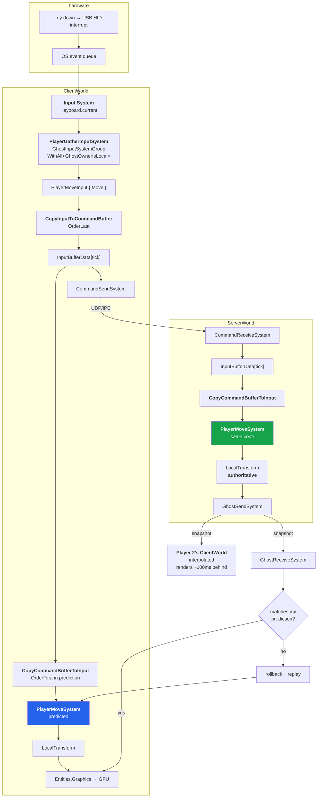

# 20 · Keypress to pixel

The full trace. One `W` press, two capsules, two screens. Every hop, in order.

This is the chapter the whole book exists for. If you can narrate this from memory, you are
done.

## The map



## The 18 hops, narrated

**Hardware → OS**
1. Key contact closes. Keyboard controller debounces, sends a HID report over USB.
2. Host controller raises an interrupt. Kernel HID driver decodes, queues an evdev event.
3. Display server delivers it to the focused window. Unity's message pump drains it.

**Client, before the tick**

4. **Input System** updates `Keyboard.current`. This is managed memory.
5. `PlayerGatherInputSystem` runs in `GhostInputSystemGroup`. Not bursted — it touches
   managed input. It filters `WithAll<GhostOwnerIsLocal>()` so it writes only *your* capsule's
   `PlayerMoveInput`.
6. `PlayerMoveInput.Move` = `(1, 0)` for W. **Intent. Four bytes. Not a position.**

**Client, command buffer**

7. `CopyInputToCommandBufferSystemGroup` (OrderLast) copies the component into
   `InputBufferData<PlayerMoveInput>[currentTick]` — a ring slot stamped with the tick.
8. `CommandSendSystem` serialises the last few ticks (built-in redundancy) and sends
   unreliably.

**Client, prediction — the same frame**

9. `CopyCommandBufferToInputSystemGroup` (OrderFirst inside
   `PredictedSimulationSystemGroup`) reads the ring slot **for the tick being simulated** back
   into the component.
10. `PlayerMoveSystem` runs with `WithAll<Simulate, GhostOwner>()`. `Simulate` is the
    clock-enable. Delta is one tick.
11. `LocalTransform.Position += (1,0,0)·Speed·dt`. Your capsule has already moved — **zero
    frames after the keypress**.

**Wire → server**

12. Packet crosses IPC or loopback UDP. `CommandReceiveSystem` writes into the server's own
    `InputBufferData` ring for that ghost.

**Server, authority**

13. Server reaches that tick. `CopyCommandBufferToInputSystemGroup` materialises the input.
14. **The same `PlayerMoveSystem`** — one `[WorldSystemFilter]` covering both worlds — runs.
    Same constant, same delta, same maths.
15. Server's `LocalTransform` is now the truth. If the client had lied, it would not matter:
    the server never received a position, only a direction.

**Server → everyone**

16. `GhostSendSystem` collects, prioritises, delta-compresses against each connection's ACKed
    baseline, and sends.

**Back at your client**

17. `GhostReceiveSystem` compares the received state for tick T with what you predicted for T.
    Match → nothing happens. Mismatch → restore and replay ticks T+1..now, re-feeding stored
    input each tick. You never see it.

**At Player 2's client**

18. Same snapshot arrives. Their copy of your capsule is **interpolated** — drawn between two
    received snapshots, roughly 100 ms behind the server. Smooth, slightly stale, never wrong.

**To the screen**

19. `Entities.Graphics` uploads `LocalToWorld` matrices to GPU buffers, issues batched draws.
    URP renders. Present blocks on vsync. Photons.

## The three "nows" on one screen

```
Player 1's screen at wall-clock T:
  ├─ own capsule      → predicted tick    ≈ T + 25 ms   (ahead)
  ├─ Player 2 capsule → interpolated tick ≈ T − 100 ms  (behind)
  └─ server truth     → somewhere between, and nobody renders it
```

Both players see a different world, and both are correct. Server-authoritative multiplayer is
the engineering discipline of making that disagreement invisible.

## Where each bug class lives

| Symptom | Hop | First check |
|---|---|---|
| Nothing moves at all | 5–6 | is `PlayerMoveInput` on the entity? (missing script / bake) |
| Moves on my screen, not on theirs | 12–14 | is the server receiving commands? `CommandTarget` / `AutoCommandTarget` |
| Moves way too far | 10 | missing `WithAll<Simulate>()` |
| Constant rubber-banding | 17 | client and server maths differ, or quantization too coarse |
| Other capsule teleports | 18 | interpolation buffer underrun |
| Capsule never appears | — | chapter 19's ladder, steps 5–7 |

> **🔬 Probe** — the one-liner that separates the first three rows:
> ```csharp
> // in ClientWorld and ServerWorld, per tick
> Debug.Log($"{world.Name} move={input.Move} pos={transform.Position}");
> ```
> If client `move` is non-zero and server `move` is zero, it is hop 12–14. Every time.

→ [21 · The client graph we built](21-client-graph.md)
