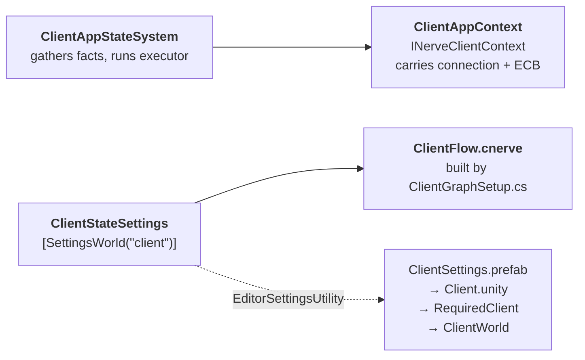

# 21 · The client graph

A worked example of the whole stack: Grove + Canopy + Nerve + settings routing, doing one
real job.

## The job

Something must add `NetworkStreamInGame` to the client's connection and send a
`GoInGameRequest` RPC. Without it, zero snapshots flow (chapter 13).

Nerve already ships the node that does this. It just never runs, because running it requires
a client graph and the sample authors none.

## The shape — and why it cannot be simpler

```mermaid
stateDiagram-v2
    [*] --> root
    state root {
        [*] --> connecting
        connecting --> gameplay : gate completes
        connecting --> disconnected : terminal event
        gameplay --> disconnected : terminal event
    }
    note right of root
        block: Client Connection Tracker
        → "disconnected"
        runs every tick, in every child
    end note
    note right of connecting
        block: Initialize
        └─exec─▶ Startup Gate (target "gameplay")
                 └─ block: Client Go In Game
    end note
```

The chain `state → Initialize → Startup Gate → Client Go In Game` looks like ceremony. It is
not — the **types force it**:

| Node | Base type | Consequence |
|---|---|---|
| `ClientGoInGameNode` | `GroveBlockNode<…, ClientGoInGameData, InitializeState>` | needs an `InitializeState` context |
| | `[UseWithContext(typeof(StartupGateNode))]` | so it can only live in a Startup Gate |
| `StartupGateNode` | `GroveContextNode<…, StartupGateData, InitializeState>` | supplies `InitializeState`, has an exec input |
| `InitializeNode` | `CanopyBlockNode<InitializeAuth, InitializeData>` | the only block with an exec **output** |

So: a state can run a block; only `Initialize` can drive a context node; only `StartupGate`
provides `InitializeState`; only inside it can `ClientGoInGame` exist.

> **⚡ Hardware analogy** — this is **type-level pin compatibility**. You cannot plug a 3.3 V
> part into a 5 V header because the connector will not accept it. The graph editor enforces
> the same thing, at author time.

## What the gate does

```csharp
var initialize = new InitializeState { State = state, IsCompleted = true, Result = true };
foreach (block in data.Blocks) block.Execute(groveContext, ref context, ref initialize);

if (!initialize.IsCompleted) return;              // hold — not ready yet
CanopyGoTo.Execute(groveContext, ref context, data.Target);   // all done → jump
```

Every block AND-s into `IsCompleted`. The gate jumps only when all report done. It is a
**barrier with a target**, and it is reusable for any "wait for N things, then advance".

## What the node does

```csharp
if (!connection.IsKnown || !connection.HasNetworkId
    || connection.State == ConnectionState.State.Disconnected)
{
    state.IsCompleted = false;   // hold the gate
    return;
}

if (!connection.IsInGame)
{
    // send once per connection identity, remembered in GroveState
    if (!graphState.TryGetValue(requestedConnectionKey, out ClientConnectionIdentity requested)
        || requested != connection.Identity)
    {
        RequestGoInGame(ref context, connection);
        graphState.AddOrSet(requestedConnectionKey, connection.Identity);
    }
}

state.IsCompleted &= connection.IsInGame;
```

Three properties worth stealing:

1. **Idempotent by identity, not by boolean.** Keying on the connection identity means a
   reconnect with a new entity re-sends correctly, while a retry on the same connection does
   not spam.
2. **State lives in `GroveState`**, not in a static. Works per entity, survives, costs
   nothing.
3. **The gate is the retry loop.** No timers, no coroutines.

## The four project-side pieces

Nerve ships the nodes. It does **not** ship a context or a driver — those are per-project,
exactly like the sample's Menu and Service ones.



The system is twelve meaningful lines:

```csharp
var connection = new ClientConnectionInput
{
    ConnectionEvents = SystemAPI.GetSingleton<NetworkStreamDriver>().ConnectionEventsForTick,
    IsHost = state.WorldUnmanaged.IsHost(),
};
if (connectionQuery.TryGetSingletonEntity<NetworkStreamConnection>(out var e))
{
    connection.LocalConnection = e;
    connection.HasNetworkId = SystemAPI.HasComponent<NetworkId>(e);
    connection.IsInGame     = SystemAPI.HasComponent<NetworkStreamInGame>(e);
}

var execution = this.executor.GetExecution(ref state);   // ← copies context BY VALUE
execution.Context.Connection    = connection;            // ← so assign AFTER
execution.Context.CommandBuffer = SystemAPI.GetSingleton<EndSimulationEntityCommandBufferSystem.Singleton>();
this.executor.Run(ref state, ref execution);
```

> **💀 Trap** — `GetExecution` returns a **copy** of the context. Assign before it and your
> values are overwritten by `Update()`; assign after and they land. Get this backwards and
> the graph runs with a zeroed connection forever, silently.

## `IsHost` is not what it sounds like

```csharp
public static bool IsHost(this World w) => IsClient(w) && IsServer(w);
```

A **single world** carrying both flags. Our separate `ClientWorld` + `ServerWorld` in one
process is **not** a host — `IsHost()` is false for both. That is correct here: it makes
`GoInGame` add `NetworkStreamInGame` on the client side, which is exactly what a real client
needs.

## Building the graph in code

`Assets/Editor/ClientGraphSetup.cs`, `[MenuItem("Daggertooth/Rebuild Client Graph")]`. Same
approach as Nerve's own `SampleProjectSetup`. Advantages over clicking in the graph window:

- reviewable in a diff
- reproducible in CI
- validation failures **throw** instead of logging
- the helper prints every available option name when `TrySetValue` fails

```csharp
var startupGate = new StartupGateNode { Position = new Vector2(820, 100) };
graph.AddNode(startupGate);
SetPortValue(startupGate, "Target", new FixedString64Bytes("gameplay"));
AddBlock<ClientGoInGameNode>(startupGate);

var initialize = AddBlock<InitializeNode>(connecting);
Connect(graph, initialize.GetOutputPortByName("Initialize"),
               startupGate.GetInputPortByName("Input"), "connecting → gate");
```

## The falsifiable check

Delete the old workaround system, run, and ask the graph where it is:

```
ClientWorld | machines=1 | conns=1 inGame=1 ghosts=2
ClientWorld state = gameplay
```

`inGame=1` proves the RPC went out. `state = gameplay` proves the **graph** sent it — that
state is reachable only through the gate, and the gate opens only when the node reports
completed. No leftover code can produce that reading.

That is what a falsifiable check looks like: a value that is impossible unless the mechanism
you claim is working, worked.

→ [22 · Ownership and spawning](22-ownership.md)
