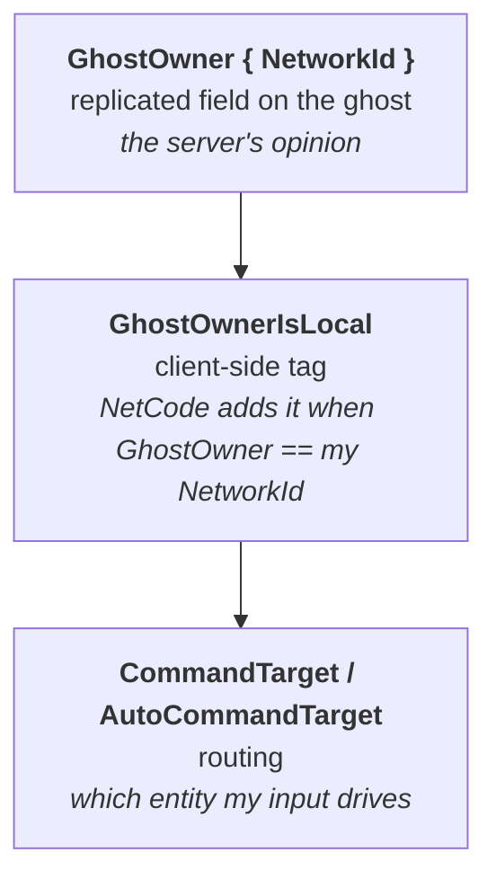
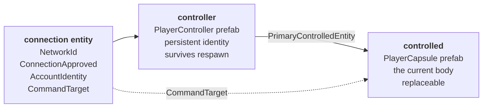
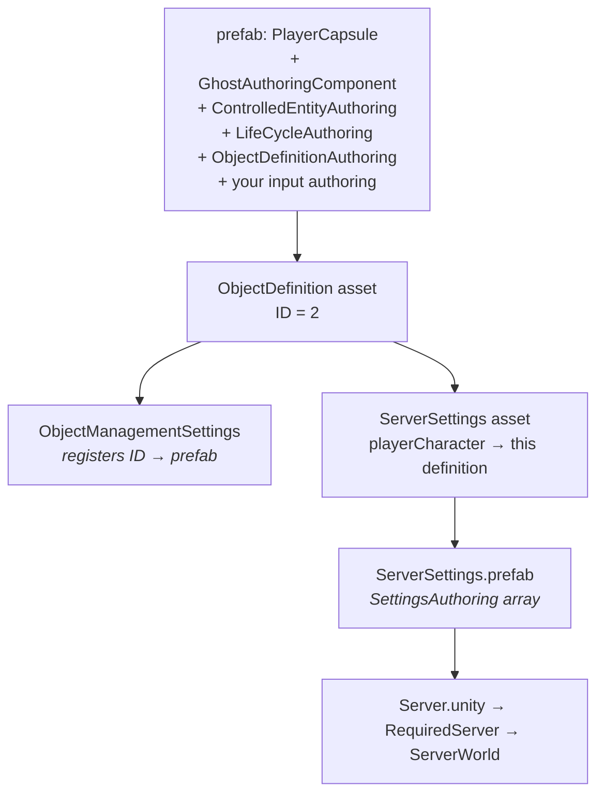

# 22 · Ownership and spawning

Who is allowed to move what, and how does a capsule exist in the first place.

## Three layers of "mine"



| Component | Lives | Answers |
|---|---|---|
| `GhostOwner` | server + all clients | who owns this, authoritatively |
| `GhostOwnerIsLocal` | this client only | is it mine |
| `AutoCommandTarget` | ghost prefab | may my input route here automatically |
| `CommandTarget` | connection entity | manual override: exactly this entity |

`GhostOwnerIsLocal` is the one you filter input on (chapter 16). `GhostOwner` is the one you
filter *rules* on — our `PlayerMoveSystem` uses `WithAll<Simulate, GhostOwner>()` so it moves
player-owned things on both client and server.

## Two entities per player

Nerve does not spawn one thing. It spawns two, and the split is worth copying:



Why bother? Because "the player" and "the thing the player is currently driving" are
different lifetimes:

- Respawn → new pawn, same controller, score and identity intact.
- Enter a vehicle → controller re-points at the vehicle; input follows.
- Spectate → controller with no pawn.
- Reconnect → match by `AccountIdentity`, re-attach to the existing controller.

> **⚡ Hardware analogy** — the controller is a **stable device handle**; the pawn is the
> **currently mapped buffer**. You re-point the handle; you do not tear down the session.

This is why our two-player run shows **4 ghosts**: 2 controllers + 2 capsules. Seeing 3 would
mean two connections adopted the same controller — an identity collision, which is exactly
the risk `AccountIdentity = "local-{networkId}"` carries and which the 4-ghost reading
disproves.

## `PlayerConnectionSystem`

The query is the specification:

```csharp
.WithAll<ConnectionApproved, AccountIdentity, NetworkId, CommandTarget>()
```

Every one of those must be present. Chapter 19's ladder is really just "which of these four
is missing".

It then:

1. Looks for an existing controller with the same `AccountIdentity` (reconnect path).
2. If none, instantiates `ServerSettings.playerController`.
3. Instantiates `ServerSettings.playerCharacter` as the controlled entity.
4. Links them (`PrimaryControlledEntity`), sets `GhostOwner.NetworkId` on both.
5. Points the connection's `CommandTarget` at the pawn.

`ControllerOwnershipInitializeSystem` then propagates ownership down linked entity groups, so
a pawn with child entities has them all owned consistently.

## Wiring it, in order



Miss any link and the failure is silent. The most common misses, in order of frequency:

1. The `ObjectDefinition` is not in `ObjectManagementSettings` → ID resolves to nothing.
2. The settings asset is not on the `SettingsAuthoring` prefab → never bakes.
3. The prefab is missing `GhostAuthoringComponent` → spawns, but only on the server.
4. `HasOwner` unchecked → no `GhostOwner` → input filters match nothing.

> **💀 Trap** — we hit a fifth: `PlayerMoveInputAuthoring` was declared *inside*
> `PlayerMoveInput.cs`. Unity only creates a `MonoScript` when the **file name matches the
> class name**, so the component serialised as `m_Script: {fileID: 0}` — a missing script.
> It baked nothing, the capsule spawned with no input component, and nothing anywhere
> complained. **One MonoBehaviour per file, named after the file.** Always.

## Authority, stated plainly

| Data | Owner | Client may |
|---|---|---|
| `PlayerMoveInput` | client | **write** — it is intent |
| `LocalTransform` | server | predict, then accept correction |
| `GhostOwner` | server | read |
| Spawn / despawn | server | observe |

The client writes exactly one thing: what it wants. Everything else it receives. That single
sentence is the security model.

> **🔬 Probe** — who owns what, right now:
> ```csharp
> foreach (var (owner, e) in SystemAPI.Query<RefRO<GhostOwner>>().WithEntityAccess())
>     Debug.Log($"{e} owned by NetworkId {owner.ValueRO.NetworkId}");
> ```

→ [23 · Two players on one machine](23-mppm.md)
