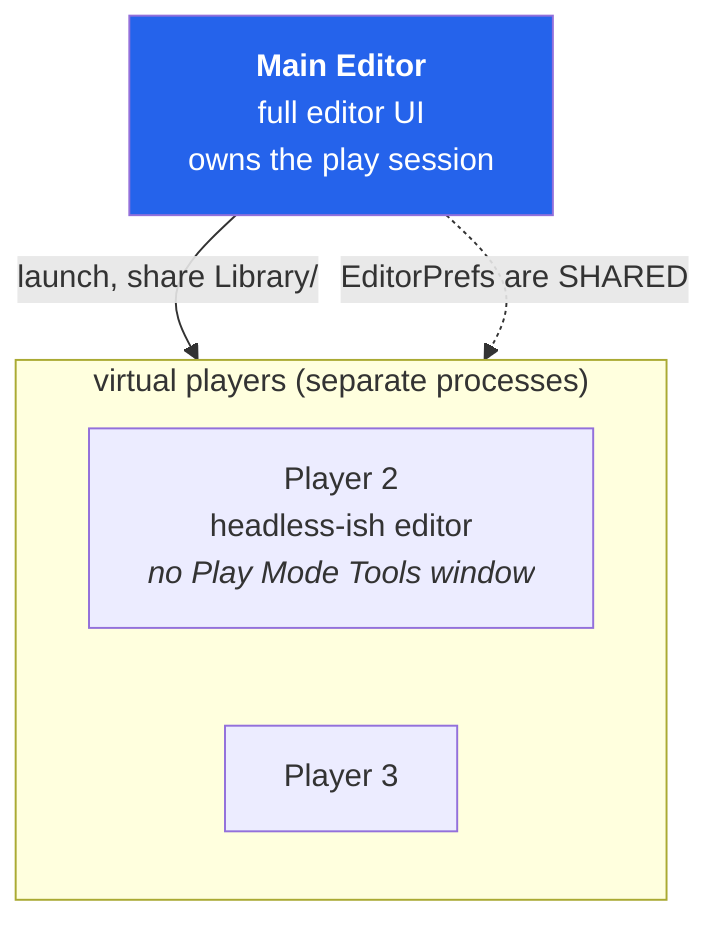
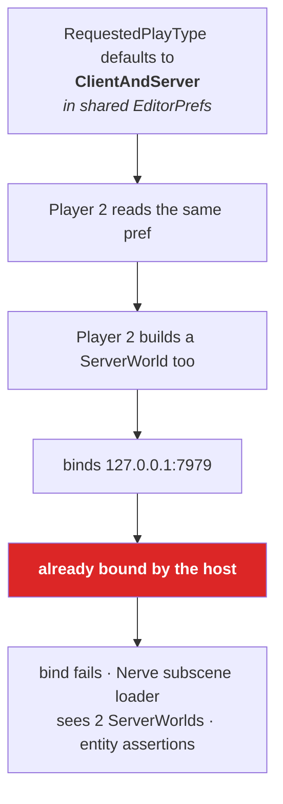
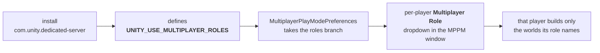

# 23 · Two players on one machine

Multiplayer Play Mode (MPPM) runs extra editor instances — **virtual players** — that share
your project folder and attach to the same play session. It is how you test two clients
without building.

## What a virtual player actually is



Two facts do all the damage:

1. A virtual player is **a real second editor process** with its own `World.All`, its own
   sockets, and its own domain.
2. It **shares your `EditorPrefs`** — and `ClientServerBootstrap.RequestedPlayType` is stored
   there.

## The crash, and its mechanism



The console error is a port-bind exception followed by a cascade — `ModLoadingScene found 2
instances`, entity assertion failures. The cascade is louder than the cause, which is why it
misleads.

The obvious fix — "change Play Mode Type to Client in Play Mode Tools" — **does not work**,
because Play Mode Tools is a window in the main editor and a virtual player does not have
one. The pref you would change is the shared one you must not change.

## The real fix: Multiplayer Roles



Installing `com.unity.dedicated-server` defines `UNITY_USE_MULTIPLAYER_ROLES` as a
`versionDefine`. That flips `MultiplayerPlayModePreferences` from the shared-EditorPrefs path
to the per-player-role path, and each virtual player gets its own dropdown.

Set it up like this:

| Instance | Multiplayer Role | Builds |
|---|---|---|
| Main Editor | **Client and Server** | host |
| Player 2 | **Client** | ClientWorld only |

A visible confirmation that the switch took effect: **Play Mode Type in Play Mode Tools goes
grey**. Roles now override it, so the old control is disabled. If it is still editable, the
define is not active.

> **⚡ Hardware analogy** — you were trying to configure two boards by editing one shared
> EEPROM. Roles give each board its own strapping pins.

## The healthy reading

With roles set correctly:

```
ServerWorld [server] [IPC:127.0.0.1:7979] [UDP:127.0.0.1:7979]   2 Clients · 4 Ghosts
ClientWorld [Client] [UDP:127.0.0.1:7979] [Connected]            25±6 ms
```

**4 ghosts = 2 players × (controller + capsule).** Chapter 22 explains why two per player,
and why 3 would be an ownership bug.

## Other MPPM facts worth having

| Fact | Consequence |
|---|---|
| Virtual players share `Library/` | a re-import can stall every instance |
| They do **not** share `SharedStatic` or ECS state | they are separate processes |
| They can each have network emulation profiles | test latency/loss without a second machine |
| They deploy the same code | a domain reload hits all of them |
| No Play Mode Tools window | you cannot inspect their worlds through the usual UI |

That last row is why we drove verification through the editor CLI instead of the GUI —
`eval` into the running instance, dump `World.All`, read the counts. When the GUI cannot
reach a process, script the process.

## Thin clients

`ThinClientSimulation` worlds simulate no rendering and no presentation — they exist to
generate load and fake input. Great for testing 50 connections. They also **do not load
client subscenes** in this project (`RequiredClient` targets `Client`, not `ThinClient`), so
a thin client has no `NerveStateMachine` and no client graph. If you add thin clients later,
that is the first thing you will need to wire.

> **🔬 Probe** — from a script, confirm what a given instance actually built:
> ```csharp
> foreach (var w in World.All) Debug.Log($"{w.Name} {w.Flags}");
> ```
> One `ServerWorld` total across all instances. If you see two, roles are not applied.

Part IV done. Now the internals, the knobs, and the design judgement.

→ [28 · Grove internals, in full](28-grove-internals.md)
