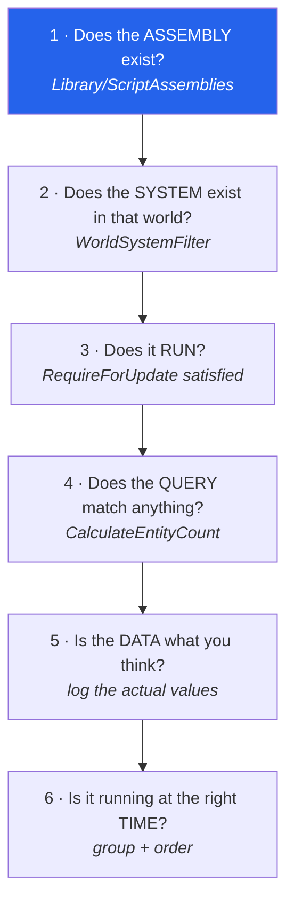

# 24 · The debugging playbook

Every trap in this book, in one table, ordered by how much time it steals. All of these are
**silent** — that is what makes them expensive.

## The silent-failure index

| # | Symptom | Real cause | Probe |
|---|---|---|---|
| 1 | Types "don't exist", `CS0246` | asmdef `defineConstraints` unmet → assembly not built | `ls Library/ScriptAssemblies/` |
| 2 | Works in editor, breaks in build | runtime asmdef references a `UNITY_EDITOR` assembly | audit references |
| 3 | Buttons do nothing | `.uxml` imported before its C# assembly existed | force-reimport the `.uxml` |
| 4 | Component missing on prefab, `m_Script: {fileID: 0}` | MonoBehaviour class name ≠ file name | one class per file |
| 5 | Player never spawns | approval off → no `ConnectionApproved` | query the connection's components |
| 6 | No ghosts at all | `NetworkStreamInGame` never added | `inGame=0` in the world probe |
| 7 | Second player: port 7979 in use | shared `EditorPrefs` play type; need Multiplayer Roles | check for 2 ServerWorlds |
| 8 | Moves too far / jitters | missing `WithAll<Simulate>()` | count prediction ticks/frame |
| 9 | Moves locally, not on server | command routing — `AutoCommandTarget` / `CommandTarget` | log `Move` in both worlds |
| 10 | System never runs | wrong `[WorldSystemFilter]`, or a `RequireForUpdate` never satisfied | log in `OnCreate` |
| 11 | System runs at 1/10 speed | `[BurstCompile]` on methods but not on the struct | Burst Inspector |
| 12 | All `ObjectDefinition.ID == 0` | `AutoRefProcessor` skipped them via its cached set | delete `Library/` |
| 13 | Graph edits have no effect | missing `baker.DependsOn(graphAsset)` or stale subscene | re-import subscene |
| 14 | Editor exits 127 / children die | missing shared library, `RUNPATH` not transitive | `ldd` (chapter 25) |

## The universal ladder

When something does not happen, walk **down**. The first `no` is your bug.



Most people start at 5. Steps 1–4 are where the silent failures live, and each is one
command.

## The probes, ready to paste

**Which worlds exist, and what is in them**

```csharp
foreach (var w in World.All) {
  if (!w.IsCreated) continue;
  var em = w.EntityManager;
  var conn   = em.CreateEntityQuery(ComponentType.ReadOnly<NetworkStreamConnection>());
  var inGame = em.CreateEntityQuery(ComponentType.ReadOnly<NetworkStreamConnection>(),
                                    ComponentType.ReadOnly<NetworkStreamInGame>());
  var ghosts = em.CreateEntityQuery(ComponentType.ReadOnly<GhostInstance>());
  Debug.Log($"{w.Name} flags={w.Flags} conns={conn.CalculateEntityCount()} " +
            $"inGame={inGame.CalculateEntityCount()} ghosts={ghosts.CalculateEntityCount()}");
}
```

**Is my system alive**

```csharp
public void OnCreate(ref SystemState state)
    => Debug.Log($"{GetType().Name} created in {state.WorldUnmanaged.Name}");
```

If that line never prints, it is step 1 or 2 — not your logic.

**Does my query match**

```csharp
var q = SystemAPI.QueryBuilder().WithAll<PlayerMoveInput, GhostOwner>().Build();
Debug.Log($"matched {q.CalculateEntityCount()} in {state.WorldUnmanaged.Name}");
```

**Where is the state machine**

```csharp
var q = em.CreateEntityQuery(ComponentType.ReadOnly<NerveStateMachine>());
if (q.CalculateEntityCount() > 0) {
  var id = q.ToComponentDataArray<NerveStateMachine>(Allocator.Temp)[0].StateId;
  foreach (var n in new[]{"root","connecting","gameplay","disconnected"})
    if (id.Equals((CanopyStateId)n)) Debug.Log($"state = {n}");
}
```

`CanopyStateId.ToString()` prints the type name, not the id — compare against candidates
instead.

## Driving the editor from a shell

`com.unity.pipeline` puts an HTTP control plane in the running editor. This is how we
verified everything in this book without touching the mouse:

```bash
U="unity command --project-path /path/to/project"

$U recompile                                  # then poll recompile_status
$U menu --path "Daggertooth/Rebuild Client Graph"
$U editor_play --state play
$U eval --code 'return World.All.Count.ToString();'
$U eval_file --file probe.cs
$U get_console_logs --count 25
```

> **💀 Trap** — always pass `--project-path`. Auto-detection picked the wrong editor instance
> for us once, and the results were confusingly plausible.
>
> **💀 Trap** — `eval` scripts run in a REPL context that already has implicit usings. A
> leading `using System.Linq;` is parsed as a *using statement*, not a directive, and the file
> fails to compile with baffling errors. Use fully-qualified names.

## The four rules that actually save time

1. **Reproduce the failure as a number, not a feeling.** `inGame=0` is debuggable; "it
   doesn't work" is not.
2. **Prove the mechanism, not the outcome.** `state = gameplay` proved the graph ran, because
   no other code path can set it. An outcome can have many causes; a mechanism has one.
3. **Suspect the toolchain before your logic** in this stack, because the toolchain fails
   silently and your logic usually fails loudly.
4. **When a null read is your evidence, ask whether the read is authoritative.** Inherited,
   lazy, and deferred values lie to naive reads. This cost us an hour on the UI bug and it is
   the most transferable lesson here.

→ [25 · The Linux library saga](25-linux-libs.md)
