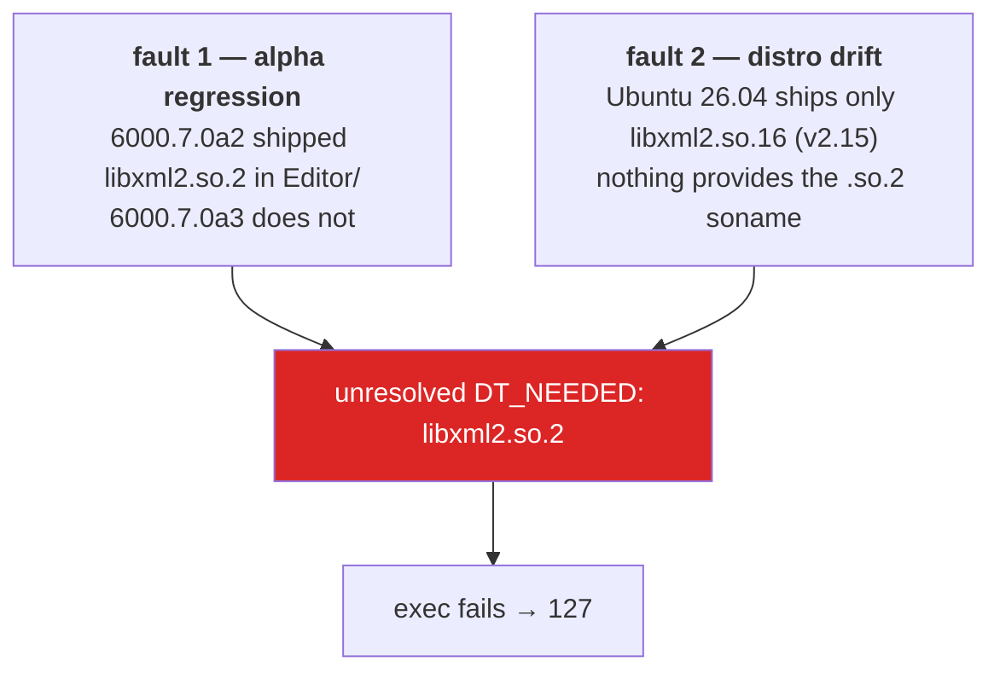
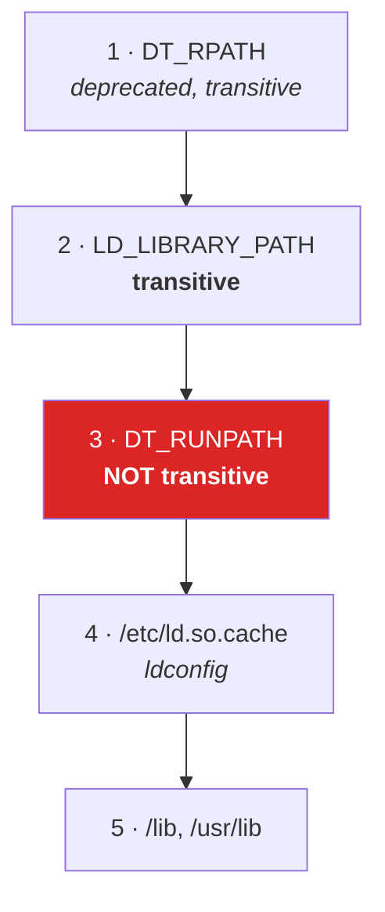

# 25 · The Linux library saga

The most *you*-shaped chapter in the book. No ECS, no networking — just the dynamic linker,
sonames, and a search-path rule that is not transitive.

## The symptom

Unity 6000.7.0a3 on Ubuntu 26.04. The editor exits with **code 127**, or launches fine and
then every MPPM virtual player dies with:

```
libxml2.so.2: cannot open shared object file
```

## Two independent faults, stacked



A soname bump (`.so.2` → `.so.16`) is an **ABI break declaration**. That is the whole point of
sonames. So `ln -s libxml2.so.16 libxml2.so.2` is not a fix — it is a promise you cannot keep,
and it will pay out months later somewhere unrelated.

## The `ldconfig` trap

The machine had a **stale `ldconfig` cache entry** pointing at `libxml2.so.2` inside an
*uninstalled older editor*. The file was gone; the cache still advertised it. Some paths
worked by accident.

Running `sudo ldconfig` cleared the stale entry — and turned "working by accident" into a
clean, honest exit 127.

> **💀 Trap** — I called `ldconfig` "free". It was not. It was load-bearing garbage. A cache
> rebuild is only free if the cache is *describing reality*, and a stale entry pointing at a
> deleted file is precisely the case where it is not.
>
> The general rule: **never run a "harmless refresh" on state you have not inspected.** The
> refresh is harmless; discovering what the state was actually doing is not.

## The fix, and why the obvious version fails

Step one: put the right library, with the right soname, next to the editor.

```sh
T=/home/i/Unity/Hub/Editor/6000.7.0a3/Editor

# libxml2 2.9.14 from Ubuntu 24.04 — has the .so.2 soname
curl -LO http://archive.ubuntu.com/ubuntu/pool/main/libx/libxml2/libxml2_2.9.14+dfsg-1.3ubuntu3.8_amd64.deb
dpkg-deb -x libxml2_*.deb ./x
cp ./x/usr/lib/x86_64-linux-gnu/libxml2.so.2.9.14 "$T/"
ln -sf libxml2.so.2.9.14 "$T/libxml2.so.2"

# that libxml2 links ICU 74; the distro ships ICU 78
curl -LO http://archive.ubuntu.com/ubuntu/pool/main/i/icu/libicu74_74.2-1ubuntu3.1_amd64.deb
dpkg-deb -x libicu74_*.deb ./icu
cp -P ./icu/usr/lib/x86_64-linux-gnu/libicu*.so.74* "$T/"
```

And it still fails. Here is why, and it is the good part:

> **⚡ THE MECHANISM** — **`RUNPATH` is not transitive.**
>
> Unity's binary has a `RUNPATH` containing `$ORIGIN`, so the loader finds
> `Editor/libxml2.so.2`. But when the loader then resolves *libxml2's own* `DT_NEEDED` entry
> for `libicui18n.so.74`, it does **not** consult Unity's `RUNPATH`. `RUNPATH` applies only to
> the direct dependencies of the object that declares it.
>
> (`RPATH`, the deprecated predecessor, *was* transitive. `RUNPATH` deliberately is not —
> that was the point of introducing it.)

`LD_LIBRARY_PATH`, by contrast, **is** consulted for every object in the process. So:

```sh
mv "$T/Unity" "$T/Unity-bin"
cat > "$T/Unity" <<'EOF'
#!/bin/sh
DIR=$(dirname "$(readlink -f "$0")")
LD_LIBRARY_PATH="$DIR${LD_LIBRARY_PATH:+:$LD_LIBRARY_PATH}"
export LD_LIBRARY_PATH
exec "$DIR/Unity-bin" "$@"
EOF
chmod +x "$T/Unity"
```

Verify — this must print nothing:

```sh
ldd "$T/Unity-bin" | grep "not found"
```

The wrapper also fixes MPPM, because virtual players are **child processes** and inherit the
environment. One `export`, every process.

## Search order, for reference



Note `LD_LIBRARY_PATH` outranks `RUNPATH`. That ordering is exactly what makes the wrapper
work.

## Why scope it to the editor folder

Because a soname is a contract. Two generations of the same library in the global namespace
will resolve fine for months and then break something unrelated, at the worst time, with no
trail. Scoping to `Editor/` means only Unity sees the old ABI — which is precisely what
6000.7.0a2 was doing before the regression.

> **💀 Trap** — an editor upgrade replaces `Unity` and silently removes the wrapper. Re-apply
> after every upgrade, or script it.

## The transferable lessons

1. **A soname bump is an ABI break.** Never alias across one.
2. **`RUNPATH` is not transitive; `LD_LIBRARY_PATH` is.** This single fact explains a huge
   class of "I copied the .so and it still can't find it" bugs.
3. **Scope compatibility shims as narrowly as possible.** Process-local beats system-wide,
   always.
4. **A stale cache entry can be load-bearing.** Inspect before you refresh.
5. **`ldd` is your `nm` here.** When a process will not start, ask the loader, not the app.

→ [26 · Extending the stack](26-extend.md)
