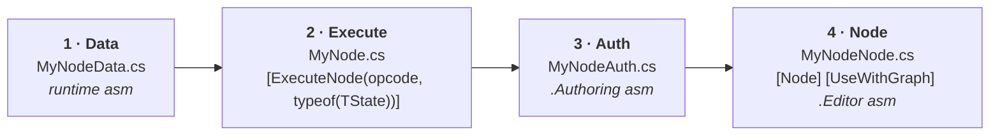

# 26 · Extending the stack

Four recipes. Each is a complete, minimal change with the exact files touched.

## Recipe 1 · Add a replicated field

Say the capsule needs health.

```csharp
// Daggertooth (runtime)
[GhostComponent(PrefabType = GhostPrefabType.All)]
public struct Health : IComponentData
{
    [GhostField(Quantization = 1)] public int Value;
}
```

```csharp
// authoring — its own file, named after the class
public class HealthAuthoring : MonoBehaviour
{
    public int Value = 100;
    private class Baker : Baker<HealthAuthoring>
    {
        public override void Bake(HealthAuthoring a) =>
            AddComponent(GetEntity(TransformUsageFlags.Dynamic), new Health { Value = a.Value });
    }
}
```

| Step | Do |
|---|---|
| 1 | Add the component + `[GhostField]` |
| 2 | Add the authoring in its **own file** |
| 3 | Put it on the prefab |
| 4 | Change it **only** in server-authoritative or predicted systems |

> **💀 Trap** — adding a `[GhostField]` changes the **ghost schema**, which changes the
> protocol version. Old clients get a handshake mismatch. Rebuild both sides together.

## Recipe 2 · Add a rule that both sides run

The template is our movement system, and the shape is non-negotiable:

```csharp
[BurstCompile]
[WorldSystemFilter(WorldSystemFilterFlags.ClientSimulation | WorldSystemFilterFlags.ServerSimulation)]
[UpdateInGroup(typeof(PredictedSimulationSystemGroup))]
public partial struct GravitySystem : ISystem
{
    [BurstCompile]
    public void OnUpdate(ref SystemState state)
    {
        var dt = SystemAPI.Time.DeltaTime;
        foreach (var t in SystemAPI.Query<RefRW<LocalTransform>>()
                                   .WithAll<Simulate, GhostOwner>())   // ← Simulate!
        {
            t.ValueRW.Position.y -= 9.81f * dt;
        }
    }
}
```

Checklist: both world flags · prediction group · `Simulate` · no branch on `IsServer` · no
one-shot side effects (or gate on `IsFirstTimeFullyPredictingTick`).

## Recipe 3 · Add a Grove node

Four files, one per representation (chapter 08):



```csharp
// 1 · payload
public struct MyNodeData { public ulong NodeId; public float Threshold; }

// 2 · the instruction
public static class MyNode
{
    [ExecuteNode((int)MyExecutionTypes.MyNode, typeof(CanopyUpdateState))]
    public static void Execute<T>(ref MyNodeData data, in GroveContext ctx,
                                  ref T context, ref CanopyUpdateState state)
        where T : unmanaged, INerveContext<T>
    {
        if (state == CanopyUpdateState.Exit) return;    // ← always
        // work here
    }
}

// 3 · import-time
public sealed class MyNodeAuth : CanopyBlockAuth<MyNodeData>
{
    public float Threshold;
    public override int NodeType => (int)MyExecutionTypes.MyNode;
    protected override void Init(BlobRemapBuilder b, ref MyNodeData d, IGroveAuthState s)
    {
        d.NodeId = this.NodeId;
        d.Threshold = this.Threshold;
    }
}

// 4 · editor
[Serializable]
[Node("MyGame", "", "My Node")]
[UseWithGraph(typeof(ClientNerveGraph))]
[UseWithContext(typeof(CanopyStateNode))]
public sealed class MyNodeNode : CanopyBlockNode<MyNodeAuth, MyNodeData>
{
    public const string ThresholdOption = "Threshold";
    protected override void DefineOptions(IOptionDefinitionContext c)
        => c.AddOption<float>(ThresholdOption).WithDisplayName("Threshold").Build();
    protected override void Init(MyNodeAuth auth, IGroveNodeState s)
        => auth.Threshold = this.GetOption<float>(ThresholdOption);
}
```

> **💀 Trap** — pick an opcode range that cannot collide with Grove's, Canopy's, or Nerve's.
> Nerve uses `-NerveId.Offset - n`. Give yourself your own offset and document it.

## Recipe 4 · Add a world-targeted settings asset

```csharp
// Daggertooth.Authoring
[SettingsGroup("Daggertooth")]
[SettingsWorld("server")]
public sealed class CombatSettings : SettingsBase
{
    public float RespawnSeconds = 3f;

    public override void Bake(Baker<SettingsAuthoring> baker) =>
        baker.AddComponent(baker.GetEntity(TransformUsageFlags.None),
                           new CombatConfig { RespawnSeconds = this.RespawnSeconds });
}
```

Then one editor call does the whole wiring:

```csharp
EditorSettingsUtility.GetSettings<CombatSettings>();
```

Creates the asset, reads `[SettingsWorld("server")]`, and inserts it into
`ServerSettings.prefab`. Never hand-edit that array.

## Recipe 5 · Add a state to the client graph

Edit `Assets/Editor/ClientGraphSetup.cs`, not the graph window:

```csharp
var loading = AddState(graph, "loading", new Vector2(440, 760));
Connect(graph, root.ChildrenOutputPort, loading.ParentInputPort, "root to loading");
SetPortValue(startupGate, StartupGateTargetPort, new FixedString64Bytes("loading"));
```

Run **Daggertooth → Rebuild Client Graph**. The validator will tell you immediately if you
broke the one-default-child rule.

## The pattern behind all five

Every extension in this stack is: **declare data → declare the code that consumes it →
declare how it is authored → declare where it lives.** Four declarations, four places, always
the same four. Once you see it, the stack stops feeling large.

→ [27 · Build your own](27-build-your-own.md)
