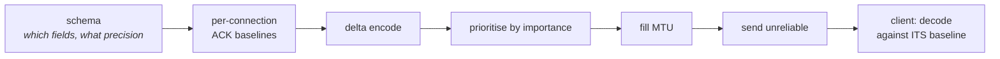
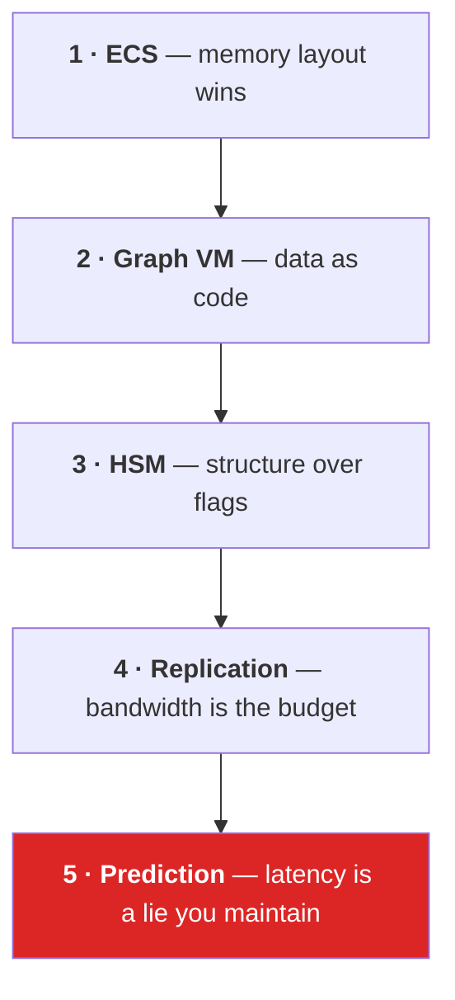

# 27 · Build your own

The final exam. Not "can you use this stack" — **could you write it?**

Below is what each layer would cost you, what the hard part actually is, and the order to
attempt it in. Build even two of these and you will never be confused by the real ones again.

## Layer 1 · An ECS core — a weekend

```
Entity      = { uint index; uint version; }
Archetype   = sorted component type list + chunk list
Chunk       = 16 KiB: header + parallel component arrays
World       = archetype table + entity→(chunk, index) lookup
Query       = archetype mask match → chunk list → raw pointers
```

**The hard part is not the layout.** It is the *structural change*: adding a component means
computing the new archetype, finding or creating a chunk, memcpy-ing every component, patching
the entity lookup, and invalidating outstanding pointers. Get that right and the rest is
bookkeeping.

Milestone: 100k entities, one component write each, faster than the array-of-structs version.

## Layer 2 · A graph VM — a week

You are writing a linker and an interpreter.

| Piece | What it is |
|---|---|
| Opcode enum | your ISA |
| Node data structs | instruction encodings |
| Blob writer | the linker — flatten a DAG to one buffer with **relative** offsets |
| Dispatch switch | the decoder |
| Context struct | the register file + MMIO |
| State buffer | RAM |

**The hard part is relative addressing.** Every pointer inside the image must be an offset
from its own location, so the whole thing is memcpy-able and shareable. That is `BlobPtr<T>`,
and it is the same discipline as writing position-independent code.

Milestone: author a 5-node graph, save it, load it into a fresh process, execute it with
zero allocations.

## Layer 3 · A hierarchical state machine — two days

On top of layer 2:

- states form a tree; the active *path* is root→leaf
- `Enter` / `Update` / `Exit` signals propagate along the path
- transitions are named jumps, resolved by hash
- validate at author time: one root, one default child per composite, no id collisions

**The hard part is exit/enter ordering.** Exit bottom-up, enter top-down, and never let a
block observe a half-torn-down path. That is why every Canopy node opens with the `Exit`
check.

Milestone: a graph where a leaf jump correctly exits three levels and enters two.

## Layer 4 · Snapshot replication — two weeks



**The hard part is per-connection baselines.** Every client has ACKed a different tick, so the
server must remember what each one knows and delta against *that*. Get it wrong and clients
decode garbage — intermittently, under loss only.

Milestone: 50 entities, 20 Hz, 5% simulated packet loss, no visible corruption.

## Layer 5 · Prediction and rollback — the real boss

```
1. ring-buffer the last N ticks of input, stamped
2. checkpoint predicted state each tick
3. on correction for tick T:
     restore all predicted entities to server state @ T
     for t in T+1..now:
         re-materialise input[t]
         run predicted systems for one tick
4. render
```

**The hard part is that your simulation must be replayable.** Which means:

- no reads of frame-varying data (frame delta, `Time.time`, `Random` without a seeded state)
- no side effects that are not idempotent per tick
- all predicted state must be *in* the checkpoint — anything stored outside it silently
  survives the rollback and desyncs

That last bullet is the one that bites. A cached value in a system field is invisible to the
checkpoint and will corrupt every replay.

Milestone: 200 ms artificial latency, capsule feels instant, no visible correction.

## What you have actually learned

If you can describe all five, you can read *any* networked engine — Unreal's replication,
Photon Quantum, Overwatch's ECS talk, Rocket League's rollback. They are the same five layers
with different names and different trade-offs.



## The five sentences worth memorising

1. **A chunk is a DMA buffer and an archetype is its type.**
2. **A blob is position-independent code; `GroveState` is its RAM.**
3. **`Simulate` is a clock-enable line.**
4. **Send intent, never results.**
5. **Nobody on screen is seeing "now", and your job is to make that invisible.**

## Where to go next

- Add physics to the predicted set. Determinism becomes a real constraint; that is where the
  next tier of difficulty lives.
- Add thin clients and wire them a graph (chapter 23's last section).
- Replace `LocalApproveConnectionSystem` with real approval, and discover what Unity
  Authentication actually costs on a cold connection.
- Predict a spawn (projectiles). It is the hardest common case: the client creates an entity
  the server has not confirmed, and they must be matched.

You started at a clock edge. You now know every hop from there to two capsules on two
screens, why each hop exists, and what it looks like when it breaks.

Go build the thing.

← [Back to the index](../README.md)
