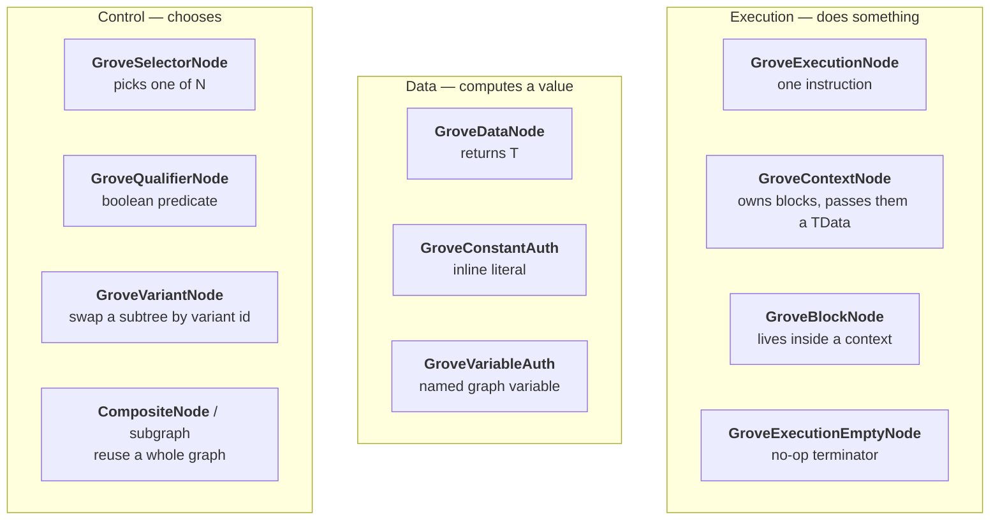

# 28 · Grove internals, in full

Chapter 08 gave you the shape. This is the datasheet.

## The node taxonomy

Grove has more than "nodes". It has **kinds**, and the kind decides what the blob holds and
how dispatch reaches it.



| Kind | Blob payload | Reached by |
|---|---|---|
| Execution | your `TData` struct | `ExecutionHeader<TState>.Execute` |
| Context | `BlobArray<BlobPtr<ExecutionHeader<TData>>> Blocks` | same, then loops blocks |
| Block | your `TData` struct | the owning context |
| Data | your `TData` struct | `DataHeader<T>.Calculate` |
| Selector/Qualifier | branch table | evaluated, then dispatches one child |

Two dispatch verbs, not one: **`Execute`** (side effects, returns nothing) and
**`Calculate`** (pure, returns `T`). That split is why data ports can be evaluated lazily and
why a data node can be shared by several execution nodes without ordering problems.

## The blob, byte by byte

```
BlobAssetReference<GraphData>
│
├─ GraphId        ulong          ← identity for GroveState keying
├─ Root           BlobPtr<ExecutionHeader>
├─ Nodes[]        BlobArray<NodeHeader>
│    └─ NodeHeader { NodeType Type; ...payload inline... }
├─ Inputs[]       BlobArray<GraphInputData>   { TypeHash, VariableKey }
└─ Outputs[]      BlobArray<GraphOutputData>  { TypeHash, VariableKey }
```

Three rules that fall out of this layout:

1. **`BlobPtr<T>` is a relative offset.** The image is position-independent, so it can be
   memcpy'd, cached, and shared read-only by every entity.
2. **The image is immutable at runtime.** No node may write to it. All mutable state goes in
   `GroveState`.
3. **`GraphId` disambiguates.** Two entities running different graphs keep separate state
   because the key includes the graph id.

> **⚡ Hardware analogy** — you are looking at a **flashed image with a header table**. `Root`
> is the reset vector. `Nodes[]` is the code segment. `Inputs/Outputs` is the symbol table.

## `GroveState`: the RAM, in detail

```csharp
DynamicBuffer<GroveState>   // reinterpreted as an untyped hash map
```

Keys are built by `GraphStateUtil.GetKey(...)` from three ingredients:

| Ingredient | Why |
|---|---|
| graph id / scope | two graphs on one entity never collide |
| node id | two instances of the same node type never collide |
| local key | one node can keep several values |

```csharp
var key = GraphStateUtil.GetKey(groveContext, data.NodeId, ClientGoInGameData.RequestedConnectionStateKey);
graphState.AddOrSet(key, connection.Identity);
graphState.TryGetValue(key, out ClientConnectionIdentity requested);
```

Values are **blittable structs stored inline**. No allocation, Burst-safe, per entity, and it
survives across ticks and across rollbacks (it lives on the entity, so it is checkpointed
with everything else).

> **💀 Trap** — do **not** cache node state in a `static` or in a system field. It will not be
> per entity, it will not be checkpointed, and under prediction rollback it will silently
> desync. `GroveState` exists precisely to make the right thing easy.

## The source-generation contract

The generator scans for three things:

| It looks for | It emits |
|---|---|
| `[ExecuteNode(opcode, typeof(TState))]` on a static method | a `case` in the dispatch switch for that opcode |
| `BufferContainer<T>` / `ComponentContainer<T>` fields on a `partial` context struct | `CreateGenerated`, `UpdateGenerated`, `SetChunkGenerated`, `IContextGenerator<T>` |
| each concrete context type used with an executor | **a full specialised copy** of the switch |

That last row is the performance secret and the compile-time cost. Every context type gets
its own monomorphised dispatch — no generic virtual calls, everything inlinable, Burst sees
concrete types all the way down.

Your obligations:

```csharp
public unsafe partial struct MyContext : INerveClientContext<MyContext>
//     ^^^^^^ required: the generator adds members
//            ^^^^^^^ required if you hold a SystemState*
{
    public BufferContainer<GroveState> GroveStates;      // ← the generator finds these
    public ComponentContainer<NerveStateMachine> StateMachines;
}
```

Forget `partial` and you get a wall of "does not implement `IContextGenerator<T>`" errors that
point at the interface rather than at the missing keyword.

## Containers: how a node reaches component data

| Container | Gives you | Backed by |
|---|---|---|
| `ComponentContainer<T>` | `GetRO(i)` / `GetRW(i)` for the current chunk | `ComponentTypeHandle<T>` |
| `BufferContainer<T>` | `DynamicBuffer<T>` for entity `i` | `BufferTypeHandle<T>` |
| lookups on `SystemState` | random access to any entity | `ComponentLookup<T>` |

`SetChunk(chunk, index)` refreshes them once per chunk; nodes then index by
`groveContext.EntityIndexInChunk`. That is why per-entity access inside a node is an array
index, not a lookup — the expensive part happened once per chunk.

## Variants and instance values

Two ways to reuse one graph with different numbers:

```csharp
GraphBaker.CreateVariants(this.graph.Variants);          // swap whole subtrees
GraphBaker.CreateInstanceValues(this.graph.InstanceValues); // override leaf constants
```

| Mechanism | Granularity | Use for |
|---|---|---|
| **Variant** | a subtree | "boss version of this behaviour" |
| **Instance value** | one constant | "same behaviour, threshold 0.8 instead of 0.5" |

Both are resolved **at bake time**, so the runtime image is already specialised. There is no
runtime branch and no lookup cost. It is template instantiation, done by the baker.

## Subgraphs

`GraphOptions.SupportsSubgraphs` is on for all three Nerve graph types. A subgraph is a whole
`.cnerve`/`.snerve` referenced as one node, with its own scope in `GroveNodeState` (see
`PushSubgraphScope`). Scoping means node ids inside a subgraph do not collide with the parent,
so the same subgraph can appear twice in one graph with independent state.

> **⚡ Hardware analogy** — a subgraph is a **linked library with its own symbol namespace**,
> instantiated at link time rather than called at runtime.

## `DisableAutoInclusionOfNodesFromGraphAssembly`

```csharp
[Graph(AssetExtension, GraphOptions.SupportsSubgraphs | GraphOptions.DisableAutoInclusionOfNodesFromGraphAssembly)]
```

Without this flag, GraphToolkit would offer every node in the assembly in every graph. With
it, a node appears only where `[UseWithGraph(...)]` says. That is why a `.snerve` cannot
contain `ClientGoInGameNode` — and why adding a node to the wrong graph type is impossible
rather than merely wrong.

## Instrumentation

`UNITY_INCLUDE_INSTRUMENTATION` compiles a debug pass that walks every node after execution
and calls `Debug(...)` on it, plus a `SelectedEntity` singleton so the graph window can show
live values for one entity. It is off in players and costs nothing there.

## The performance model

| Cost | Where it lands |
|---|---|
| Blob load | once, at subscene load |
| Query + chunk iteration | once per system update |
| `SetChunk` | once per chunk |
| Node dispatch | one jump-table branch per node per entity |
| `GroveState` access | one hash lookup per keyed value |

The hash lookups are the only non-trivial per-entity cost. If a graph is hot, the first
optimisation is **fewer keyed state values**, not fewer nodes.

→ [29 · Every knob in NetCode](29-netcode-settings.md)
