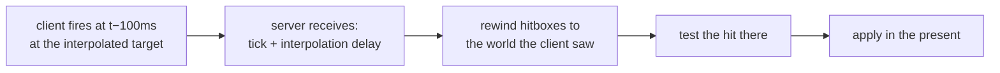
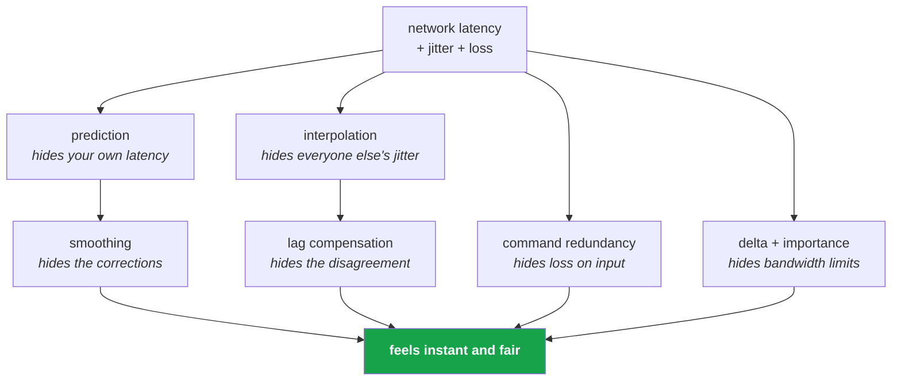

# 30 · How it is made to feel nice

Every trick in this chapter exists to hide the same fact: **information takes time to travel,
and players will not forgive it.** These are the mechanisms, ranked by how much perceived
quality they buy.

## The perception budget

| Latency | How it reads |
|---|---|
| < 16 ms | instant |
| 16–50 ms | responsive |
| 50–100 ms | noticeable, playable |
| 100–150 ms | sluggish |
| > 150 ms | broken |

A 60 ms RTT with no prediction puts you at "sluggish" on every single input. That is the
problem the entire stack is arranged around.

## 1 · Prediction — buys the most, costs the most

```
without:  press ─────── 30ms ──────▶ server ─────── 30ms ──────▶ move
with:     press ▶ move (locally, same frame)
                  └─ server confirms 60ms later, usually silently
```

**Perceived input latency: zero.** The price is a replay whenever the server disagrees, and a
hard requirement that your simulation is replayable (chapter 17).

## 2 · Interpolation — buys smoothness for everyone else

Rendering other players in the past, between two known snapshots, converts *irregular* arrival
into *regular* motion. It is a jitter buffer, and it is why a 20 Hz snapshot rate can look
like 144 Hz motion.

## 3 · Partial ticks — buys smoothness between ticks

Simulate at 60, render at 144, and 60% of frames have nothing new. Partial ticks run a
fraction of a tick purely for presentation, then throw it away.

```
ticks:   ●───────────────●───────────────●
frames:  ●───●───●───●───●───●───●───●───●
             ↑   ↑   ↑       ↑   ↑   ↑
             partial ticks — presentation only
```

> **💀 Trap** — one-shot effects must be gated on `IsFirstTimeFullyPredictingTick`, or they
> fire on every partial tick too.

## 4 · Command redundancy — buys resilience to loss for free

Each command packet contains the last several ticks of input, not just one. A dropped packet
costs nothing because the next one carries the gap. This is why input feels solid on a lossy
connection while *positions* still visibly hitch.

## 5 · Snapshot delta compression — buys bandwidth, which buys rate

Only changed fields are sent, delta-coded against what each client last ACKed. Fewer bits per
ghost means more ghosts per packet means a higher effective update rate for everything.

Quantization amplifies this: quantized values compare equal more often, so more fields are
"unchanged".

## 6 · Importance scheduling — buys the illusion of a full world

The server cannot send everything. It sends the *most important* things this tick and defers
the rest. Nearby, moving, dangerous things update at a high rate; distant scenery updates
occasionally. The player perceives a fully live world because the parts they are looking at
are live.

## 7 · Correction smoothing — buys invisibility for the fix

When a rollback moves your capsule, snapping is visible. Blending the rendered position over
a few frames hides small corrections entirely. Above `MaxSmoothingDistance` it snaps instead,
because sliding a long way looks worse than a clean cut.

## 8 · Lag compensation — buys fairness

The advanced one. The client shoots at what it *sees*, which is the past. Naively, the server
checks against the present and the shot misses.



`TrackInterpolationDelay` on the ghost is what makes the server able to reconstruct "what did
this client see". The trade is real and famous: *behind cover and still shot.* Every shooter
picks a point on that spectrum; none escape it.

## 9 · Time synchronisation — buys stability under changing conditions

The client continuously measures RTT and jitter, then adjusts:

- how far **ahead** it predicts (so commands land just in time)
- how far **behind** it interpolates (so the buffer never underruns)

It does this by nudging the *rate* of local time, not by jumping. Slow drift is invisible;
a jump is not.

> **⚡ Hardware analogy** — a **PLL**. You do not step the clock; you adjust its frequency and
> let phase converge. Same reason: discontinuities are what people notice.

## 10 · Static optimization — buys headroom

Ghosts marked `OptimizationMode.Static` that have not changed are skipped entirely. Every ghost
you can mark static is bandwidth handed back to the ghosts that need it.

## The composite picture



Six independent mechanisms, each hiding one consequence of the same physical fact. None of
them removes latency. They relocate it to places players do not look.

## What to reach for, by symptom

| The game feels… | Reach for |
|---|---|
| unresponsive to my own input | prediction; check `TargetCommandSlack` is not oversized |
| jerky for other players | interpolation delay too small, or send rate too low |
| like it snaps and pops | correction smoothing; check quantization is not too coarse |
| like the world is stuttering | partial ticks not running, or frame rate below tick rate |
| unfair in fights | lag compensation absent or misconfigured |
| fine alone, bad when busy | bandwidth — importance, relevancy, static optimization |

→ [31 · When to use what](31-when-to-use-what.md)
