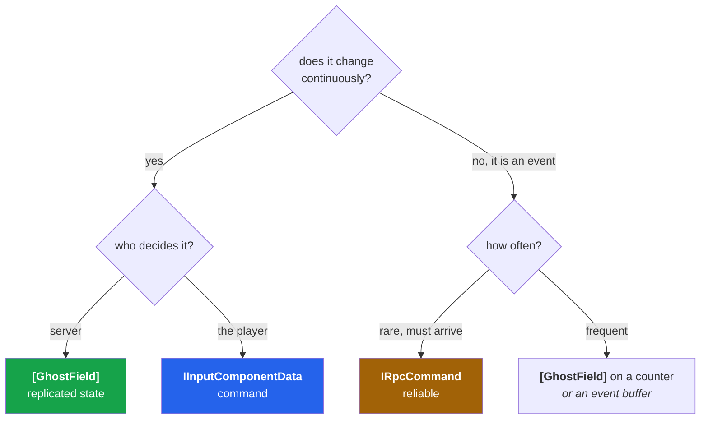
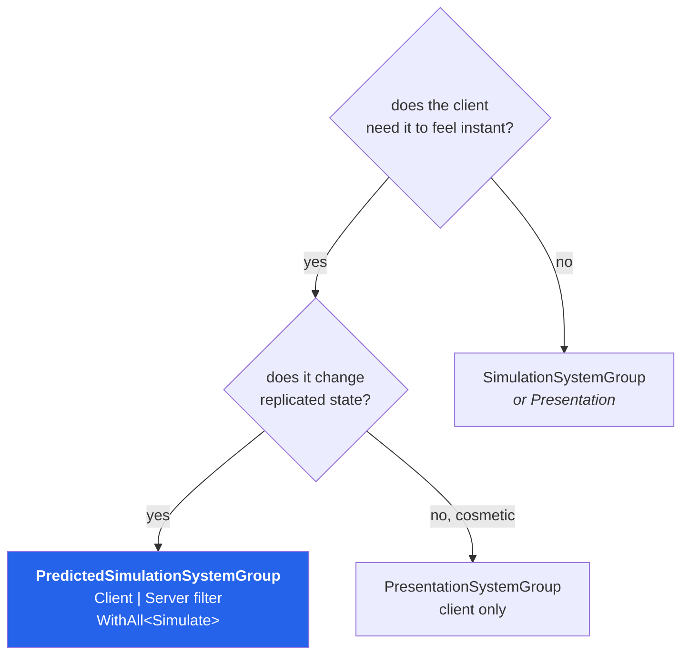

# 31 · When to use what

Decision tables. Keep this chapter open while designing a feature.

## A · How should this data reach the other side?

| Mechanism | Direction | Reliability | Rate | Use for |
|---|---|---|---|---|
| `IInputComponentData` | client → server | unreliable + redundant | every tick | movement, aim, buttons |
| `[GhostField]` | server → clients | unreliable, delta | every send tick | position, health, state |
| `IRpcCommand` | either | **reliable, ordered** | rare | go-in-game, chat, match start |
| `SharedStatic` | inside one process | n/a | any | UI ↔ ECS in the same world |

> **Rule** — if you are about to send an RPC every tick, you wanted a ghost field. If you are
> about to put a one-shot event in a ghost field, you wanted an RPC.

## B · Which ghost mode?

| Ask | Answer |
|---|---|
| Does the local player control it? | **OwnerPredicted** |
| Does it interact physically with the player *right now*? | **Predicted** |
| Is it scenery, an NPC, or another player's pawn? | **Interpolated** |
| Does it never move? | **Interpolated + `OptimizationMode.Static`** |

Cost check: rollback cost is `predicted entities × replayed ticks`. Every entity you add to
the predicted set multiplies every correction.

## C · Which spawn type?

| Type | Client copy created by | Use for | Cost |
|---|---|---|---|
| **Server-spawned** | first snapshot | players, pickups, most things | one RTT before it appears |
| **Predicted spawn** | client immediately, matched later | projectiles, instant feedback | matching complexity |
| **Pre-spawned** | baked into the subscene both sides | doors, level props | zero — nothing is sent |

Pre-spawned is free and badly under-used. If it exists at level load and the server does not
create it, bake it.

## D · Tick rate and send rate

| Genre | Sim | Send | Why |
|---|---|---|---|
| Turn-based / strategy | 20–30 | 10–20 | decisions are not frame-tight |
| MMO / open world | 30 | 10–20 | player count dominates the budget |
| **Third-person action** | **60** | **20** | our project; balanced |
| FPS | 60 | 30–60 | aim precision needs fresh data |
| Fighting | 60–120 | 60 | frame-exact interactions |

Raise sim rate for *simulation fidelity*. Raise send rate for *visual freshness*. They are
different problems.

## E · Where does this system belong?

| Group | Runs | Put here |
|---|---|---|
| `GhostInputSystemGroup` | client, once per frame | reading devices |
| `PredictedSimulationSystemGroup` | client + server, 1..N per frame | shared game rules |
| `SimulationSystemGroup` | everywhere, once per frame | server-only logic, UI bridges |
| `PresentationSystemGroup` | client, once per frame | VFX, audio, camera |
| `LateSimulationSystemGroup` | everywhere | cleanup, after-the-fact reads |

## F · Server-only, or shared?

| Logic | Where | Why |
|---|---|---|
| Movement, physics response | **shared, predicted** | must feel instant, must be authoritative |
| Damage, scoring, loot rolls | **server only** | never let a client decide an outcome |
| Spawning | **server only** | ghosts originate on the server |
| VFX, audio, camera shake | **client only** | pure presentation |
| Validation of input ranges | **server only** | clients lie |

## G · Relevancy strategy

| World | Strategy |
|---|---|
| Single room, < 30 ghosts | relevancy off; importance is enough |
| Arena with sightlines | importance by distance; relevancy for other rooms |
| Open world | `SetIsRelevant` grid/zone allowlist per connection |
| Competitive FPS | relevancy as **anti-cheat**: never send what cannot be seen |

## H · Grove or a plain system?

| Use Grove when | Use a plain `ISystem` when |
|---|---|
| the flow has states and transitions | it is one rule applied to a query |
| designers should see or edit it | it is engine plumbing |
| the same shape recurs with different data (variants) | it runs once, everywhere, always |
| you want author-time validation | correctness is obvious from the code |

Our project uses both, correctly: `PlayerMoveSystem` is a plain system (one rule, no states);
the connection flow is a graph (states, gates, transitions, recovery).

## I · Which world does this settings asset target?

| `[SettingsWorld(...)]` | Lands in | Use for |
|---|---|---|
| *(omitted)* | default authoring — every world | shared constants |
| `"service"` | ServiceWorld | app lifecycle, services |
| `"menu"` | MenuWorld | menu-only content |
| `"client"` | ClientWorld | prediction config, client graph, local presentation |
| `"server"` | ServerWorld | spawn tables, relevancy, authoritative tuning |

## J · Quick sanity table for a new feature

Before writing a line, answer these six:

| # | Question | If you cannot answer |
|---|---|---|
| 1 | Who has authority over this state? | you will build a cheat |
| 2 | Does it need to feel instant? | you will over- or under-predict |
| 3 | Continuous or event? | you will pick the wrong transport |
| 4 | Which world(s) does the system live in? | it will run twice or never |
| 5 | Is it replay-safe? | it will desync under loss |
| 6 | What is the falsifiable check that it works? | you will ship on vibes |

Question 6 is the one people skip. For our client graph the answer was
`state = gameplay`, a value unreachable unless the mechanism worked.

→ [32 · Tying it together](32-tying-it-together.md)
