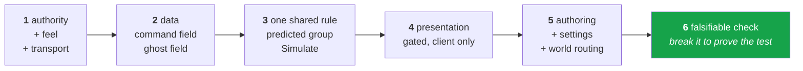

# 32 · Tying it together

One feature, designed end to end, touching every layer. Follow this and the stack stops being
a list of packages and becomes one machine.

**The feature:** a dash. Tap Shift, the capsule lunges forward, then a cooldown before you can
dash again. It must feel instant, be cheat-proof, and be visible to the other player.

## Step 1 · Answer the six questions

| # | Question | Answer |
|---|---|---|
| 1 | Authority? | **Server.** Cooldown must not be client-decided. |
| 2 | Instant? | **Yes.** A dash you feel 60 ms later is a broken dash. |
| 3 | Continuous or event? | **Event**, but a *per-tick* event → it belongs in the command, not an RPC. |
| 4 | Worlds? | Gather: client. Rule: client + server, predicted. VFX: client only. |
| 5 | Replay-safe? | The state change is; the VFX is not — gate it. |
| 6 | Falsifiable check? | With 200 ms emulated latency: dash fires on the frame of the press, and the cooldown matches on both sides. |

## Step 2 · Extend the command

`IInputComponentData` supports event-style fields that survive the tick they were pressed on:

```csharp
public struct PlayerMoveInput : IInputComponentData
{
    public float2 Move;
    public InputEvent Dash;      // ← not a bool: a tick-accurate one-shot
}
```

`InputEvent` exists precisely because a bool sampled per frame and consumed per tick loses
presses. It carries a counter so the consumer can tell "pressed once" from "still held" even
across a rollback.

```csharp
// GhostInputSystemGroup, client, not bursted
if (kb.leftShiftKey.wasPressedThisFrame) input.ValueRW.Dash.Set();
```

## Step 3 · Replicated state for the cooldown

```csharp
public struct DashState : IComponentData
{
    [GhostField] public NetworkTick CooldownUntil;   // ticks compare with IsNewerThan
}
```

A **tick**, not a float timer. Ticks are the shared clock; a float seconds value would drift
between the two simulations and desync under replay.

## Step 4 · One shared rule

```csharp
[BurstCompile]
[WorldSystemFilter(WorldSystemFilterFlags.ClientSimulation | WorldSystemFilterFlags.ServerSimulation)]
[UpdateInGroup(typeof(PredictedSimulationSystemGroup))]
public partial struct DashSystem : ISystem
{
    private const float DashImpulse = 12f;
    private const uint CooldownTicks = 90;              // 1.5 s at 60 Hz

    [BurstCompile]
    public void OnUpdate(ref SystemState state)
    {
        var tick = SystemAPI.GetSingleton<NetworkTime>().ServerTick;

        foreach (var (input, dash, transform) in
                 SystemAPI.Query<RefRO<PlayerMoveInput>, RefRW<DashState>, RefRW<LocalTransform>>()
                          .WithAll<Simulate, GhostOwner>())
        {
            if (!input.ValueRO.Dash.IsSet) continue;
            if (dash.ValueRO.CooldownUntil.IsValid && dash.ValueRO.CooldownUntil.IsNewerThan(tick)) continue;

            var move = input.ValueRO.Move;
            var dir  = math.lengthsq(move) > 0.0001f
                ? math.normalize(new float3(move.x, 0, move.y))
                : math.forward(transform.ValueRO.Rotation);

            transform.ValueRW.Position += dir * DashImpulse;

            var until = tick;
            until.Add(CooldownTicks);
            dash.ValueRW.CooldownUntil = until;
        }
    }
}
```

Every constraint from the book is visible here:

| Line | Chapter |
|---|---|
| both world flags | 17 — one rule, executed twice |
| `PredictedSimulationSystemGroup` | 15 — tick delta, replay participation |
| `WithAll<Simulate>` | 17 — the clock-enable |
| `WithAll<GhostOwner>` | 22 — only player-owned things |
| `NetworkTick` + `IsNewerThan` | 15 — wrapping counter, never `<` |
| reads intent, computes the impulse itself | 16 — send intent, never results |
| no `if (isServer)` branch | 17 — two branches means two behaviours |

## Step 5 · Presentation, gated

```csharp
[WorldSystemFilter(WorldSystemFilterFlags.ClientSimulation)]
[UpdateInGroup(typeof(PredictedSimulationSystemGroup), OrderLast = true)]
public partial struct DashVfxSystem : ISystem
{
    public void OnUpdate(ref SystemState state)
    {
        if (!SystemAPI.GetSingleton<NetworkTime>().IsFirstTimeFullyPredictingTick) return;   // ← chapter 15
        // spawn the trail, play the whoosh
    }
}
```

Without that gate the effect fires on every partial tick and on every replayed tick of every
rollback. This is the single most common "why does my gun fire three times" bug.

## Step 6 · Authoring and wiring

| Piece | Where | Chapter |
|---|---|---|
| `DashStateAuthoring.cs` — **its own file** | `Daggertooth` | 22 |
| add the component on `PlayerCapsule.prefab` | prefab | 22 |
| `DashSettings : SettingsBase` + `[SettingsWorld("server")]` for tunables | `Daggertooth.Authoring` | 07 |
| `EditorSettingsUtility.GetSettings<DashSettings>()` to wire it | `Daggertooth.Editor` | 07 |

## Step 7 · Should the graph know?

If dashing should be blocked in a menu, or should trigger a state change, add a Grove node.
If it is just a rule, leave it as a system. Chapter 31, table H.

For a dash: **leave it a system.** No states, no transitions, no designer-facing flow.

## Step 8 · Verify falsifiably

```
1. Emulation: 200 ms RTT, 2% loss, 30 ms jitter.
2. Press Shift. The capsule moves on the frame of the press.        → prediction works
3. Watch the other client. The dash appears ~RTT/2 later, smooth.   → interpolation works
4. Spam Shift. Exactly one dash per cooldown, both sides agree.     → the rule is shared
5. Log CooldownUntil on both worlds. Same tick value.               → no desync
6. Remove WithAll<Simulate> and repeat step 4.
   It should visibly break under loss.                              → the test can fail
```

Step 6 is the important one. **A check that cannot fail is not a check.** Break the thing on
purpose once, confirm your test catches it, then fix it. That is the difference between
"I believe it works" and "I know what would tell me it didn't".

## The shape you just used



Six steps. Every multiplayer feature you will ever build fits them. Weapons, vehicles,
abilities, inventory, doors — the answers change, the questions do not.

→ [24 · The debugging playbook](24-debug-playbook.md)
