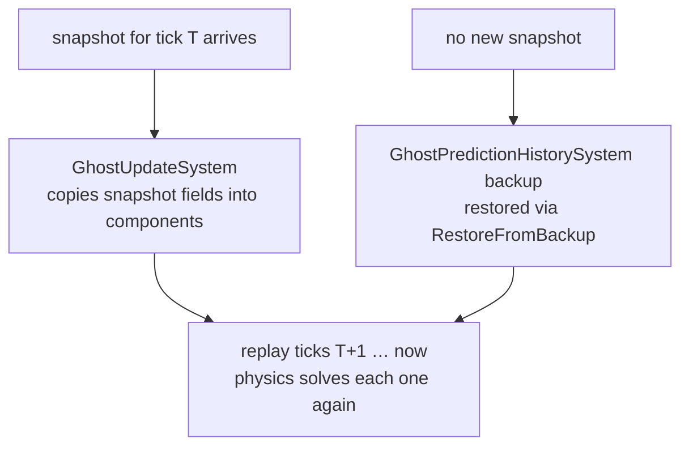

# 33 · Predicted physics

Chapter 17 built a rollback loop out of your own systems. This chapter puts a third-party
rigid body solver inside that loop and explains exactly what survives the trip.

> **📄 Provenance** — this chapter is derived from reading the Netcode for Entities package
> source at version 6.6.0. It was **not measured on the two-capsule project**, which does not
> have Unity Physics installed at all; the runtime-verified chapters of this book are 19
> through 23. Every default value quoted below names the file and line it came from, so you
> can check it against your own package version.

## Physics is relocated, not called

Unity Physics normally runs in `FixedStepSimulationSystemGroup`, driven by an accumulator
against wall-clock time. That is the wrong clock for prediction, because prediction needs to
run the same tick several times.

So NetCode moves it. At the first world update, `PredictedPhysicsConfigSystem` walks
`FixedStepSimulationSystemGroup`, collects `PhysicsSystemGroup` and every system ordered
before or after it, removes them from that group, and adds them to
`PredictedFixedStepSimulationSystemGroup` (`Runtime/Physics/PredictedPhysicsSystemGroup.cs:189`).
It then installs a custom rate manager on the physics group and removes itself from the
update list, because the move only needs to happen once
(`Runtime/Physics/PredictedPhysicsSystemGroup.cs:184`).

> **⚡ Hardware analogy** — this is a **clock domain crossing**. The same combinational block
> is unchanged; only the clock feeding it is swapped. It used to be driven by a free-running
> wall clock at one edge per frame. It is now driven by the prediction tick clock, which can
> issue ten edges in a single frame after a correction.

The consequence follows immediately. Any system you wrote that assumed
`FixedStepSimulationSystemGroup` ordering relative to physics is now in a different group
from the thing it was ordering against, and it will silently run at the wrong time.

## The gate on the physics group

`NetcodePhysicsRateManager.ShouldGroupUpdate` decides, once per frame per tick, whether
physics runs at all (`Runtime/Physics/PredictedPhysicsSystemGroup.cs:79`). It keeps a
`m_DidUpdate` flag so the group runs exactly once per invocation rather than looping.

The condition it evaluates is configurable, and the default is the narrowest of the three.

| `PhysicGroupRunMode` | Physics runs when | Source |
|---|---|---|
| `LagCompensationEnabledOrKinematicGhosts` **(default)** | an entity with `PredictedGhost` **and** `PhysicsVelocity` exists, or lag compensation is on | `Runtime/Physics/PhysicGroupConfig.cs:30` |
| `LagCompensationEnabledOrAnyPhysicsEntities` | an entity with `PhysicsVelocity` **or** `PhysicsCollider` exists, or lag compensation is on | `Runtime/Physics/PhysicGroupConfig.cs:45` |
| `AlwaysRun` | always, subject to the prediction loop running at all | `Runtime/Physics/PhysicGroupConfig.cs:50` |

There is a second gate above it. On the client the prediction loop itself only runs when
predicted ghosts exist, unless you set `ClientTickRate.PredictionLoopUpdateMode` to
`AlwaysRun` (`Runtime/ClientServerWorld/ClientServerTickRate.cs:657`). Both gates must open.
This is the mechanism behind the most common report on the forums: a raycast against static
level geometry returns nothing on the client, because no predicted ghost exists yet and the
collision world was never built.

When no entities match and lag compensation is the only reason to run, the manager runs
physics only on `NetworkTime.IsFirstTimeFullyPredictingTick`
(`Runtime/Physics/PredictedPhysicsSystemGroup.cs:107`).

## Partial ticks get no physics

`PredictedFixedStepSimulationSystemGroup` is a fixed-rate group and does not do partial ticks
(`Runtime/PredictionTicking/GhostPredictionSystemGroup.cs:196`). Its timestep is
`1 / (SimulationTickRate × PredictedFixedStepSimulationTickRatio)`
(`Runtime/ClientServerWorld/ClientServerTickRate.cs:130`), with the ratio defaulting to 1
(`Runtime/ClientServerWorld/ClientServerTickRate.cs:304`).

So a rigid body's transform advances at most once per simulation tick, no matter how fast you
render. Anything smoother than that has to come from graphical smoothing, not from
re-simulating.

## What rollback actually restores

Nothing here is physics-specific, which is the point worth internalising. Physics bodies are
restored by the same two paths as every other predicted ghost.

The backup is taken after the last full tick of each frame's prediction loop
(`Runtime/Snapshot/GhostPredictionHistorySystem.cs:181`), and it is a raw memory copy of the
whole component. On restore, only the fields that are actually serialised are copied back,
through the generated `RestoreFromBackup` function pointer
(`Runtime/Snapshot/GhostComponentSerializer.cs:316`).

> **💀 Trap** — that last sentence is the whole trap. `PhysicsMass`, `PhysicsGravityFactor`,
> `PhysicsColliderBlob` and your own gameplay state are **not replicated by default and are
> therefore never rolled back**. Mutate one inside the prediction loop — a mass change on
> pickup, a gravity flip on a dash — and the mutation is applied once per replayed tick and
> never undone. It will look correct on a perfect connection.

## What is actually on the wire

The package ships two default serialization variants for physics, and they carry the whole
replication contract.

| Component | Variant | Replicated fields | Options | Source |
|---|---|---|---|---|
| `PhysicsVelocity` | `PhysicsVelocityDefaultVariant` | `Linear`, `Angular` | `Quantization = 1000`, `SendTypeOptimization = OnlyPredictedClients` | `Runtime/Physics/PhysicsVelocityVariant.cs:12` |
| `PhysicsGraphicalSmoothing` | `PhysicsGraphicalSmoothingDefaultVariant` | none | `PrefabType = AllPredicted` | `Runtime/Physics/PhysicsVelocityVariant.cs:31` |

Quantization of 1000 means the velocity on the wire is rounded to 0.001 units per second, and
velocity is only sent to clients that predict the ghost. Position and rotation come from the
transform variants, not from here.

The second row is a deletion, not an addition. `PhysicsGraphicalSmoothing` is restricted to
predicted prefab variants so that interpolated clients do not have physics smoothing fighting
the snapshot interpolation that is already positioning the body.

## Determinism, stated honestly

The integration does not require your client and server to produce bit-identical physics
results, and it does not claim cross-platform bitwise determinism anywhere in the package.

What it requires is weaker and more useful: that per-tick divergence stays small enough that
the quantized correction, when it lands, moves the body less than a player can notice. That is
why the guidance in the package documentation is to raise quantization for physics ghosts when
you see visible corrections, and why velocity is replicated at all — correcting position
without correcting velocity would leave the client re-diverging immediately from the same
wrong momentum.

Within one machine, replay is repeatable: the same bodies in the same broadphase order with
the same inputs produce the same result. Across machines, treat agreement as a tuning target,
not a guarantee.

## Non-ghost dynamic bodies are an error

The predicted physics world can only contain things that roll back. A dynamic body that is not
a ghost cannot be rolled back, so it would be simulated forward several times per frame and
never corrected.

`PredictedPhysicsValidationSystem` queries for entities with `PhysicsVelocity` and
`PhysicsWorldIndex` but no `GhostInstance` in world index 0, and logs an error naming the
offending entities (`Runtime/Physics/PredictedPhysicsSystemGroup.cs:240`). If you add a
`PredictedPhysicsNonGhostWorld` singleton, it instead moves them to the world index you
specify (`Runtime/Physics/PredictedPhysicsSystemGroup.cs:224`). That singleton is baked from
the `ClientNonGhostWorldIndex` field, which defaults to 0, meaning off
(`Runtime/Physics/Hybrid/NetCodePhysicsConfig.cs:48`).

## Smoothing the render pose

Between two simulation ticks the body does not move. Unity Physics fills that gap with
`SmoothRigidBodiesGraphicalMotion`, and NetCode orders its own prediction-switch smoothing
after it so that the switch smoothing wins when a ghost changes between predicted and
interpolated (`Runtime/Physics/PredictedPhysicsSystemGroup.cs:304`).

> **💀 Trap** — smoothing writes a render pose. It must never be read back into simulation.
> The moment a smoothed value feeds a force, you have a feedback loop that diverges under
> exactly the conditions that produce corrections.

> **A name that is not in this package** — `EnablePhysicsSync` does not exist anywhere in
> Netcode for Entities 6.6.0. Search the package and you get nothing. The knob people mean is
> usually `NetCodePhysicsConfig.EnableLagCompensation`
> (`Runtime/Physics/Hybrid/NetCodePhysicsConfig.cs:35`), or the graphical smoothing variant
> above. If a tutorial tells you to tick `EnablePhysicsSync`, it is describing a different
> package or an older API.

## Every knob on `NetCodePhysicsConfig`

All defaults below are the field initialisers in
`Runtime/Physics/Hybrid/NetCodePhysicsConfig.cs`.

| Field | Default | Effect |
|---|---|---|
| `PhysicGroupRunMode` | `LagCompensationEnabledOrKinematicGhosts` | which of the three gates above applies (line 29) |
| `EnableLagCompensation` | `false` | bakes a `LagCompensationConfig`, turning on the history ring (line 35) |
| `ServerHistorySize` | `0` | zero means "use the default"; see chapter 35 for what that resolves to (line 38) |
| `ClientHistorySize` | `1` | 0 disables client-side history entirely (line 41) |
| `ClientNonGhostWorldIndex` | `0` | 0 means do not relocate non-ghost dynamic bodies (line 48) |
| `DeepCopyDynamicColliders` | `true` | deep-copies dynamic collider blobs into each history entry (line 52) |
| `DeepCopyStaticColliders` | `false` | deep-copies static collider blobs; expensive on large worlds (line 56) |

## The real cost

Rollback cost is predicted entities times replayed ticks, and physics multiplies both terms.
A solver step is not a transform integration; it is broadphase, narrowphase, and a constraint
solve over every body in the predicted world, repeated once per replayed tick.

The three knobs that bound it:

| Knob | Where | What it trades |
|---|---|---|
| `MaxPredictionStepBatchSizeRepeatedTick` | `ClientTickRate` | merges already-predicted replay ticks into one larger step; 0 becomes 1 at runtime (`Runtime/PredictionTicking/UpdateRateManagement/NetcodeClientPredictionRateManager.cs:190`) |
| `MaxPredictionStepBatchSizeFirstTimeTick` | `ClientTickRate` | same, for ticks predicted for the first time; degrades input fidelity harder |
| `MaxSimulationStepBatchSize` | `ClientServerTickRate` | the server-side equivalent when the server falls behind |

Batching is a real accuracy loss. A batched step integrates a larger delta through the solver,
so contacts resolve differently. It is the correct emergency valve and the wrong default.

## When to use what

- **Interpolated physics ghosts.** Everything the local player does not push: falling debris,
  world props, vehicles you only watch. The server simulates, the client interpolates, and
  the client's solver is never involved.
- **Predicted physics ghosts.** Only what must answer your input in zero frames: the local
  character body, a shoved crate, a ball you can hit. Every one you add costs a full solve per
  replayed tick.
- **A second physics world.** Client-only debris, ragdolls, and cosmetic impacts. Set
  `ClientNonGhostWorldIndex` and give the prefabs a matching `PhysicsWorldIndex`; the
  validation system stops complaining and the predicted world stays small.
- **`PhysicGroupRunMode.AlwaysRun` plus `PredictionLoopUpdateMode.AlwaysRun`.** Use when you
  need to raycast static geometry before any predicted ghost exists — the classic case is
  raycasting to decide where to spawn the first predicted ghost. Pay for it with systems that
  now update every frame, so guard them with `RequireForUpdate`.
- **Raise quantization before you raise tick rate.** Visible physics corrections are far more
  often a precision problem than a rate problem, and quantization is the cheaper fix.

→ [34 · Predicted spawning](34-predicted-spawning.md)
