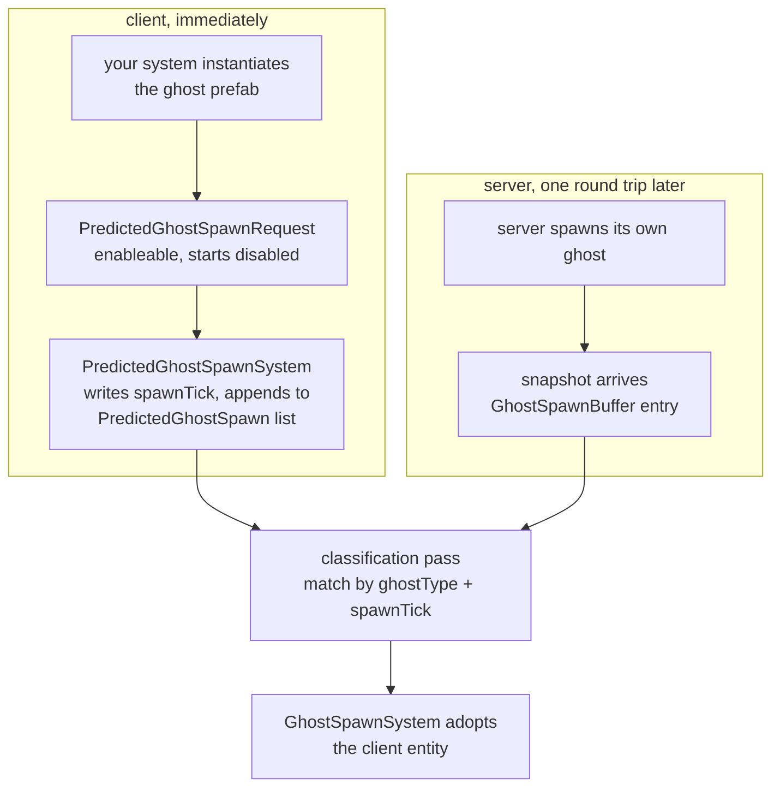

# 34 · Predicted spawning

Chapter 14 listed three ways a ghost can come into existence on a client. This chapter is the
second one, because it is the only shape in which a projectile leaves the barrel in the same
frame you pulled the trigger.

> **📄 Provenance** — derived from reading the Netcode for Entities package source at version
> 6.6.0. **Not measured on the two-capsule project**, which spawns only server-authoritative
> capsules; the runtime-verified chapters of this book are 19 through 23. Every default value
> names the file and line it came from.

## Why the obvious design fails

Server-spawned is the default and it is correct for almost everything. The client presses
fire, a command goes up, the server spawns a rocket, a snapshot comes down, the client
instantiates it. The rocket appears one round trip after the trigger.

For a capsule that is fine, because your own capsule is already predicted and moving. For a
projectile it is not, because there is nothing to predict — the entity does not exist yet. You
get a hole in the feedback loop exactly where the player is paying most attention.

The fix is to let the client create the entity itself, immediately, and then arrange for the
server's authoritative ghost to **take over that same entity** rather than creating a second
one. Everything below is the machinery for that handover.

## The two halves and the seam between them



The seam is the classification pass. Everything upstream of it is two independent streams;
everything downstream is one entity.

## The client half

The `PredictedGhostSpawnRequest` component is added by the ghost baker whenever the prefab's
supported ghost modes include Predicted, and it is added **disabled**
(`Runtime/Authoring/Hybrid/GhostAuthoringComponentBaker.cs:149`). It is an enableable
component with no fields (`Runtime/Snapshot/GhostComponent.cs:364`), so your spawn code is
just an instantiate — the request rides along on the prefab.

`PredictedGhostSpawnSystem` consumes it. For each entity it:

1. Writes `GhostInstance` with `ghostId = 0`, the real `ghostType`, and a `spawnTick`
   (`Runtime/Snapshot/PredictedGhostSpawnSystem.cs:170`). Ghost id zero is the marker for
   "client-authored, not yet adopted".
2. Sets `PredictedGhost { AppliedTick = spawnTick, PredictionStartTick = spawnTick }`
   (`:174`), so rollback has a starting point from tick one.
3. Sizes the snapshot ring and serialises the entity's **current** state into slot zero, using
   the same generated serializers the server uses (`:177` through `:204`). The client's own
   prediction history therefore starts from real data, not zeroes.
4. Appends a `PredictedGhostSpawn { entity, ghostType, spawnTick }` record to the
   `PredictedGhostSpawnList` singleton buffer (`:207`), then schedules removal of the request
   component (`:208`).

The system runs in two places: in `GhostSpawnSystemGroup` (`:77`), and again inside the
prediction loop through `PredictedSpawningSystemGroup`, which is ordered last in
`PredictedSimulationSystemGroup` and after the end-of-prediction command buffer (`:59`). That
second placement is what lets a ghost spawned by a predicted system be fully initialised
before the tick ends.

> **⚡ Hardware analogy** — `PredictedGhostSpawnList` is a **content-addressable pending queue**.
> Entries are not looked up by index; they are searched by a key pair, and a hit removes the
> entry. It behaves like a small store buffer waiting for a matching write to retire.

## Spawn-tick alignment, and why the window exists

The whole match hinges on two ticks agreeing, and the client cannot know the server's tick.
`PredictedGhostSpawnSystem` picks one of two values
(`Runtime/Snapshot/PredictedGhostSpawnSystem.cs:301`):

| Where you spawned | Tick assigned |
|---|---|
| inside the prediction loop | `NetworkTime.ServerTick` — the tick being simulated |
| anywhere else | the **last full server tick**, computed at the start of the frame |

The server, meanwhile, stamps its ghost's spawn tick at the end of its own frame, in the send
system. The package's own comment on that branch says plainly that the two will normally
differ by about one tick, and that a command for tick T can legitimately cause a spawn at
T plus one or T plus two when a rate of fire is involved.

That is why classification is a window and not an equality test. It is also why the single
most effective thing you can do for match reliability is to **spawn inside the prediction
loop**, where the tick is exact.

## The classification pass

`GhostReceiveSystem` does not create ghosts. It appends `GhostSpawnBuffer` entries to the
`GhostSpawnQueue` singleton with `SpawnType` left as `Unknown`, and leaves the decision to a
classification group (`Runtime/Snapshot/GhostSpawnClassificationSystem.cs:36`).

`GhostSpawnClassificationSystemGroup` runs inside `GhostSimulationSystemGroup`, before the
input group (`Runtime/Snapshot/GhostSpawnClassificationSystem.cs:161`). Two systems live in it
by default.

`GhostSpawnClassificationSystem` turns `Unknown` into `Interpolated` or `Predicted`. It reads
the prefab's fallback mode, and for owner-predicted ghosts it digs the `GhostOwner` value out
of the received snapshot bytes and compares it to the local network id
(`Runtime/Snapshot/GhostSpawnClassificationSystem.cs:223`). It never matches anything; it only
decides the mode.

`DefaultGhostSpawnClassificationSystem` is ordered last in the group
(`Runtime/Snapshot/GhostSpawnClassificationSystem.cs:245`) and does the matching. For every
queued spawn that is `Predicted`, unclassified, and has no entity assigned yet, it scans the
`PredictedGhostSpawn` list for a record where the ghost type matches and the absolute tick
difference is under the accepted period
(`Runtime/Snapshot/GhostSpawnClassificationSystem.cs:298`). On a hit it writes
`PredictedSpawnEntity`, sets `HasClassifiedPredictedSpawn`, and removes the record with a
swap-back.

Then `GhostSpawnSystem` performs the adoption. Its `SpawnGhost` helper returns the predicted
entity untouched when one was assigned, and only instantiates a fresh prefab otherwise
(`Runtime/Snapshot/GhostSpawnSystem.cs:96`). The adopted entity keeps its identity, its
transform, its trail renderer, and every local component you added — it just gains the
server's ghost id and starts receiving snapshots.

## What a misclassify actually costs

There are two distinct failures and they look nothing alike.

**No match.** The server's ghost is instantiated fresh, so there are now two rockets. The
client's orphan is destroyed by `PredictedGhostDespawnSystem` once the interpolation tick
passes its spawn tick (`Runtime/Snapshot/PredictedGhostSpawnSystem.cs:453`). The player sees a
brief double image and one of them vanishes. On the wire nothing is wrong; the cost is purely
visual, plus a wasted instantiate.

**Wrong match.** Two rockets fired three ticks apart, and the second one is matched to the
first one's ghost. The adopted entity is now receiving snapshots describing a different
projectile, and it will snap to that position on the next update. This is the failure mode
that looks like teleporting projectiles and is nearly impossible to reproduce on a LAN.

The tick window trades directly between the two. Widen it and misses become mismatches;
narrow it and mismatches become misses.

## Every knob in predicted spawning

Defaults are from `NetworkTimeSystem.DefaultClientTickRate`
(`Runtime/PredictionTicking/NetworkTimeSystem.cs:212`) unless stated otherwise.

| Knob | Default | Effect |
|---|---|---|
| `ClientTickRate.DefaultClassificationAllowableTickPeriod` | `5` | plus-or-minus tick window used by the default matcher (`Runtime/PredictionTicking/NetworkTimeSystem.cs:220`) |
| `ClientTickRate.NumAdditionalClientPredictedGhostLifetimeTicks` | `0` | extra ticks a client spawn survives before cleanup, buying more chances to classify (`Runtime/ClientServerWorld/ClientServerTickRate.cs:574`) |
| `ClientTickRate.InterpolationTimeNetTicks` | `2` | sets the interpolation tick, which is what the despawn deadline is measured against |
| `GhostAuthoringComponent.SupportedGhostModes` | `All` | must include Predicted or no `PredictedGhostSpawnRequest` is baked |
| `GhostSpawnBuffer.PredictedSpawnEntity` | `Entity.Null` | the field your classification system writes |
| `GhostSpawnBuffer.HasClassifiedPredictedSpawn` | `false` | set it to true so later systems skip the entry |
| `GhostSpawnBuffer.ServerSpawnTick` | — | the server's spawn tick; the correct field to compare against, not the receive tick |

A custom classification system is a small `IJobEntity` over the `GhostSpawnQueue` singleton's
buffer, placed in the group:

```csharp
[WorldSystemFilter(WorldSystemFilterFlags.ClientSimulation)]
[UpdateInGroup(typeof(GhostSpawnClassificationSystemGroup))]
[UpdateAfter(typeof(GhostSpawnClassificationSystem))]
public partial struct MyRocketClassificationSystem : ISystem { }
```

Order it after `GhostSpawnClassificationSystem` so the owner-predicted decision has already
run, and before the default matcher so yours wins.

## When to use what

- **Server-spawned.** The default. Anything the local player did not personally cause, and
  anything where a round trip of delay is invisible: enemies, pickups, world events.
- **Predicted spawn.** Only for entities created by the local player's own input, where the
  gap between input and appearance is the feature: bullets, grenades, dashes, placed blocks.
- **Pre-spawned.** Static level content that exists identically on both sides before anyone
  connects. Zero spawn traffic.
- **Default matcher.** Correct when at most one ghost of a given type spawns within the window.
  A single-shot rifle, a grenade, an ability with a cooldown longer than five ticks.
- **Custom matcher.** Required as soon as several ghosts of one type can spawn within five
  ticks — a shotgun, a burst-fire weapon, a swarm. Match on a replicated `[GhostField]` you
  control, such as a per-shot sequence number written by the same code on both sides. That is
  an exact key, and it removes the window entirely.
- **Raise `NumAdditionalClientPredictedGhostLifetimeTicks`** when you see misses on a lossy
  link. It keeps mispredicted spawns alive longer too, so raise it in single digits.
- **Widen `DefaultClassificationAllowableTickPeriod`** only if server tick batching is
  producing large spawn-tick discrepancies. Prefer a custom matcher.

→ [35 · Lag compensation](35-lag-compensation.md)
