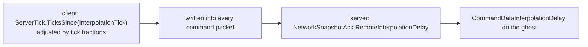

# 35 · Lag compensation

Chapter 15 established that three different "nows" are on screen at once. This chapter is
what the server does about it when a client claims to have hit something.

> **📄 Provenance** — derived from reading the Netcode for Entities package source at version
> 6.6.0. **Not measured on the two-capsule project**, which has no hit registration and no
> Unity Physics; the runtime-verified chapters of this book are 19 through 23. Every default
> value names the file and line it came from.

## The accounting problem

When a player fires, they are aiming at a composite image. Their own capsule is drawn at the
predicted tick, ahead of the server. Every other player is drawn at the interpolation tick,
behind the server. The crosshair was over a body that, by the server's clock, is already
somewhere else.

If the server tests the shot against its own present, it will miss shots the player saw land,
and the error grows linearly with latency. Lag compensation fixes this by testing the shot
against a reconstruction of what that specific client actually saw — which means the server
must keep the recent past, and must know how far into the past each client is looking.

## The ring buffer

`RawHistoryBuffer` is thirty-two `CollisionWorld` slots
(`Runtime/Physics/PhysicsWorldHistory.cs:112`), plus thirty-two parallel `NetworkTick` fields.
Slot selection is `tick.TickIndexForValidTick % size`
(`Runtime/Physics/PhysicsWorldHistory.cs:455`), and the size is required to be zero, one, or a
power of two — the constructor throws otherwise
(`Runtime/Physics/PhysicsWorldHistory.cs:271`).

> **⚡ Hardware analogy** — this is a **direct-mapped cache indexed by the low bits of the
> tick, with the tick itself stored as the tag**. The power-of-two requirement is exactly why:
> the index is a mask, not a division, and it has to stay correct when the tick counter wraps
> `uint`. A read hands you back the tag it found, so you can verify the line you got is the
> line you asked for.

The buffer is not a `NativeArray` of worlds. It is thirty-two named fields in a struct, read
through a switch statement, because a `CollisionWorld` contains a broadphase tree and cannot
simply be memcopied into an arbitrary slot.

## Who writes it

`PhysicsWorldHistory` runs in `PhysicsSystemGroup` with `OrderLast`, on both client and server
(`Runtime/Physics/PhysicsWorldHistory.cs:478`). Running last inside the physics group matters:
it clones the collision world after it has been built, so the collider blob references are
valid and copyable.

It requires a `LagCompensationConfig` singleton to exist at all
(`Runtime/Physics/PhysicsWorldHistory.cs:497`) — no config, no history, and the system never
runs. It also returns immediately unless `NetworkTime.IsFirstTimeFullyPredictingTick` is true
(`Runtime/Physics/PhysicsWorldHistory.cs:523`), so re-simulated ticks never overwrite history
that was already recorded.

On the first update it fills every slot with the current collision world, walking the tick
backwards (`Runtime/Physics/PhysicsWorldHistory.cs:552`). After that it stores only the ticks
that have not been stored yet, clamped so a single frame can never overwrite a slot it wrote
in the same frame (`Runtime/Physics/PhysicsWorldHistory.cs:565`).

Each store is `CollisionWorld.Clone` with the two deep-copy flags and the optional whitelist
(`Runtime/Physics/PhysicsWorldHistory.cs:354`). This is the real cost of lag compensation:
thirty-two live broadphase trees resident in memory, and one clone per tick.

## Who reads it

The read API is on the `PhysicsWorldHistorySingleton` component
(`Runtime/Physics/PhysicsWorldHistory.cs:35`):

```csharp
history.GetCollisionWorldFromTick(tick, interpolationDelay, ref physicsWorld,
                                  out var collWorld, out var expectedTick, out var returnedTick);
```

Read the four behaviours it can produce, because they are not interchangeable:

| Situation | What you get | How you detect it |
|---|---|---|
| requested tick is newer than anything stored | the **live** collision world | `returnedTick` equals the tick you passed |
| requested tick is in range | the stored clone for that tick | `expectedTick == returnedTick` |
| requested tick is older than the ring | clamped to the **oldest** stored tick | `expectedTick != returnedTick` |
| history never initialised | the live world | `LatestStoredTick` is invalid |

The first case is in the singleton wrapper
(`Runtime/Physics/PhysicsWorldHistory.cs:39`); the clamping is in the buffer reference
(`Runtime/Physics/PhysicsWorldHistory.cs:445`).

> **💀 Trap** — the four-argument overload discards `expectedTick` and `returnedTick`
> (`Runtime/Physics/PhysicsWorldHistory.cs:49`). Use it and a client whose interpolation delay
> exceeds your history size is silently served the oldest world you have, forever, with no
> signal. Compare the two ticks and log the mismatch; that comparison is the only way to learn
> that your history is too short for your player base.

## Where the interpolation delay comes from

The delay is not estimated by the server. It is measured by the client and shipped in the
command header.



The client computes it in `CommandSendSystem`: ticks since the interpolation tick, plus or
minus one depending on the sub-tick fractions, floored at zero
(`Runtime/Command/CommandSendSystem.cs:282`). It is written as a raw uint into the packet
(`Runtime/Command/CommandSendSystem.cs:251`).

On the server it lands in `NetworkSnapshotAck.RemoteInterpolationDelay`
(`Runtime/Connection/NetworkSnapshotAck.cs:179`), and the command receive job copies it onto
the target entity as `CommandDataInterpolationDelay`
(`Runtime/Command/CommandReceiveSystem.cs:165`) — but only if the component is present.

That component is not baked by default. You get it by ticking **Track Interpolation Delay** on
the ghost authoring component, which only adds it when the ghost also has an owner
(`Runtime/Authoring/Hybrid/GhostAuthoringComponentBaker.cs:96`). The component itself is
restricted to predicted prefab variants (`Runtime/Command/CommandDataInterpolationDelay.cs:19`).

> **💀 Trap** — the delay is only refreshed when a command arrives for that entity. If the
> player switches command target — entering a vehicle, possessing a turret — the old entity
> keeps its last reported delay forever. The package documents this explicitly: the value is
> never reset to zero (`Runtime/Command/CommandDataInterpolationDelay.cs:28`).

## Choosing the rewind tick

Inside the prediction loop, the tick you are simulating is `NetworkTime.ServerTick`. The
rewind tick is that minus the delay, and `GetCollisionWorldFromTick` does the subtraction for
you — you pass the current tick and the delay separately.

Three rules follow from that, and all three are load-bearing:

1. **Query inside the prediction group**, so the tick you pass is the tick the command belongs
   to. A hit test in a presentation system is using the wrong clock.
2. **Gate the hit on `IsFirstTimeFullyPredictingTick`.** Applying damage is a one-shot side
   effect, and chapter 15's rule applies unchanged.
3. **Filter on `Simulate`.** The same rule as every other predicted system.

The client can run the identical code. `ClientHistorySize` defaults to 1
(`Runtime/Physics/Hybrid/NetCodePhysicsConfig.cs:41`), which is enough for the client to test
against the current tick through the same call, so one implementation serves both sides. Set
it to 0 to disable client history entirely and save the clone
(`Runtime/Physics/LagCompensationConfig.cs:37`). The client's own delay is always zero, so a
predicted client naturally tests against its own present.

## The shot behind cover

Lag compensation is not free of consequences, and the consequence has a precise mechanism.

The server rewinds **the target**, not the shooter and not the level. Player A shoots at where
they saw Player B, one interpolation window in the past. The server rewinds B's collider to
that moment and registers a hit. But B, in the server's present, has already stepped behind a
wall — and B's client, which is predicting B, has already drawn B safely behind the wall.

B is told they were hit while their own screen shows cover. That is not a bug in the
implementation; it is the choice the system makes. Somebody has to absorb the latency, and
lag compensation assigns it to the target. The alternative — no compensation — assigns it to
the shooter, who must lead every moving target by their own ping.

The knobs that bound how bad it can get:

| Knob | Effect on the tradeoff |
|---|---|
| `ClientTickRate.InterpolationTimeNetTicks` (default 2) | the main term in the delay; smaller window, less rewind, more visible stutter on the interpolated ghosts |
| `ServerHistorySize` | a hard ceiling on rewind — beyond it, high-latency clients are clamped and simply start missing |
| `NetworkTickRate` | a lower snapshot rate forces a larger interpolation window, which enlarges the rewind |

Clamping is the honest ceiling. A player far enough behind gets the oldest world you kept, so
their shots stop landing rather than rewinding arbitrarily far.

## Every knob in `LagCompensationConfig`

| Field | Default | Meaning |
|---|---|---|
| `ServerHistorySize` | `0` means "use the default" | number of stored collision worlds on the server (`Runtime/Physics/LagCompensationConfig.cs:25`) |
| `ClientHistorySize` | `1` | stored worlds on the client; `0` disables client history (`Runtime/Physics/LagCompensationConfig.cs:37`) |
| `DeepCopyDynamicColliders` | `true` in the authoring component | deep-copy dynamic collider blobs; required for accurate queries against dynamic bodies (`Runtime/Physics/LagCompensationConfig.cs:49`) |
| `DeepCopyStaticColliders` | `false` | deep-copy static collider blobs; only needed if static geometry changes (`Runtime/Physics/LagCompensationConfig.cs:67`) |
| `PhysicsWorldHistorySingleton.DeepCopyRigidBodyCollidersWhitelist` | empty | per-body opt-in when the blanket flags are too expensive (`Runtime/Physics/PhysicsWorldHistory.cs:70`) |
| `PhysicsWorldHistory.RawHistoryBufferMaxCapacity` | `32` | hard maximum; larger values are rejected (`Runtime/Physics/PhysicsWorldHistory.cs:490`) |

> **📄 A contradiction inside the package** — the documentation comment on `ServerHistorySize`
> says that leaving it at zero gives you the default value of 16
> (`Runtime/Physics/LagCompensationConfig.cs:19`). The code does something else: zero resolves
> to `RawHistoryBuffer.Capacity`, which is 32
> (`Runtime/Physics/PhysicsWorldHistory.cs:531`). The code wins. Set the value explicitly if
> you care, and do not trust the comment.

## When to use what

- **Lag compensation off.** Any game where hit detection is not instantaneous, or where
  projectiles are themselves predicted ghosts that travel visibly. A rocket that takes half a
  second to arrive does not need rewind; it needs to exist on both sides. This is the cheapest
  option and it is the right one more often than people assume.
- **Lag compensation on, dynamic deep copy, static off.** The standard hitscan shooter. You
  are testing against moving players, and your walls do not move.
- **Static deep copy on.** Only when static geometry genuinely changes at runtime — a
  destructible wall, a felled tree. On a large world this copies your entire level geometry
  thirty-two times. Prefer the two-query pattern the package recommends: query live static
  geometry first, use that hit distance as the max cast distance for the historic dynamic
  query.
- **The whitelist instead of the flags.** When you know precisely which bodies need rewind —
  the player characters, nothing else. Cheapest accurate configuration available.
- **`ServerHistorySize` sizing.** It has to cover the worst interpolation delay you intend to
  support, in ticks. At 60 hertz simulation, 32 slots is a little over half a second of
  rewind. Log the `expectedTick` versus `returnedTick` mismatch in production and let the data
  choose the number.
- **`ClientHistorySize = 0`.** When the client never needs to test its own shots, because the
  server is the only place hit registration happens. Saves one collision world clone per tick
  on every client.

→ [36 · Ghost serializer code generation](36-ghost-codegen.md)
