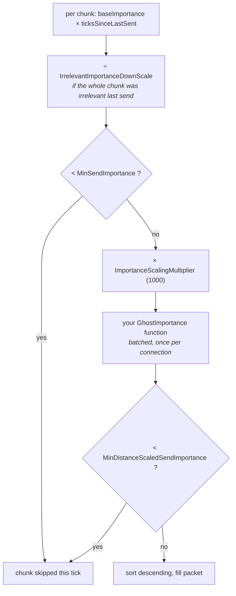

# 37 · Interest management: scale and relevancy

The server has one packet per connection per network tick. Everything in this chapter is
about deciding what goes in it.

> **📋 Honesty label** — chapters 19–23 were verified at runtime on a two-player capsule
> build. **This chapter is not.** Every claim here is read out of the installed
> `com.unity.netcode@6.6.0` source and cited by file and line. Nothing in it was measured
> on a populated server, because this project never had one. Treat the mechanism as
> accurate and the tuning advice as reasoned, not benchmarked.

## The budget is one packet, not one world

`GhostSendSystem` is designed to send **one snapshot packet per connection per network
tick** (`Runtime/Snapshot/GhostSendSystem.cs:433`). Its size is resolved in this order
(`GhostSendSystem.cs:1009`): `NetworkStreamSnapshotTargetSize.Value` on the connection
entity if present, else `GhostSendSystemData.DefaultSnapshotPacketSize` if non-zero, else
the driver's payload capacity minus the pipeline header.

Unity Transport's `NetworkParameterConstants.MaxMessageSize` is **1400 bytes**
(`Runtime/NetworkParams.cs:82` in `com.unity.transport@6.7.0`), and NetCode clamps any
request to a floor of 100 bytes (`GhostSendSystem.cs:96`). Ask for more than the message
size and the snapshot silently moves onto the fragmenting pipeline
(`GhostSendSystem.cs:1034`).

Up to a third of that packet can go to despawn messages before ghost data gets any of it —
`PercentReservedForDespawnMessages` defaults to `.33f` (`GhostSendSystem.cs:405`).

## Two different verbs: importance and relevancy

- **Importance** answers *how often*. A low-importance ghost is still replicated; it just
  waits its turn. Rate control.
- **Relevancy** answers *whether*. An irrelevant ghost is not sent, and if the client
  already had it, the server queues a despawn
  (`Runtime/Snapshot/GhostChunkSerializer.cs:1817`). Interest management, and a security
  boundary.

Both operate **per chunk**, not per entity.

## The importance pipeline, in execution order

The arithmetic is literal. `chunkPriority = chunkState.baseImportance * ticksSinceLastSent`
(`GhostSendSystem.cs:1612`), then the irrelevance divisor, then the `MinSendImportance`
gate, then multiplication by `m_ImportanceScalingMultiplier` on insertion
(`GhostSendSystem.cs:1624`), then the user function, then the sort
(`GhostSendSystem.cs:1680`).

> **⚡ Hardware analogy** — this is a **priority arbiter with aging**. `baseImportance` is
> the static request priority; `ticksSinceLastSent` is the age counter a starvation-
> prevention arbiter adds so a low-priority requester eventually wins the bus. A cone with
> importance 1 is not silent forever for the same reason a low-priority DMA channel is not
> starved forever: its age term keeps climbing while everyone else's resets on grant.

The multiplier exists because that product is a small integer and your scaling function
needs headroom to divide. It defaults to 1000 (`GhostSendSystem.cs:416`).

## Every knob on `GhostSendSystemData`

Defaults are from `GhostSendSystemData.Initialize` (`GhostSendSystem.cs:401`).

| Field | Default | Effect |
|---|---|---|
| `DefaultSnapshotPacketSize` | 0 (use MTU) | target snapshot bytes for every connection |
| `PercentReservedForDespawnMessages` | 0.33 | ceiling on despawn bytes; docs suggest ~0.75 at large scale |
| `MinSendImportance` | 0 (off) | floor applied **before** scaling; a chunk below it waits |
| `MinDistanceScaledSendImportance` | 0 (off) | floor applied **after** your scaling function |
| `MaxIterateChunks` | 0 | how many sorted chunks are even examined; 0 means "use `MaxSendChunks`", −1 means "until full" |
| `MaxSendChunks` | 0 (off) | how many chunks may contribute ghosts to one snapshot |
| `MaxSendEntities` | 0 | **obsolete and non-functional in 6.6** |
| `IrrelevantImportanceDownScale` | 1 (off) | divisor for chunks that were entirely irrelevant last send |
| `ImportanceScalingMultiplier` | 1000 | headroom granted to your scaling function |
| `FirstSendImportanceMultiplier` | 1 (off) | boosts chunks new to this connection so they are not starved by `MinSendImportance` |
| `ForceSingleBaseline` | false | measurement aid: collapses three delta baselines to one |
| `ForcePreSerialize` | false | debug only; forces per-world instead of per-connection serialization |
| `KeepSnapshotHistoryOnStructuralChange` | true | preserves delta history across structural changes, at CPU cost |
| `EnablePerComponentProfiling` | false | per-component profiler scopes inside serialization |
| `CleanupConnectionStatePerTick` | 1 | connections whose stale serialization state is reclaimed per tick |
| `TempStreamInitialSize` | 8192 | scratch serialization buffer; too small means repeated re-serialization |

> **💀 Trap** — chapter 29 lists `MaxSendEntities` as a "hard cap on ghosts per snapshot".
> In 6.6 that field carries `[Obsolete("No longer functional!...")]`
> (`GhostSendSystem.cs:242`). Use `MaxSendChunks` and `MaxIterateChunks`: **the send
> scheduler thinks in chunks, not entities.**

`MaxIterateChunks` has a second-order failure the source calls out directly
(`GhostSendSystem.cs:204`): the cap is applied *before* relevancy. If the highest-importance
chunks within it hold only irrelevant ghosts, the snapshot goes out nearly empty. Set it to
at least twice `MaxSendChunks`.

## Per-prefab knobs

From `Runtime/Authoring/BaseGhostSettings.cs`:

| Setting | Default | Line | Use |
|---|---|---|---|
| `Importance` | 1 | 115 | base request priority for this ghost type's chunks |
| `MaxSendRate` | 0 (off) | 152 | hard ceiling in Hz for this prefab's chunks |
| `OptimizationMode` | Dynamic | 108 | Static skips unchanged chunks entirely |
| `UsePreSerialization` | false | 48 | serialize once for all connections instead of per connection |
| `UseSingleBaseline` | false | 58 | one delta baseline instead of three: less CPU, more bytes |
| `GhostGroup` | false | 39 | atomic co-send; **forces Dynamic** (line 215) and costs random chunk access |

`MaxSendRate` is enforced as a tick interval before priority is computed
(`GhostSendSystem.cs:1583`) and is deliberately **ignored when the chunk has structural
changes**, so a ghost type that spawns and despawns every tick blows straight through its
own rate limit.

## Custom importance: the `GhostImportance` singleton

`GhostImportance` (`Runtime/Snapshot/GhostImportance.cs:82`) is a server singleton you
create yourself. It carries a function pointer and three `ComponentType` declarations:

| Field | Meaning |
|---|---|
| `GhostConnectionComponentType` | per-connection input, read off the connection entity |
| `GhostImportanceDataType` | optional global config, read off the singleton entity |
| `GhostImportancePerChunkDataType` | **must be a shared component**; carries the per-chunk key |
| `BatchScaleImportanceFunction` | called once per connection with the whole chunk list |
| `ScaleImportanceFunction` | obsolete per-chunk variant; batched wins if both are set |

The batched form mutates `PrioChunk.priority` in place. It may also set
`PrioChunk.isRelevant`, a whole-chunk relevancy fast path that skips the hash map entirely
(`GhostImportance.cs:29`).

> **💀 Trap** — importance scaling only runs when the connection entity actually carries
> `GhostConnectionComponentType` (`GhostSendSystem.cs:1637`). Forget to add it and your
> scaling function is never called, with no error. The packet dump prints
> `GhostImportance(...) disabled!` for exactly this case (`GhostSendSystem.cs:1711`).

## The built-in distance implementation

`GhostDistancePartitioningSystem` adds a `GhostDistancePartitionShared { int3 Index }` to
every server ghost with a transform and updates it when the ghost crosses into a new tile
(`Runtime/Snapshot/GhostDistancePartitioningSystem.cs:15`). Tile geometry comes from
`GhostDistanceData { TileSize, TileCenter, TileBorderWidth }`
(`Runtime/Snapshot/GhostDistanceImportance.cs:37`); the per-connection focal point comes
from `GhostConnectionPosition` (`GhostDistanceImportance.cs:15`).

The default scaling function is four lines of arithmetic
(`GhostDistanceImportance.cs:118`): take the tile-index delta, square its length, and if
that squared distance exceeds 3, divide priority by it. The threshold of 3 makes all 26
adjacent tiles count as "here", so a player near a tile edge does not lose the tile they are
looking at. The relevancy-aware variant `BatchScaleWithRelevancy` goes further and marks any
chunk beyond a squared tile distance of 16 as irrelevant outright
(`GhostDistanceImportance.cs:152`).

> **💀 Trap** — the partitioning system's own docs warn that adding a shared component per
> ghost fragments chunks: two ghosts of one archetype in one tile means a chunk holding two
> entities (`GhostDistancePartitioningSystem.cs:33`). Tile size is therefore a *cache*
> decision as much as a bandwidth decision. Large tiles keep chunks full; small tiles give
> sharper priority. Set `AutomaticallyAddGhostDistancePartitionSharedComponent = false`
> (`GhostDistancePartitioningSystem.cs:60`) to opt only some ghost types in.

## Relevancy modes

`GhostRelevancy` (`Runtime/Snapshot/GhostRelevancy.cs:93`) is a singleton with a mode, a
set, and a query.

| `GhostRelevancyMode` | Semantics | Reach for it when |
|---|---|---|
| `Disabled` | everything relevant | small worlds; importance alone is enough |
| `SetIsRelevant` | only listed ghosts are sent | large worlds; the player sees a fraction of the world |
| `SetIsIrrelevant` | listed ghosts are excluded | mostly-visible world with specific exceptions |

Three inputs combine per ghost (`GhostChunkSerializer.cs:1786`): an internal always-relevant
archetype mask, your `DefaultRelevancyQuery` mask, and the `PrioChunk.isRelevant` chunk flag.
Only if none of those settles it is the `GhostRelevancySet` hash map consulted, keyed by
`(connectionId, ghostId)`. A ghost matching netcode's *internal* rule can never be made
irrelevant by you (`GhostChunkSerializer.cs:1804`).

When a relevant ghost turns irrelevant, the server clears its snapshot history and enqueues
a pending despawn (`GhostChunkSerializer.cs:1823`); on the client the entity is destroyed.
Relevancy churn is spawn/despawn churn, which is why hysteresis matters.

## Static optimization

`OptimizationMode.Static` lets a chunk be skipped completely. `CanUseStaticOptimization`
(`GhostChunkSerializer.cs:1865`) returns true only when **all** of these hold:

1. no relevancy changes for this chunk this tick,
2. no structural (order) change in the chunk,
3. at least one previously-sent zero-change snapshot has been acked by this connection,
4. a valid zero-change version exists,
5. `chunk.DidChange` is false for every replicated component against that version.

Point 3 is the one people miss: static optimization does nothing until the client has acked
a snapshot containing the chunk. Prespawned chunks get it free — loading the subscene counts
as an implicit ack (`GhostChunkSerializer.cs:1896`).

Point 5 uses Unity's chunk change version, not a value comparison. Writing a non-replicated
field on a replicated component bumps the version and un-optimizes the chunk — a false
positive the source notes it cannot currently warn about
(`GhostChunkSerializer.cs:1943`).

## How this degrades as players climb

Serialization is per connection — each one has its own acked baseline, chunk states and
sorted chunk list — so per-tick cost is roughly `connections × chunks examined × ghosts
written`. Doubling players roughly doubles `GhostSendSystem` cost with an unchanged world.

| Symptom as counts rise | Mechanism | First lever |
|---|---|---|
| Server frame time grows linearly with players | per-connection serialization | `UsePreSerialization` on the expensive shared ghosts |
| Distant ghosts feel frozen | aging cannot beat nearby chunks | raise `Importance` on the frozen type, or widen tiles |
| Snapshots arrive under-full | `MaxSendChunks` / `MaxIterateChunks` too tight | raise `MaxIterateChunks` to ≥ 2× `MaxSendChunks` |
| New joiners take seconds to see the world | `MinSendImportance` starving new chunks | set `FirstSendImportanceMultiplier` above `MinSendImportance` |
| Despawns lag far behind reality | send system rarely revisits the chunk | raise `MaxIterateChunks` and `PercentReservedForDespawnMessages` |
| Chunks half empty, CPU high | shared-component fragmentation from tiling | larger `TileSize`, or opt fewer types into partitioning |

## When to use what

| World shape | Configuration |
|---|---|
| One arena, under ~50 ghosts | relevancy `Disabled`; per-prefab `Importance` only |
| Arena with rooms or floors | `SetIsIrrelevant` for other rooms; distance importance inside a room |
| Open world, hundreds of ghosts | `GhostDistanceImportance` with `BatchScaleWithRelevancy`; tiles sized so a chunk holds many ghosts |
| Thousands of static props | `OptimizationMode.Static` + pre-spawned; `MaxIterateChunks` around 10 |
| Competitive shooter | `SetIsRelevant` allowlist driven by visibility, not distance — see chapter 40 |
| Bandwidth-capped clients | `NetworkStreamSnapshotTargetSize` per connection, sized to your kbit/s target |

Choose in that order. Relevancy first, because a ghost you never send costs nothing. Static
optimization second, because an unchanged ghost costs nothing. Importance last, because it
only decides who spends a budget you have already minimised.

> **🔬 Probe** — the packet dump is ground truth here. Enable
> `NetCodeDebugConfig.DumpPackets` (`Runtime/Debug/NetCodeDebugConfig.cs:23`) in a
> `NETCODE_DEBUG` build. It logs, per chunk per tick, the priority assigned and the exact
> reason a chunk was skipped — `MinSendImportance`, `MaxSendRate`, or an unacked prespawn
> scene — plus how many chunks your importance function culled.

→ [38 · Profiling for real](38-profiling.md)
