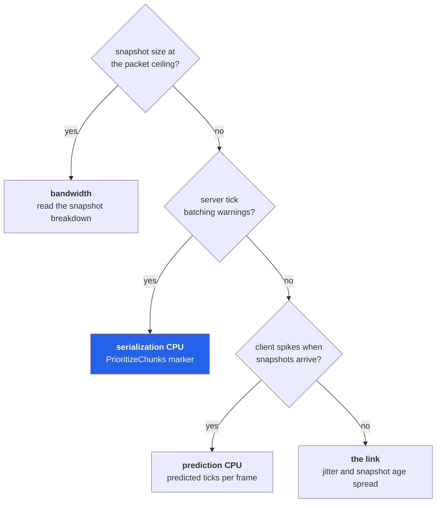

# 38 · Profiling for real

Netcode has four bottlenecks and they look identical from outside: the game gets worse with
more players. This chapter is the counters that tell them apart.

> **📋 Honesty label** — chapters 19–23 were verified at runtime on a two-player capsule
> build. **This chapter is not.** Every component, counter, marker and threshold below is
> read out of the installed `com.unity.netcode@6.6.0` source and cited by file and line.
> **No numbers are quoted for what you will observe**, because nothing here was measured on
> a loaded server. Where a bad value has a definition, it is the package's own definition.
> Where it does not, this chapter describes the *shape* of a bad value, not a figure.

## The four bottlenecks

| # | Bottleneck | Lives on | Grows with |
|---|---|---|---|
| 1 | Snapshot serialization CPU | server | connections × chunks × replicated fields |
| 2 | Egress bandwidth | server → each client | ghosts in packet × bits per ghost |
| 3 | Prediction CPU | client | predicted entities × replayed ticks |
| 4 | Link quality | the wire | latency, jitter, loss — not your code |

Each has its own instrument. Reaching for the CPU profiler when you have a bandwidth
problem is how weeks disappear.

## Turning the instrumentation on

Everything in `Runtime/Stats/` is wrapped in `#if UNITY_EDITOR || NETCODE_DEBUG`
(`Runtime/Stats/GhostStatsMetrics.cs:1`). In a release player without `NETCODE_DEBUG` these
components do not exist and these counters are not emitted. Profile a development build.

The collector gates itself on `Profiler.enabled`
(`Runtime/Stats/ProfilerMetricsCollector.cs:149`) and creates its own singleton entity —
named `MetricsMonitor` — with the six required component types
(`ProfilerMetricsCollector.cs:59`). If you already created a `GhostMetricsMonitor`, it
destroys yours and logs a warning (`ProfilerMetricsCollector.cs:129`).

## The metric singletons

These are ordinary ECS data. Read them from your own system and put them on screen, which
is usually better than alt-tabbing to a profiler window.

| Type | Kind | Fields worth reading |
|---|---|---|
| `GhostMetricsMonitor` | singleton | `CapturedTick` — the tick these metrics describe |
| `NetworkMetrics` | singleton | `Rtt`, `Jitter`, `CommandAge`, `SnapshotAgeMin`/`Max`, `TimeScale`, `InterpolationOffset`/`Scale` |
| `SnapshotMetrics` | singleton | `TotalSizeInBits`, `TotalGhostCount`, `DestroyInstanceCount`, `DestroySizeInBits` |
| `GhostMetrics` | buffer | per ghost type: `InstanceCount`, `SizeInBits`, `ChunkCount` (server), `Uncompressed` (client) |
| `GhostNames` | buffer | index-parallel names for `GhostMetrics` |
| `GhostSerializationMetrics` | buffer | per ghost type serialization time, **in microseconds** |
| `PredictionErrorMetrics` | buffer | per-error magnitudes |
| `PredictionErrorNames` | buffer | index-parallel names for the above |

Source: `Runtime/Stats/GhostStatsMetrics.cs:18`, `:29`, `:68`, `:151`, `:138`, `:98`,
`:113`, `:126`.

> **💀 Trap** — `GhostMetrics`, `GhostSerializationMetrics` and `GhostNames` are parallel
> buffers joined only by index (`GhostStatsMetrics.cs:148`). The metric buffer without the
> name buffer is numbers attached to nothing. Read both, same frame, same world.

## The profiler modules and their counters

Two modules register themselves: **Client World**
(`Editor/Profiler/Common/ClientWorldProfiler.cs:11`) and **Server World**
(`Editor/Profiler/Common/ServerWorldProfiler.cs:12`), reachable through
`Window → Multiplayer → Network Profiler` (`Editor/Profiler/Common/ProfilerUtils.cs:242`).

| Counter | Category | Unit | Emitted on |
|---|---|---|---|
| `Ghost Instances (Server)` | Network | Count | server |
| `Snapshot Size (Server)` | Network | Bytes | server |
| `Ghost Instances (Client)` | Network | Count | client |
| `Snapshot Size (Client)` | Network | Bytes | client |
| `Jitter` | Network | Nanoseconds | client |
| `RTT` | Network | Nanoseconds | client |

Registered at `Runtime/Stats/ProfilerMetricsCollector.cs:106`–`:114`. Snapshot size is
published as bytes by right-shifting the bit total by three
(`ProfilerMetricsCollector.cs:243`). `NetworkMetrics.Rtt` and `NetworkMetrics.Jitter` are
**milliseconds** — they come straight from `NetworkSnapshotAck.EstimatedRTT` and
`DeviationRTT` (`Runtime/Connection/NetworkSnapshotAck.cs:275`, `:280`) — and the collector
multiplies them by one million for the nanosecond-unit counters
(`ProfilerMetricsCollector.cs:271`). Read the singleton if you want milliseconds; read the
counter if you want a graph.

> **💀 Trap** — `Window → Multiplayer → Network Debugger (Browser)` still exists but is
> labelled **Deprecated** in 6.6 (`Runtime/Stats/GhostStatsSystem.cs:22`). It launches a
> local HTML page over a websocket. The profiler modules are the current tool. If a tutorial
> tells you to use the browser debugger, it predates this package version.

## The snapshot breakdown, and its two defined warnings

The per-tick snapshot view breaks a snapshot into rows with these columns
(`Editor/Profiler/Common/NetcodeProfilerConstants.cs:24`): name, size, percent of snapshot
size, instance count, compression efficiency, and average size per instance. Two non-ghost
rows also appear: *snapshot overhead* (spawns, despawns, prefab lists) and *ghost prefab
overhead* (ghost IDs, spawn ticks, baselines) — `NetcodeProfilerConstants.cs:38`.

The package defines exactly two thresholds. They are the only numeric "bad values" this
chapter gives you, because they are the package's own:

| Threshold | Value | Source | Meaning |
|---|---|---|---|
| Compression efficiency warning | below **70 %** | `NetcodeProfilerConstants.cs:7` | this row is barely delta-compressing |
| Snapshot size warning | above **90 %** of `snapshotCount × MTU` | `NetcodeProfilerConstants.cs:8` | you are at the packet ceiling, so ghosts are being deferred |

Compression efficiency is defined in the tooltip as `1 − (uncompressed / compressed)`, and
higher is better (`NetcodeProfilerConstants.cs:47`). A type below the threshold means one of
three things: quantization too fine, a field changing every tick that should not, or a type
that wants `UseSingleBaseline` because its changes are not linear (chapter 37).

## Profiler markers worth pinning

All are real `ProfilerMarker` instances, so they appear in the Timeline and Hierarchy views
by name.

| Marker | File | What it isolates |
|---|---|---|
| `PrioritizeChunks` | `Runtime/Snapshot/GhostSendSystem.cs:511` | gathering + sorting chunks per connection |
| `Relevancy` | `GhostSendSystem.cs:514` | per-entity relevancy evaluation |
| `CanUseStaticOptimization` | `GhostSendSystem.cs:513` | the static-skip check |
| `GhostGroup` / `GhostGroupRelevancy` | `GhostSendSystem.cs:512`, `:515` | ghost group random access cost |
| `TryGetChunkStateOrNew` | `GhostSendSystem.cs:517` | per-connection chunk state churn |
| `GhostSendSystem_Scheduling` | `GhostSendSystem.cs:516` | job scheduling overhead, not work |
| `SnapshotData_GetDataAtTick` | `Runtime/Snapshot/SnapshotData.cs:140` | client-side snapshot lookup |
| `ServerFixedUpdate` | `Runtime/PredictionTicking/UpdateRateManagement/NetcodeTimeTracker.cs:41` | one server tick |
| `<GhostCollectionSystem>_*` | `Runtime/Snapshot/GhostCollectionSystem.cs:250` | prefab collection, stripping, mapping — startup, not steady state |

`GhostSendSystemData.EnablePerComponentProfiling` (`GhostSendSystem.cs:335`) adds a marker
per component inside serialization. It costs performance, which is why it is off; use it to
answer "which component is expensive", then turn it off. A per-ghost-name marker is also
created at `GhostCollectionSystem.cs:796`.

> **⚡ Hardware analogy** — these markers are **chip-select lines on a logic analyser**.
> They do not tell you the value on the bus; they tell you which unit was driving it. You
> still read the value from the metric buffers.

## Prediction cost, and what batching actually buys

Rollback cost is `predicted entities × replayed ticks`. Both terms are readable.

| What to read | Where |
|---|---|
| ticks predicted this frame so far | `NetworkTime.PredictedTickIndex` (`Runtime/PredictionTicking/NetworkTime.cs:178`) |
| ticks the loop expects this frame | `NetworkTime.NumPredictedTicksExpected` (`NetworkTime.cs:189`) |
| whether this is a re-simulation | `NetworkTime.IsFirstTimeFullyPredictingTick` (`NetworkTime.cs:159`) |
| ticks merged into one server step | `NetworkTime.SimulationStepBatchSize` (`NetworkTime.cs:123`) |
| predicted entity count | a query on `PredictedGhost` in the client world |

`NetworkTime.ToFixedString()` prints most of this in one line
(`NetworkTime.cs:219`) — including `PredictedTickIndex/NumPredictedTicksExpected` — which
makes it the cheapest possible prediction probe.

Predicted tick batching is controlled by two `ClientTickRate` fields:
`MaxPredictionStepBatchSizeFirstTimeTick` and `MaxPredictionStepBatchSizeRepeatedTick`
(`Runtime/ClientServerWorld/ClientServerTickRate.cs:644`, `:634`). Both are clamped to
`[0,16]`, and a zero is normalised to 1 at runtime
(`Runtime/PredictionTicking/UpdateRateManagement/NetcodeClientPredictionRateManager.cs:189`).

**What batching costs is simulation accuracy, not correctness of the rollback.** Batching N
ticks runs one step with N times the delta, so anything non-linear — collision, thresholds,
integrating acceleration — gives a different answer than N separate steps. Raise the
repeated-tick batch first, because replayed ticks are the ones the player never sees
directly; leave first-time ticks at 1 unless your simulation is verifiably delta-linear.

Server-side batching is a different mechanism, and a warning sign rather than a knob.
`WarnAboutBatchedTicksSystem` keeps a rolling average of `SimulationStepBatchSize` and warns
when it exceeds `NetDebug.WarnAboveAverageBatchedTicksPerFrame`, default **1.2** over a
rolling window of **4** frames (`Runtime/Debug/NetDebug.cs:247`;
`Runtime/Connection/WarnAboutBatchedTicksSystem.cs:46`). The warning text is explicit that
frequent batching with Burst enabled means unacceptable server performance
(`WarnAboutBatchedTicksSystem.cs:55`).

## The command path

Ingress has its own statistics block, `CommandArrivalStatistics`, hanging off
`NetworkSnapshotAck` (`Runtime/Connection/CommandArrivalStatistics.cs:10`):

| Field | Derived | Reads as bad when |
|---|---|---|
| `NumCommandPacketsArrived` | — | far below tick rate: client is not sending |
| `NumCommandsArrived` | — | — |
| `NumArrivedTooLate` | `ArrivedTooLatePercent` | non-trivial: `TargetCommandSlack` too small for this link |
| `NumRedundantResends` | `ResendPercent` | near zero: redundancy is too low for the loss rate |
| `AvgCommandPayloadSizeInBits` | — | large: your input struct is over-replicated |
| — | `AvgCommandsPerPacket` | should track `TargetCommandSlack + NumAdditionalCommandsToSend` |

`ResendPercent` near zero with `ArrivedTooLatePercent` non-zero is the signature of
under-redundant input on a lossy link: nothing arrives twice, and some things arrive after
the tick that needed them.

## Burst, and the failure that looks like a netcode problem

A system that is not actually Burst-compiled runs roughly an order of magnitude slower and
shows up as server tick batching, which reads exactly like a bandwidth or design problem.
Chapter 24 lists this as silent failure 11: `[BurstCompile]` on methods but not the struct.

The check is the **Burst Inspector** (`Jobs → Burst → Open Inspector` — a Unity editor
feature, documentation-derived, not part of this package). If a job or system appears with
no generated assembly, it is not compiled, and no netcode tuning will help.

## Which bottleneck do I have?

Read down. The first row that matches is your problem.

| Observation | Bottleneck | Next instrument |
|---|---|---|
| `Snapshot Size (Server)` at the warning, ghost count *not* growing | 2 · bandwidth | snapshot breakdown → which ghost type owns the percentage |
| Tick batching warnings, `Snapshot Size` under the ceiling | 1 · serialization CPU | `PrioritizeChunks` and `Relevancy` markers; connection count |
| `NumPredictedTicksExpected` large; client spikes on snapshot arrival | 3 · prediction CPU | predicted entity count; consider prediction switching |
| `Jitter` high, `SnapshotAgeMax` far above `SnapshotAgeMin` | 4 · link | simulator settings; interpolation window |
| `ArrivedTooLatePercent` non-zero with low RTT | 4 · link, input side | `TargetCommandSlack`, `NumAdditionalCommandsToSend` |
| One ghost type below the 70 % compression warning | 2 · bandwidth, per type | quantization, `UseSingleBaseline`, `OptimizationMode` |
| Fine alone, degrades linearly with players | 1 · serialization CPU | `UsePreSerialization`, relevancy (chapter 37) |
| `NetworkMetrics.CommandAge` drifting | server behind, or time sync fighting | `ServerFixedUpdate` marker; `CommandAgeCorrectionFraction` |

## When to use what

| Question | Tool |
|---|---|
| Which ghost type costs the most bytes? | snapshot breakdown, `% of snapshot size` column |
| Which component inside that ghost? | `EnablePerComponentProfiling`, then off again |
| Is my ghost worth static optimization? | `ForceSingleBaseline = true`; if bits per ghost barely move, go static (`GhostSendSystem.cs:284`) |
| Would pre-serialization help? | `ForcePreSerialize = true` to measure, never in production (`GhostSendSystem.cs:306`) |
| Why did this chunk not get sent? | packet dump — the exact skip reason, per chunk |
| Is my prediction loop replaying too much? | `PredictedTickIndex` / `NumPredictedTicksExpected` |
| Is my system even Bursted? | Burst Inspector |
| Link or server at fault? | `Rtt` and `Jitter` versus tick batching warnings |

> **🔬 Probe** — the fastest netcode dashboard is not a window. Query `NetworkMetrics`,
> `SnapshotMetrics` and `NetworkTime` in one client-world system, log a line per second.
> Four numbers — RTT, jitter, snapshot bits, predicted ticks — separate all four
> bottlenecks, and unlike a profiler window they survive into a headless build.

→ [39 · Connection topologies](39-connection-topologies.md)
