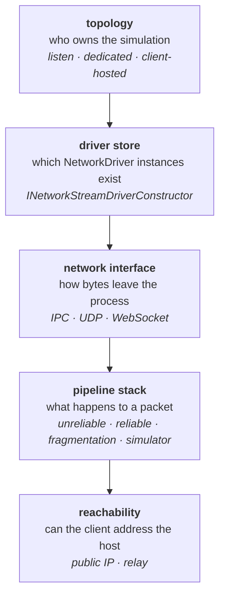

# 39 · Connection topologies

Two capsules on one machine connect over an in-process pipe. Everything harder than that is
this chapter: who runs the authoritative simulation, and what carries the bytes to it.

> **📋 Honesty label** — chapters 19–23 were verified at runtime on a two-player capsule
> build. **This chapter is not.** Claims about `com.unity.netcode@6.6.0` and
> `com.unity.transport@6.7.0` are read out of the installed package source and cited by file
> and line. Claims about **Relay, Matchmaker, Lobby and Multiplay Hosting are service-side**
> — those are Unity Gaming Services, not code in these packages — and are marked as such,
> with Unity's public documentation as the source. Nothing about relays or hosting was
> exercised here.

## The layers, and which one you are actually choosing



These are independent. A listen server can use a relay; a dedicated server can use
WebSockets; a client-hosted game can run in one world or two. Confusing the topology
question with the reachability question is the single most common mistake in this area.

## Topology: three shapes and one experiment

`ClientServerBootstrap.PlayType` (`Runtime/ClientServerWorld/ClientServerBootstrap.cs:502`)
has exactly three values, and it decides which worlds exist:

| `PlayType` | Worlds created | Set by |
|---|---|---|
| `ClientAndServer` (0) | `ServerWorld` **and** `ClientWorld` | default; editor PlayMode Tools |
| `Client` (1) | `ClientWorld` only | `UNITY_CLIENT` define |
| `Server` (2) | `ServerWorld` only | `UNITY_SERVER` define |

In a build the value is derived from the platform defines
(`ClientServerBootstrap.cs:538`); in the editor it comes from the PlayMode Tools window.
World creation itself is `CreateDefaultClientServerWorlds`
(`ClientServerBootstrap.cs:221`).

A **listen server** is `ClientAndServer` in one process: two worlds, and the local client
connects to the local server over the IPC interface, so the host's own input has no wire
latency. A **dedicated server** is `Server` in one process and `Client` in another. There
is no third code path — the systems are the same, only the worlds differ.

Netcode 6.6 also carries an experimental **single-world host**: one world that is both
client and server, with no client-to-server connection at all, only a listening driver and
a synthetic connection entity for convenience
(`Runtime/NetCodeConfig.cs:51`). It is gated behind the
`NETCODE_EXPERIMENTAL_SINGLE_WORLD_HOST` define (`ClientServerBootstrap.cs:223`), and the
package's own comment marks it as the intended default for a future major version. Because
a single world cannot run partial ticks, ghosts get an interpolation-smoothing component
instead, controlled per prefab by `SingleWorldHostInterpolationSmoothing`
(`Runtime/Authoring/BaseGhostSettings.cs:167`) — at a cost the source states as about half a
tick of render latency.

> **💀 Trap** — do not read "client-hosted" as a separate netcode mode. It is
> `ClientAndServer` running on a player's machine. Everything in chapter 40 about server
> authority still holds, with one change that matters enormously: **the authority is now
> running on hardware the attacker owns.**

## The driver store

`NetworkStreamDriver` is the singleton your game talks to: `Listen(endpoint)`
(`Runtime/Connection/NetworkStreamDriver.cs:212`) and `Connect(entityManager, endpoint)`
(`:257`). Underneath it holds a `NetworkDriverStore`, which is an array of driver
instances, each tagged with a `TransportType` of `IPC` or `Socket`
(`Runtime/Connection/NetworkDriverStore.cs:17`).

The server usually registers **two**: an IPC driver for the in-process client and a socket
driver for everyone else (`Runtime/Connection/DefaultDriverConstructor.cs:380`). The client
registers **one**, chosen by `ClientUseSocketDriver`
(`DefaultDriverConstructor.cs:204`), which prefers IPC only when a server world exists in
the same process and the network simulator is off. Turning the simulator on forces sockets
(`DefaultDriverConstructor.cs:209`) — otherwise emulation would have nothing to emulate.

> **💀 Trap** — the local client only gets the IPC driver if the server world exists first.
> The package states it plainly: call `Listen` on the server world before the client tries to
> connect (`DefaultDriverConstructor.cs:606`). Get the order wrong and your listen server
> quietly routes its own player through the loopback socket.

## Swapping the driver constructor

One static property is the entire extension point:

```csharp
// Your own implementation, assigned before any world is created.
NetworkStreamReceiveSystem.DriverConstructor = new MyDriverConstructor();

public struct MyDriverConstructor : INetworkStreamDriverConstructor
{
    public void CreateClientDriver(World w, ref NetworkDriverStore store, NetDebug d)
    {
        var settings = DefaultDriverBuilder.GetNetworkClientSettings();
        // mutate settings here — relay parameters, TLS, queue sizes
        DefaultDriverBuilder.RegisterClientDriver(w, ref store, d, settings);
    }

    public void CreateServerDriver(World w, ref NetworkDriverStore store, NetDebug d)
        => DefaultDriverBuilder.RegisterServerDriver(w, ref store, d,
               DefaultDriverBuilder.GetNetworkServerSettings());
}
```

`NetworkStreamReceiveSystem.DriverConstructor`
(`Runtime/Connection/NetworkStreamReceiveSystem.cs:273`) lazily defaults to
`IPCAndSocketDriverConstructor` (`DefaultDriverConstructor.cs:608`). The interface has two
methods (`NetworkStreamReceiveSystem.cs:51`), and `DefaultDriverBuilder` gives you a
register helper for every combination so you rarely write driver creation by hand.

## Pipelines: the stack a packet actually traverses

Both client and server create three pipelines
(`DefaultDriverConstructor.cs:458`, `:469`):

| Pipeline | Stages | Carries |
|---|---|---|
| `unreliablePipeline` | `UnreliableSequencedPipelineStage` | snapshots, commands |
| `reliablePipeline` | `ReliableSequencedPipelineStage` | RPCs |
| `unreliableFragmentedPipeline` | `FragmentationPipelineStage` | snapshots larger than the message size |

In the editor or a `NETCODE_DEBUG` build with the simulator enabled, the **client** gets a
fourth stage appended to all three: `SimulatorPipelineStage`
(`DefaultDriverConstructor.cs:482`). The server never gets it.

> **⚡ Hardware analogy** — a pipeline stack is a **chain of bus bridges**. Each stage may
> reorder, buffer, duplicate, or drop, and each adds header bytes that come out of your
> payload budget. `NetworkDriver.MaxHeaderSize(pipeline)` is what NetCode subtracts before
> deciding how big a snapshot may be (`Runtime/Snapshot/GhostSendSystem.cs:1010`) — exactly
> like accounting for protocol overhead before sizing a DMA burst.

Transport-level settings applied by default (`DefaultDriverConstructor.cs:43`, `:70`):
reliable window size **32**, fragmentation payload capacity **16 KB**
(`DefaultDriverConstructor.cs:23`), and in editor or debug builds `maxFrameTimeMS = 100`
(`DefaultDriverConstructor.cs:24`) so a breakpoint does not look like a timeout.

## Transport defaults worth knowing

From `com.unity.transport@6.7.0`, `Runtime/NetworkParams.cs:27`:

| Constant | Default | Meaning |
|---|---|---|
| `MaxMessageSize` / `MTU` | 1400 bytes | ceiling before fragmentation |
| `ConnectTimeoutMS` | 1000 | gap between connection attempts |
| `MaxConnectAttempts` | 60 | attempts before a disconnect event |
| `DisconnectTimeoutMS` | 30000 | silence before a peer is dropped |
| `HeartbeatTimeoutMS` | 500 | keepalive interval |
| `ReconnectionTimeoutMS` | 2000 | re-establish attempt, e.g. mobile roaming |
| `ReceiveQueueCapacity` / `SendQueueCapacity` | 512 each | packets in flight per driver |

NetCode overrides all of these from `NetCodeConfig.Global` when one exists
(`DefaultDriverConstructor.cs:88`), and uses separate send and receive queue capacities for
client and server (`DefaultDriverConstructor.cs:96`).

## Reachability: relay, and what is not in the box

Searching the whole transport package for hole punching, STUN, or NAT traversal returns
nothing. **Unity Transport does not do NAT punchthrough.** What it does have is a relay
client: `RelayServerData` (`com.unity.transport/Runtime/Relay/RelayServerData.cs:14`)
carrying an endpoint, an allocation ID, connection data for both ends, and an HMAC key,
applied to a driver through `settings.WithRelayParameters(...)`.

NetCode wires that in with two overloads:
`RegisterClientDriver(..., ref RelayServerData)` (`DefaultDriverConstructor.cs:554`) and
`RegisterServerDriver(..., ref RelayServerData)` (`DefaultDriverConstructor.cs:585`). Note
what the server overload does: it registers the IPC driver **without** relay parameters and
the UDP driver **with** them (`DefaultDriverConstructor.cs:588`). The host's local client
still takes the fast path; only remote clients go through the relay.

Everything that produces a `RelayServerData` in the first place — allocating a relay,
getting a join code, matchmaking tickets, lobby membership, fleet allocation — is
**service-side**. It lives in `com.unity.services.*` packages talking to Unity Gaming
Services over HTTPS, is documented in Unity's UGS documentation, and is not present in the
packages read for this book. This chapter cannot verify any of it and does not try.

| Concern | Where it lives | Verified here |
|---|---|---|
| `RelayServerData` struct and driver parameter | `com.unity.transport` | yes, by source |
| Relay allocation, join codes, region selection | Unity Relay service | no — service-side, see Unity docs |
| Matchmaking tickets and backfill | Unity Matchmaker service | no — service-side, see Unity docs |
| Lobby membership and player data | Unity Lobby service | no — service-side, see Unity docs |
| Fleet, build config, server allocation | Multiplay Hosting | no — service-side, see Unity docs |
| Dedicated server build target | Unity editor / `UNITY_SERVER` | partially — the define is read at `ClientServerBootstrap.cs:540` |

> **💀 Trap** — a relay is a reachability fix, not a topology. Traffic through a relay is
> still client to authoritative server; it just takes a longer path with an extra hop of
> latency. If you route a listen server through a relay, the host keeps its zero-latency IPC
> advantage over every guest. Whether that is acceptable is a design decision, not a
> transport one.

WebGL is the case where reachability forces topology: a browser client cannot open a UDP
socket, so it uses `WebSocketNetworkInterface`. A WebGL build cannot listen at all — the
default server constructor throws for WebGL and tells you to use Relay with a custom driver
constructor (`DefaultDriverConstructor.cs:640`).

## Host migration, as it stands

Netcode 6.6 ships a host migration feature behind an `EnableHostMigration` component
(`Runtime/HostMigration/HostMigrationSystem.cs:22`). The mechanism is state export and
import: `HostMigrationData.Get(World, ref NativeList<byte>)` serialises host state to a byte
blob, and `HostMigrationData.Set(NativeArray<byte>, World)` applies it to the new host
(`Runtime/HostMigration/HostMigrationData.cs:38`, `:197`). Entities respawned by that
process are tagged `IsMigrated`, and a `HostMigrationInProgress` component is present for
the duration so your systems can stand down (`HostMigrationSystem.cs:27`, `:33`).

What that gives you is the *transfer of authority*. What it does not give you is the part
that decides who becomes host, tells the other clients where to reconnect, and holds the
blob in the meantime — that is a lobby or session service, and it is service-side.

**Distributed authority does not exist in Netcode for Entities.** The only reference to the
phrase in the package is a forward-looking comment
(`Runtime/GameObjectLayer/GameObjectBridge/GhostBehaviour.cs:145`). The authority model of
this package is single-authority server; if you need per-object distributed authority today,
that is a different Unity netcode product, and this book does not cover it.

## When to use what

| Situation | Topology | Reachability |
|---|---|---|
| Competitive, cheating matters, revenue supports it | dedicated server | direct, or Multiplay Hosting |
| Co-op with friends, small sessions, cost matters | listen server (`ClientAndServer`) | Relay — most players have no public IP |
| LAN, arcade, tournament | listen or dedicated | direct IP; no relay hop |
| Browser client | dedicated (WebGL cannot listen) | WebSocket, plus Relay if the server is not public |
| Editor development, two players | `ClientAndServer` | IPC — free, zero latency, hides all latency bugs |
| Editor development, realistic | `ClientAndServer` + simulator on | forced to sockets; this is the daily setting |
| Sessions that must survive the host leaving | listen server + host migration | Relay + a session service to re-point clients |

And the three decision criteria that actually decide it:

1. **Can you afford one server process per concurrent match?** If no, the host is a player,
   and chapter 40's threat model changes shape.
2. **Do both ends have routable addresses?** Usually no. That is a relay, not a topology
   change.
3. **Does the host's zero-latency advantage break your game?** In a shooter, yes. In co-op
   PvE, usually not. This is the honest cost of a listen server and no amount of
   configuration removes it.

> **🔬 Probe** — the driver store is inspectable at runtime. `NetworkStreamDriver.DriverStore`
> exposes each registered driver, and `GetLocalEndPoint(driverId)`
> (`Runtime/Connection/NetworkStreamDriver.cs:419`) tells you the address a given driver
> actually bound to. When a listen server's local client is mysteriously laggy, check whether
> its connection went to the IPC driver or the socket one.

→ [40 · The cheat surface](40-cheat-surface.md)
