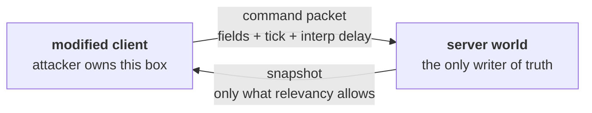

# 40 · The cheat surface

The security model of this stack is one sentence: **the client sends intent, the server
computes results.** This chapter is what that sentence buys, what it does not, and which
holes are closed by structure versus only ever detected.

> **📋 Honesty label** — chapters 19–23 were verified at runtime on a two-player capsule
> build. **This chapter is not.** Every mechanism below is read out of the installed
> `com.unity.netcode@6.6.0` source and cited by file and line. No attack was performed and
> no mitigation was measured. This is defensive material: it exists so you can find the
> holes in *your* server and close them.

## Where the boundary actually is



Everything in the client box is the attacker's — memory, code, input field values, packet
timing, the local clock, including the parts NetCode fills in automatically. Everything the
server *derives* from those fields is yours. The model's strength is **how much the server
derives and how little it accepts.**

> **⚡ Hardware analogy** — this is a **privilege boundary with a mailbox**, not a shared
> bus. The client writes a mailbox; the server reads it as a *request* and executes in its
> own address space. A client that writes a position is an untrusted side with a write port
> into privileged memory. Every hole below is either an unvalidated field in the mailbox or
> a read port opened too wide.

## What a modified client controls, and what it does not

| The attacker can | The attacker cannot | Because |
|---|---|---|
| Put any value in any `IInputComponentData` field | write a `[GhostField]` | ghost fields flow server → client only |
| Send commands for any tick it likes | make the server accept a stale tick as current | late ticks are rewritten to the server tick |
| Send at any rate | get more than one input applied per server tick | commands land in a tick-keyed ring |
| Report any interpolation delay | rewind further than the history buffer | the delay is clamped |
| Read every byte the server sends it | read what was never sent | relevancy |
| Fake a `NetworkId` locally | be treated as another connection | the server keys everything by connection |
| Skip its own prediction entirely | change the outcome by doing so | the server simulates regardless |

The middle column is the value of server authority. Note what is *not* in it: nothing about
the *plausibility* of the values on the left. That is your job.

## Hole 1 — input content is not validated, at all

The command receive path deserializes your input struct field by field into the target
entity's command buffer (`Runtime/Command/CommandReceiveSystem.cs:217`). No range check, no
clamp, no normalisation. A `float2 Move` arrives as whatever bit patterns the client sent,
including `(1e30, 1e30)`. Your prediction system then multiplies it by speed and delta time
— **on the server, with full authority.** That is an authoritative teleport.

Mitigation is structural and yours to write. Clamp on read, in the shared movement system:

```csharp
// Runs in PredictedSimulationSystemGroup on both client and server.
var wish = input.Move;
if (!math.all(math.isfinite(wish))) wish = float2.zero;      // never trust NaN
var lenSq = math.lengthsq(wish);
if (lenSq > 1f) wish *= math.rsqrt(lenSq);                   // never trust magnitude
transform.Position += new float3(wish.x, 0, wish.y) * Speed * dt;
```

Two rules follow. **Every input field needs a domain, enforced where it is consumed.** And
**enforce it in the shared predicted system**, because a server-only clamp the client does
not apply is a permanent prediction mismatch seen as rollback jitter. One rule, executed
twice — chapter 20's principle.

## Hole 2 — input rate and tick manipulation

Here the package defends you, partially. Exactly how far:

- A command packet carries at most **32** commands, five bits of count
  (`Runtime/Command/CommandSendSystem.cs:132`, `:138`).
- The per-entity command buffer is a ring of **64** slots keyed by tick
  (`Runtime/Command/ICommandData.cs:163`).
- Commands older than the current server tick are **rewritten to it** before insertion
  (`Runtime/Command/CommandReceiveSystem.cs:258`), counted as `NumArrivedTooLate` (`:184`).
- Inserting into an occupied tick slot replaces it and increments `NumRedundantResends`
  (`CommandReceiveSystem.cs:261`).

The consequence: **flooding does not multiply your actions.** The prediction loop reads one
command per tick, by tick key, so a thousand packets per second still yields one command per
tick. What flooding does buy is server CPU and ingress — denial of service, not unfair
advantage. `CommandArrivalStatistics` (`Runtime/Connection/CommandArrivalStatistics.cs:10`)
is where you detect it.

Commands for *future* ticks simply sit in the ring until the server reaches them — the
normal mechanism, since clients run ahead by `TargetCommandSlack`. It only becomes a concern
if your gameplay code reads the buffer directly instead of by tick.

## Hole 3 — look direction and the limit of the model

Aim direction arrives as an input field, already bounded — a unit vector is a unit vector —
so hole 1's clamping does not help. An aimbot's aim is perfectly legal.

**There is no mechanism in server authority that distinguishes a human's aim from a
program's.** Say it out loud, because design time is wasted looking for one. What authority
gives you is that the aimbot cannot hit what the server would not have let it hit: no
shooting through unseen walls, no range beyond your weapon, no rate above your fire rate —
provided you check those server-side. Beyond that it is **detection**: trajectory and
hit-distribution analysis, off the critical path. The netcode contribution to anti-aimbot is
hole 4 — an aimbot that cannot see you cannot aim at you.

## Hole 4 — snapshot-derived wallhacks

A client can render anything it received. Send the position of an enemy behind a wall because
that enemy is merely *far away but relevant*, and the client has a wallhack no client-side
code prevents. Four mechanisms narrow the read port:

| Mechanism | Granularity | Notes |
|---|---|---|
| `GhostRelevancyMode.SetIsRelevant` | per ghost, per connection | allowlist — correct for a competitive game |
| `GhostRelevancyMode.SetIsIrrelevant` | per ghost, per connection | denylist — wrong for security, unlisted leaks |
| `PrioChunk.isRelevant` from your importance function | per chunk, per connection | coarser, free if you already scale |
| `[GhostComponent(OwnerSendType = SendToOwnerType.SendToOwner)]` | per component | ammo, cooldowns, private state |

Modes: `Runtime/Snapshot/GhostRelevancy.cs:11`. `SendToOwnerType` has four values — `None`,
`SendToOwner`, `SendToNonOwner`, `All` — at `Runtime/Authoring/GhostModifiers.cs:78`. All
four rows are **structural**: the bytes never leave the server.

> **💀 Trap** — quantization, obfuscation and encryption do **not** close this hole. The
> client must decode the snapshot to render the game, so whatever it renders it can read.
> The only defence is not sending it.

Distance-driven relevancy leaks through walls at close range, exactly where it matters.
Visibility-driven relevancy is more expensive and more correct — but flipping a ghost to
irrelevant despawns it on the client (`Runtime/Snapshot/GhostChunkSerializer.cs:1823`), so
per-frame visibility trades wallhack resistance for pop-in. Hysteresis is the compromise.

## Hole 5 — what lag compensation gives back

Lag compensation judges a client's shot against the world it actually saw (chapter 30). To
do that the server must know how far behind that view was — and **the client tells it.** The
interpolation delay is written into the command packet header by the sender
(`Runtime/Command/CommandSendSystem.cs:251`) and copied onto the target entity as
`CommandDataInterpolationDelay` (`Runtime/Command/CommandReceiveSystem.cs:165`), whose
documentation calls it "the latest reported interpolation delay"
(`Runtime/Command/CommandDataInterpolationDelay.cs:23`). Inflate it and the server rewinds
further than your view required.

The structural bound is the history buffer. `PhysicsWorldHistory` clamps the requested delay
to `Size − 1` (`Runtime/Physics/PhysicsWorldHistory.cs:299`); the raw buffer holds at most
**32** collision worlds (`PhysicsWorldHistory.cs:112`), sized by
`LagCompensationConfig.ServerHistorySize` (`Runtime/Physics/LagCompensationConfig.cs:25`).
**Your history size is your maximum exploitable rewind.** At 60 Hz, 32 ticks is a little
over half a second; size it to realistic worst-case ping, not to the maximum.

The detection hook comes with it: `GetCollisionWorldFromTick` returns `expectedTick` and
`returnedTick`, and the doc comment says to compare them to find players hitting the clamp
(`Runtime/Physics/PhysicsWorldHistory.cs:34`).

> **💀 Trap** — the reported delay is never reset when the client changes command target
> (`CommandDataInterpolationDelay.cs:26`), so a stale delay from a previous vehicle silently
> applies to the new one.

## Identity: connection approval

By default, a connection that completes the transport handshake and the protocol version
check is in the game. `NetworkStreamDriver.RequireConnectionApproval`
(`Runtime/Connection/NetworkStreamDriver.cs:76`) inserts an authentication step first, and
must be set **before** listening — the setter refuses once a driver is bound
(`NetworkStreamDriver.cs:86`). The flow is deliberately game-specific:

1. The connection enters `ConnectionState.State.Approval`
   (`Runtime/Connection/NetworkStreamConnectionComponent.cs:226`).
2. Only RPCs implementing `IApprovalRpcCommand` (`Runtime/Rpc/IRpcCommand.cs:89`) are
   accepted; anything else disconnects with `InvalidRpc` (`Runtime/Rpc/RpcSystem.cs:439`).
3. Your system validates the token against your own backend. NetCode has no opinion about
   what valid means.
4. Success adds `ConnectionApproved`
   (`Runtime/Connection/NetworkStreamConnectionComponent.cs:116`); failure disconnects with
   `ApprovalFailure` (`:176`).
5. Neither within `ClientServerTickRate.HandshakeApprovalTimeoutMS` — default **5000 ms**
   (`Runtime/ClientServerWorld/ClientServerTickRate.cs:305`) — drops the connection with
   `ApprovalTimeout` (`:182`).

The RPC layer hardens itself too: an out-of-range RPC index disconnects the connection
(`RpcSystem.cs:451`), as does a declared-versus-actual bit count mismatch
(`RpcSystem.cs:464`) — whose error text honestly notes the malformed RPC **may already have
executed**. Treat RPC handlers as untrusted input parsers.

`NetworkProtocolVersion` (`Runtime/Connection/NetworkProtocolVersion.cs:28`) carries a
netcode version, your `GameVersion`, an RPC collection hash and a component collection hash.
It is a *compatibility* check: it stops mismatched builds, not modified ones.

## Structural versus detection

| Concern | Structural mitigation | Detection only |
|---|---|---|
| Speed hack, teleport | clamp inputs in the shared predicted system | — |
| Extra actions per tick | tick-keyed command ring (built in) | packet rate via `CommandArrivalStatistics` |
| Wallhack | `SetIsRelevant` allowlist; `SendToOwner` components | — |
| Aimbot | server-side line of sight, range, fire rate | aim trajectory analysis, off the critical path |
| Lag-compensation abuse | small `ServerHistorySize` | `expectedTick` vs `returnedTick` clamp hits |
| Item or currency duplication | server-only authority over the mutation | audit logs |
| Unauthorised players | `RequireConnectionApproval` + `IApprovalRpcCommand` | — |
| Malformed RPCs | index and size validation (built in) | disconnect reason counts |
| Client-hosted manipulation | **none** — the host owns the authority | server-side match validation |

That last row is the honest one. On a listen server the authority runs on hardware the host
controls: everything here still protects the *guests from each other*, and nothing protects
them from the host. If that matters, the answer is a dedicated server (chapter 39), not a
configuration.

## When to use what

| Situation | Do this |
|---|---|
| Any input field with an unbounded range | clamp it in the shared predicted system |
| Any state only one player should know | `OwnerSendType = SendToOwner` |
| Competitive game, any player count | `GhostRelevancyMode.SetIsRelevant`, visibility-driven |
| Co-op PvE with friends | relevancy for bandwidth; approval optional |
| Accounts, progression, or purchases | `RequireConnectionApproval` plus a real token check |
| Server-side hit registration | `ServerHistorySize` sized to realistic ping, not maximum |
| Deciding an outcome — damage, loot, score | server-only system; never the predicted group |
| Cosmetic consequence of an outcome | client-only; faking it changes nothing |

The rule underneath all of it: **if a client can state it, a client can lie about it, so make
the server derive it instead.** Chapter 31's table F is the same rule as a design question
rather than a threat.

> **🔬 Probe** — the cheapest security audit in this stack is to list every field of every
> `IInputComponentData` in your project and write its enforced domain next to it. A field
> without one is an unvalidated write from an untrusted process straight into your
> authoritative simulation.

→ [24 · The debugging playbook](24-debug-playbook.md)
