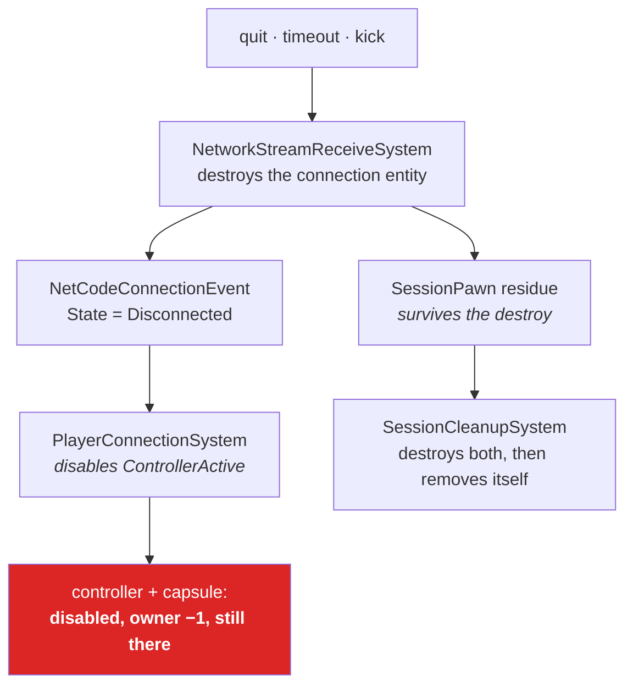

# 45 · Session control: approve, kick, clean up

Chapter 19 walked the eight steps from socket to capsule and named the two gaps this project
hit on the way in. This chapter is the other three problems: how the server says **no**, how it
throws someone **out**, and what it must destroy when anybody **leaves**. That last one is
where the bug is, and nothing in the stack does it for you.

> **📄 Provenance** — runtime-verified. The approval, kick and cleanup systems described here
> were written into `vex-ee-3` and exercised in the editor with two simultaneous connections: a
> full `ClientWorld` plus a thin client world created and connected by hand. Every entity count
> quoted was read out of a live `ServerWorld`. The **source citations** for Netcode for Entities
> and Entities were read at the monorepo fork pinned in `Packages/manifest.json`; Netcode
> reports 6.6.0, Entities 6.5. Chapters 19 through 23 are this book's other runtime-verified
> chapters; this one belongs with them.

## What approval actually gates

`NetworkStreamDriver.RequireConnectionApproval` is a single byte with a lot of leverage. It is
server-only — the field's own doc says it is "always false on the client"
(`Runtime/Connection/NetworkStreamDriver.cs:70`–`:76`) — and it changes what the server does at
the end of the protocol handshake.

With it **off**, the server calls its internal `ApproveConnection` the instant the handshake
completes (`Runtime/Connection/NetworkStreamReceiveSystem.cs:1100`–`:1104`). A `NetworkId` is
assigned and the client is in. Your game logic never got a vote.

With it **on**, the server instead moves the connection to `ConnectionState.State.Approval`,
raises an event, and sends `ServerRequestApprovalAfterHandshake`
(`:1106`–`:1122`). It then waits for one thing: the `ConnectionApproved` component appearing on
that connection entity (`:1126`–`:1137`). Your code adds it, or the connection times out with
`ApprovalTimeout`.

The gate is real, and it is not merely "no `NetworkId`". While a connection is in handshake or
approval, `RpcSystem` executes **only** RPCs marked as approval types; a normal RPC arriving in
that window is answered with a disconnect (`Runtime/Rpc/RpcSystem.cs:437`–`:447`). Non-RPC
traffic is dropped outright (`NetworkStreamReceiveSystem.cs:856`–`:862`). Since
`NetworkStreamInGame` is what arms snapshots, and the request that sets it is a normal RPC, a
pending connection cannot go in game, and a client that cannot go in game receives nothing.

Measured, with `session.max-players` set to `1` and a second connection arriving:

```
ServerWorld:      ghosts=3  connections=2
   Entity(33164:59)  state=Handshake  hasNetworkId=False  approved=False  inGame=False
   Entity(33159:67)  state=Connected  hasNetworkId=True   approved=True   inGame=True
ThinClientWorld1: ghosts=0  connections=1
   Entity(50699:11)  state=Handshake  hasNetworkId=False  approved=False  inGame=False
```

`ghosts=0` on the joining side, and one poll later its connection is gone entirely. The server's
own ghost count never moved off 3. Nothing replicated to a client that was never approved.

## The gate, in this project

`Assets/Scripts/SessionApprovalSystem.cs` replaces the old auto-approve hack chapter 19
described. It is deliberately two passes, because the identity cannot exist until Netcode has
handed out the `NetworkId` that names it:

```csharp
// pass 1 — the decision
if (approved >= maxPlayers)
{
    ecb.AddComponent(entity, new NetworkStreamRequestDisconnect
    {
        Reason = NetworkStreamDisconnectReason.ApprovalFailure,
    });
    continue;
}

ecb.AddComponent<ConnectionApproved>(entity);
```

The refusal rule is a cap, `session.max-players`, because a cap is the one deny condition you
can trigger on purpose without inventing a fake credential. A real deployment reads
`ApprovalRequest.AccessToken` off the approval RPC instead; that is exactly where Nerve's
`ConnectionApprovalServerSystem` validates a Unity Authentication JWT. This project switches
that system off, because it takes the real network branch whenever `World.IsServer()` is true
(`BovineLabs.Nerve.State/Authentication/ConnectionApprovalServerSystem.cs:108`–`:117`), and a
separate `ServerWorld` in one process *is* a server world.

One sharp edge worth naming. Pass 1 must not add `ConnectionApproved` to a connection that is
neither in `Approval` nor already carrying a `NetworkId`. Do that with approval switched off and
Netcode logs a warning that you approved a connection on a server which never asked
(`NetworkStreamReceiveSystem.cs:1149`–`:1153`). One condition fixes it, and it is the condition
that makes the same system correct in both modes.

## Kick is one component

There is no kick API. There is `NetworkStreamRequestDisconnect`
(`Runtime/Connection/NetworkStreamConnectionComponent.cs:261`–`:267`) on a connection entity, and
Netcode does the rest: it reads the request, calls `Disconnect` on that connection's driver
(`NetworkStreamReceiveSystem.cs:780`–`:785`), destroys the connection entity
(`:1041`–`:1042`), returns the `NetworkId` to the free list (`:1047`–`:1048`), and raises a
`Disconnected` event. Netcode uses the same component itself for protocol mismatches, and Nerve
uses it to refuse a duplicate login
(`BovineLabs.Nerve.State/Session/PlayerConnectionSystem.cs:272`–`:278`).

The `Reason` field is **server-local**. The transport `Disconnect` call carries no payload, so
the kicked client reads the transport's own reason byte
(`NetworkStreamReceiveSystem.cs:846`–`:847`) and always sees `ClosedByRemote` — never the value
you wrote. Measured on a kicked client that was in game:

```
DisconnectReason=ClosedByRemote  HasEnteredGame=True
IsVoluntary=False  kind=ConnectionLost  retryable=True
```

Compare a client that disconnects itself:

```
DisconnectReason=ConnectionClose  HasEnteredGame=True
IsVoluntary=True   kind=VoluntaryLeave  retryable=False
```

So chapter 19's rule survives contact: a disconnect is voluntary only if it is `ConnectionClose`
**and** you had entered the game
(`BovineLabs.Nerve.State/States/Client/ClientConnectionTracker.cs:148`). A kick can never be
mistaken for a quit, because a kick never arrives as `ConnectionClose`.

One correction to chapter 19 while we are here. It lists six `DisconnectReason` values. There
are **eleven** (`NetworkStreamConnectionComponent.cs:150`–`:183`): `ConnectionClose`, `Timeout`,
`MaxConnectionAttempts`, `ClosedByRemote`, `BadProtocolVersion`, `InvalidRpc`,
`AuthenticationFailure`, `ProtocolError`, `HandshakeTimeout`, `ApprovalFailure` and
`ApprovalTimeout`. The last three are Netcode-specific and the first eight map onto the
transport's own enum. Nerve splits them by whether reconnecting could plausibly work
(`BovineLabs.Nerve.State/ClientDisconnectionClassifier.cs:25`–`:45`) — timeouts are retryable, a
version mismatch or a failed approval is not.

## The departure, and the thing that leaks



Nothing in Netcode or Nerve destroys a departed player's entities. Nerve deliberately retains
them: on a disconnect it only disables `ControllerActive`
(`PlayerConnectionSystem.cs:145`–`:154`), and a second system clears the connection pointer and
sets `GhostOwner.NetworkId` to `-1`
(`ControllerOwnershipDeactivateSystem.cs:44`–`:47`). That is a reconnect feature, and it is a
good one when you can match a returning player to their controller by account. It is not
cleanup.

Measured, with that retention as the only behaviour — one client joins, then leaves:

```
before disconnect   ServerWorld  conns=2  ghosts=5  controllers=2  pawns=2
after  disconnect   ServerWorld  conns=1  ghosts=5  controllers=2  pawns=2
   ctrl Entity(49941:37) acct=local-2 active=False enabled=False
        conn=Entity.Null  pawn=Entity(49942:37) pawnExists=True  owner=-1
```

Still 5 ghosts twenty seconds later, and the remaining client still sees all five. The capsule
of a player who left is standing in the room forever.

With `SessionCleanupSystem` in place, the same experiment:

```
before disconnect   ServerWorld  conns=2  ghosts=5  controllers=2  pawns=2
after  disconnect   ServerWorld  conns=1  ghosts=3  controllers=1  pawns=1
                    ClientWorld  conns=1  ghosts=3  controllers=1  pawns=1
```

The remaining client dropped from five ghosts to three without being told anything. Snapshot
despawn handles it, and it handles it with the same trick the fix uses.

## Cleanup components, and two-phase deletion

The hard part of a departure is that the connection entity is gone before you can ask it
anything. Netcode destroys it from inside a job the moment the socket dies, and it does not
record what that connection had spawned.

`ICleanupComponentData` (`Unity.Entities/IComponentData.cs:149`) changes what *destroy* means
for the entity carrying it. Any archetype containing one is flagged `CleanupNeeded`
(`Unity.Entities/EntityComponentStore.cs:2588`, `:2610`–`:2622`). `DestroyEntity` on a chunk with
that flag does not free anything — it **moves** the entity to a residue archetype
(`Unity.Entities/EntityComponentStoreCreateDestroyEntities.cs:312`–`:343`) built from the cleanup
components plus an internal tag, everything else stripped
(`Unity.Entities/EntityComponentStoreCreateArchetype.cs:41`–`:76`). The entity index stays alive
and its cleanup data stays readable. Only when the last cleanup component is removed does the
archetype become `CleanupComplete` (`EntityComponentStore.cs:2605`–`:2608`) and the memory get
released (`Unity.Entities/ChunkDataUtility.cs:1388`–`:1390`).

So the pattern is: write down what you will need *before* the destroy, read it *after*, then
remove the component to finish the job.

```csharp
public struct SessionPawn : ICleanupComponentData
{
    public Entity Controller;
    public Entity Pawn;
}

// the connection entity is gone; this is its residue
foreach (var (session, entity) in SystemAPI.Query<RefRO<SessionPawn>>()
             .WithNone<NetworkStreamConnection>().WithEntityAccess())
{
    Doom(session.ValueRO.Pawn);
    Doom(session.ValueRO.Controller);
    ecb.RemoveComponent<SessionPawn>(entity);   // phase two
}
```

This generalises far past sessions. Netcode itself uses it for ghost despawn: `GhostCleanup` is
an `ICleanupComponentData` (`Runtime/Snapshot/GhostSendSystem.cs:22`), the despawn query is "has
`GhostCleanup`, has no `GhostInstance`" (`:569`–`:575`), and the despawn message is sent from the
residue before the component is removed and the entity freed (`:2331`–`:2343`). `ConnectionState`
is a cleanup component for the same reason
(`Runtime/Connection/NetworkStreamConnectionComponent.cs:199`). Any time you allocate something
external to ECS — a file handle, a physics body in a foreign world, a row in a lookup — that is
the shape of the release.

Three details `Assets/Scripts/SessionCleanupSystem.cs` has to get right.

**Where the pointer lives.** `CommandTarget` on the connection points at the *controller*, not
the pawn (`BovineLabs.Nerve.State/Session/ControllerOwnership.cs:27`); the pawn is one further
hop through `PrimaryControlledEntity`. Chapter 22's diagram draws that arrow at the pawn, and it
is wrong.

**A residue entity still exists.** `EntityManager.Exists` returns true for it. That is what keeps
the reap and the orphan sweep from doing each other's work: the sweep skips any controller whose
connection still resolves, and a connection in residue still resolves.

**Mid-tick departures.** The record only happens once the controller exists, and Nerve
instantiates through a deferred command buffer. A socket that dies inside that window leaves a
controller nobody ever recorded. The sweep catches it — a controller whose connection resolves to
nothing has no owner and never will. Forced deliberately, it reports:

```
[session] swept orphan controller Entity(33193:53) with no live connection
ServerWorld  controllers=0  pawns=0  ghosts=1
```

This project destroys on departure rather than retaining, and that is a real change to Nerve's
model. It is the honest one here: `AccountIdentity` is `local-{networkId}` and Netcode recycles
`NetworkId`s (`NetworkStreamReceiveSystem.cs:1047`–`:1048`), so a "reclaimed" controller could
just as easily belong to somebody else. Retention needs a real account before it is a feature.

## Settings

| Setting | Where | Default | Effect |
|---|---|---|---|
| `network.require-connection-approval` | `BovineLabs.Nerve/Utility/BovineLabsBootstrap.NetCode.cs:34` | `false` | Sets `NetworkStreamDriver.RequireConnectionApproval` before `Listen` (`:205`–`:210`). Must be set before the driver binds. |
| `session.max-players` | `Assets/Scripts/SessionSettings.cs:20` | `4` | Connections beyond this are refused with `ApprovalFailure`. |
| `session.kick-network-id` | `Assets/Scripts/SessionSettings.cs:27` | `-1` | Set to a live `NetworkId` to kick it; consumed and reset to `-1`. |
| `debug.loglevel` | `BovineLabs.Core/Debug/BLLogger.cs:23` | `3` (Warning) | Approve, kick and reap log at Info; raise it to `4` to watch them. |
| `HandshakeApprovalTimeoutMS` | `ClientServerTickRate` | package default | How long a connection may sit unapproved before `ApprovalTimeout`. |

## One MPPM trap that belongs next to this

Chapter 23 covers Multiplayer Roles. The failure it does not name: a virtual player whose role
is **Client and Server** builds its own `ServerWorld`, because the bootstrap creates one whenever
the requested play type is anything but `Client`
(`BovineLabs.Nerve/Utility/BovineLabsBootstrap.NetCode.cs:60`–`:65`). You then have two servers
and two isolated sessions that each look fine in isolation. Only the host carries the server
role; every other instance is `Client`. Chapter 23's probe — one `ServerWorld` across all
instances — is the check.

## When to use what

- **Approval off.** Single-player, a LAN tool, a demo. Netcode lets everyone in and you spend no
  frames on it. You still cannot refuse anyone, so do not ship a public server this way.
- **Approval on, cheap gate.** A cap, a build-hash check, a lobby ticket you already hold. Costs
  one tick of latency and buys the guarantee that an unapproved client receives no game state at
  all.
- **Approval on, real credential.** Validate a token from your backend on the `IApprovalRpcCommand`
  and answer with `ApprovalFailure`. Budget for it being asynchronous, and watch the approval
  timeout.
- **Kick.** `NetworkStreamRequestDisconnect`, always server-side. Never try to encode *why* in the
  `Reason` field expecting the client to read it — send an RPC first if the player deserves a
  message.
- **Cleanup component.** Use it whenever the answer to "what did this entity own?" must outlive
  the entity. Sessions, pooled handles, anything with an external allocation.
- **Retain instead of destroy.** Only once `AccountIdentity` means something durable. Until then,
  retention is a leak with a nicer name.
